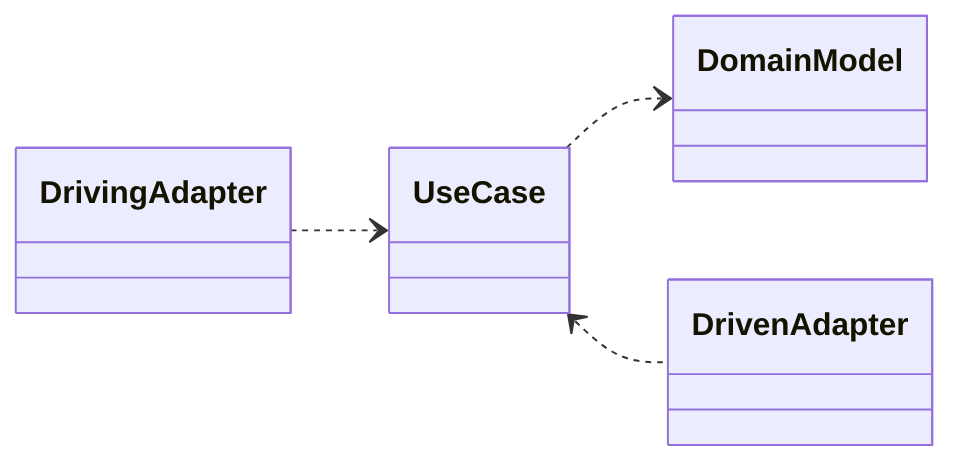
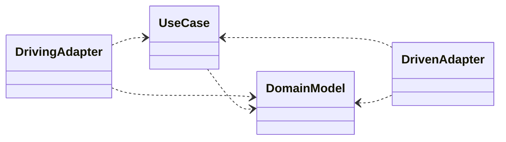
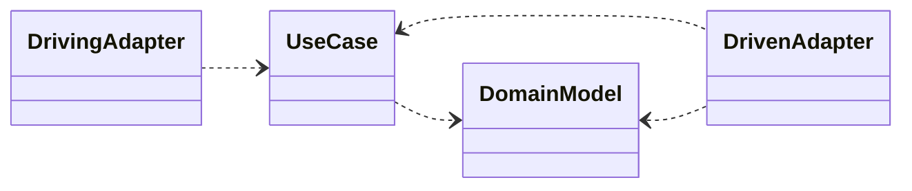

# Clean Architecture

**Clean Architecture** is an attempt to bring together multiple architectural ideas (including Ports and Adapters)  into a single actionable idea (Martin, 2018 p202).

The discussion of the Ports and Adapters architecture only has inside (the application code) and outside (the technology) and doesn’t specify how the inside is structured. It does however specify that the inside application code defines ports (implemented as `interfaces` in Java) that define the boundaries of the application code and everything else (the outside) drives or is driven by the application code. We are going to take this further and discuss how to structure the application code.

Unfortunately, some of the terminology used in descriptions of Clean Architecture is different to that used in Ports and Adapters, so we are going to describe Clean Architecture (CA) using the basic terminology of Ports and Adapters and adding in some other terminology from descriptions of Clean Architecture.

Clean architecture introduces the idea of splitting what we called the application code into a **Domain Model** and **Use Cases**.

## Implementing the Domain Model

We will define the Domain Model as being the Entities, Value Objects and Domain Services that model the business domain. We will use a slightly more complex example to illustrate this, that of a Basket in an online e-commerce shopping application.

Entities are objects that have an identity and a lifecycle. The Basket is example of an entity because it has an identity (usually the BasketId) and a lifecycle (it is created, updated and deleted) over many steps in shopping process.

For example a `Customer` is an Entity, as it has an identity (a unique identifier such as a customer number) and a lifecycle (it can be created, updated, and deleted). Similarly, a class representing a Product would be an Entity because it has an identity (a ProductId or SKUCode) and a lifecycle.

We met Value Objects earlier and are immutable objects that represent a value that is important to the domain. GTIN codes (representing the product code printed as a barcode) are an example of a Value Object. Other examples of Value Objects in the e-commerce domain might be `Price` (representing a price).

Sometimes there is significant process, algorithm or calculation in the domain is not a natural responsibility of an Entity or Value Object. In which case these are implemented in services (which we defined earlier). The characteristics of a domain service are that it is stateless and parameters and results are domain Entities or domain Value Objects. Services are named for an activity (verb), rather than an entity (noun). There might be a single implementation of the domain service, or the service might be defined as Strategy so variations can be more easily implemented.

Together all the business rules (such as the maintaining the invariants or how values are calculated) are implemented within either the Entities, Value Objects or Domain Services. For example, the Basket Entity would have methods to add and remove items, calculate the total price, and apply discounts, potentially using multiple Value Objects and Domain Services.

- The domain model should be independent of any particular use case (i.e. the implementation is common to all possible usages)
- The domain model should be independent of any particular usage in any software product (i.e. the implementation is common to all possible software products), so for example the same domain model could be used in a web application, a mobile application, or a command-line application.

> The original description and diagram in Martin (2018 Ch 22) used the term Entity to describe any code that encapsulated business rules. Domain Driven Design defines an Entity as being an object that is defined by its identity (Evans 2003, p. 91) and also introduces Value Objects and Domain Services. We have expanded our definition of the Domain Model to include Entities (in the DDD sense), Value Objects and Domain Services. What Martin calls Entities we are calling Domain Model.

## Use Cases
A **Use Case** is a widely overloaded term, but has a specific meaning when discussing clean architecture.

A Use Case is a set of actions that provide some value for one of the driving actors of the software product.

Recall that in Ports and Adapters we described the application code as having a driving port (called by technology) and one or more driven ports (called by the application code).

In clean architecture, a Use Case is implemented in a class that provides and implements one interface for the driving port and requires and uses 0..* driven interfaces. The use case class encapsulates all the behaviour required for a single use case for one driving actor in one software product.

For example, we would write different Use Case components that to create a Basket and update a Basket. Both use cases would use the same Entities and DomainServices, but goals of the driving actors are different, and the inputs and outputs for the Use Case would be different. For example its likely that the "Create Basket" Use Case would take a CustomerId as an input and return a BasketId, whereas the "Update Basket" use case would take a BasketId as inputs.

In fact the provided and required interfaces for Use Case classes often use their immutable types for inputs and outputs which are specific to the Use Case.

This makes every use case class independent of other use case class, and avoids the coupling that would occur if we used the same input or output types across multiple use cases. If we are using Java, custom input and output types are often implemented as immutable `record` classes. These custom types being passed in and out of the use case class are often referred to as **Parameter Objects**  or **Data Transfer Objects (DTOs)**.

## The relationship between Domain Model and Use Cases

The split between Domain Model and Use Cases has several benefits:
- The Domain Model contains the enterprise wide objects and business rules and are stable for **any** application of the domain model.
- The Use Cases contain objects and business rules that are **specific** to an application and orchestrate the flow of data between the provided interfaces, the required interfaces and from the domain model.
- The Domain Model changes rarely (or at least less frequently) because they represent the core business rules of the enterprise.
- The Use Cases change more frequently because they represent the specific behaviour required by a particular application.
- We are separating the stable core business rules from the more volatile application specific behaviour.

## Interface Adapters, Frameworks and Drivers

As with Ports and Adapters, what Clean ArchitectureMartin (2018 Ch 22) calls **Interface Adapters** are the adapters that convert between the requirements of the Use Case component and the requirements of the frameworks and drivers. Frameworks are typically UI frameworks (include Web frameworks), drivers are typically database drivers such as JDBC or JPA, or other drivers for other technologies such as messaging systems.

## Example implementation

> See the complete *ShippingCostCleanArchitecture* example code from the Student GitHub repository.


Converting our example of calculating a shipping charge to a clean architecture style, the `applicationcode` package splits into two packages: `applicationcode.domainmodel` and `applicationcode.usecase`.

```Text
applicationcode
-- domainmodel
-- usecase
infrastructure
-- driving
-- driven
SoftwareProduct (class)
```
The `applicationcode.domainmodel` package contains the domain model, which includes a `ShippingRegion` class as an Entity which represents a shipping region as well as the `ShippingCostStrategy` strategy interface and its concrete implementations. The code in the domain model is independent of any particular use case and holds the business rules for calculating a shipping cost.

```Java
package applicationcode.domainmodel;

public class ShippingRegion {
    private final ShippingCostStrategy strategy;
    private Region region;

    public ShippingRegion(Region region, ShippingCostStrategy strategy) {
        this.region = region;
        this.strategy = strategy;
    }

    public double calculate(double weight) {
        return strategy.calculate(weight);
    }

    @Override
    public String toString() {
        return String.format("ShippingRegion{region=%s, strategy=%s}", region, strategy.getClass().getSimpleName()
        );
    }
}
```

The `applicationcode.usecase` package contains individual use cases. Each use case provides a driving port (implements the `provided` interface) and requires one or more driven ports (depends on the `required` interfaces).

For example, a use case to calculate shipping costs might be implemented as follows in an `applicationcode.usecase.calculateshipping` package:

```Java
package applicationcode.usecase.calculateshipping;


public class ShippingCost {
    private final double minCharge;
    private final double costPerKg;

    public ShippingCost(double minCharge, double costPerKg) {
        this.minCharge = minCharge;
        this.costPerKg = costPerKg;
    }

    public double getMinCharge() {
        return minCharge;
    }
    public double getCostPerKg() {
        return costPerKg;
    }
}

public interface Required {
    String getRegionCode(String countryCode);

    ShippingCost getShippingCostForRegion(String regionCode);
}

public interface Provided {
    static Provided create(Required required) {
        return new UseCase(required);
    }
    double calculate(String countryCode, double weight);
}

class UseCase implements Provided {
    private final Required required;

    UseCase(Required required) {
        this.required = required;
    }

    @Override
    public double calculate(String countryCode, double weight) {
        if (countryCode == null || countryCode.isEmpty()) {
            throw new IllegalArgumentException("Country code cannot be null or empty");
        }

        String regionCode = required.getRegionCode(countryCode);

        if (regionCode == null || regionCode.isEmpty()) {
            throw new IllegalArgumentException("Region code cannot be null or empty");
        }

        ShippingCost shippingCost = required.getShippingCostForRegion(regionCode);

        if (shippingCost == null) {
            throw new IllegalArgumentException("No shipping cost found for region: " + regionCode);
        }

        if (weight <= 0) {
            throw new IllegalArgumentException("Weight must be greater than zero");
        }

        Region region = Region.valueOf(regionCode);

        ShippingRegion shippingRegion = ShippingRegionFactory.create(region, shippingCost.getMinCharge(), shippingCost.getCostPerKg());

        return shippingRegion.calculate(weight);
    }
}
```

We can also have a use case that doesn't use the domain model because it is simple logic that does not require any business rules or domain entities or (more likely) is a query.

For example, a use case to query available shipping countries costs might be implemented as follows in an `applicationcode.usecase.listavailablecountries` package:

```Java
package applicationcode.usecase.listavailablecountries;

public interface Provided {
    static Provided create(Required required) {
        return new UseCase(required);
    }
    Set<String> list();
}

public interface Required {
    Set<String> getRegionCodes();
    Set<String> getCountryCodes();
}

class UseCase implements Provided {
    private final Required required;

    UseCase(Required required) {
        this.required = required;
    }

    @Override
    public Set<String> list() {
        return Set.copyOf(required.getCountryCodes());
    }
}

```

The database adapter classes in the `infrastructure.driven` package implements the `Required` interfaces and a CLI adapter class in the `infrastructure.driving` package uses the different use cases' `Provided` interfaces to drive the application.



Both the driving and driven adapters (the outside) depend on the use case, and the use case depends on the domain model. Neither use case nor domain model depend on either the driving or driven adapters. All dependencies are point inwards, from the outside to the inside.

## Request and Response Objects

If we have created a Use Case class for each action that a driving actor can take, then we can standardise on UseCase classes having a single method that takes a Request object and returns a Response object. These are like Value Objects in that they are immutable and contain only data, but they are different to Value Objects because they specific to the Use Case and are not shared across different Use Cases. They do not implement the `equals` and `hashCode` methods because as they are not used in collections or compared for equality.

Taking our example of calculating shipping costs, we could define a Request object that contains the country code and weight, and a Response object that contains the calculated shipping cost.

```Java

public class Request {
    private final String countryCode;
    private final double weight;

    public Request(String countryCode, double weight) {

        if (countryCode == null || countryCode.isBlank()) {
            throw new IllegalArgumentException("countryCode must not be null or blank");
        }
        if (weight <= 0) {
            throw new IllegalArgumentException("weight must be greater than 0");
        }
        this.countryCode = countryCode;
        this.weight = weight;
    }


    public String getCountryCode() {
        return countryCode;
    }

    public double getWeight() {
        return weight;
    }

}

public class Response {

    private final String countryCode;
    private final double weight;
    private final String regionCode;
    private final double cost;


    //Package private  constructor that uses the request object
    Response(Request request, String regionCode, double cost) {
        this(request.getCountryCode(), request.getWeight(), regionCode, cost);
    }

    public Response(String countryCode, double weight, String regionCode, double cost) {
        this.countryCode = countryCode;
        this.weight = weight;
        this.regionCode = regionCode;
        this.cost = cost;
    }

    public String getCountryCode() {
        return countryCode;
    }

    public double getWeight() {
        return weight;
    }

    public String getRegionCode() {
        return regionCode;
    }

    public double getCost() {
        return cost;
    }
}


public interface Provided {

    Response handle(Request request);
}
```

> You may see the terms "input model" and "output model" used instead of request and response objects. The word "model" conflicts with the "domain model" (meaning the entities, value objects and services modelling the business domain) and so we will use request and response to mean the input and output of a Use Case.

### Validation

We can now validate the inputs to the use case in the Request constructor, so the Use Case implementation can assume that the inputs are valid.

This places the responsibility for validating the inputs to the Request object in the Request class itself, rather than in the Use Case implementation and the Use Case implementation takes responsibility for validating the business rules using the domain model or queries to the database (only the Use Case implementation has access to the domain model in this architecture).

For example, the `Request` class validates that the country code is not null or blank and that the weight is greater than zero. If the validation fails, an `IllegalArgumentException` is thrown.

```Java

public Request(String countryCode, double weight) {

    if (countryCode == null || countryCode.isBlank()) {
        throw new IllegalArgumentException("countryCode must not be null or blank");
    }
    if (weight <= 0) {
        throw new IllegalArgumentException("weight must be greater than 0");
    }
    this.countryCode = countryCode;
    this.weight = weight;
}
```
> Validation is another reason that it is not recommended to share request classes across different Use Case implementations, in addition to creating a coupling between Use Cases, each Use Case will have its own specific validation requirements.

> Validation of fields in classes is a common requirement, and Java libraries such as Jakarta Bean Validation can be used to declare constraints on fields using annotations (for example @NotNull ). Search for Jakarta Bean Validation for more information.

The validation code inside the Use Case implementation assumes the input is OK and just validates that the non-null and non-empty country code has an associated  region, something that requires access to the domain model or the `Required` interface.

```Java
        String regionCode = required.getRegionCode(request.getCountryCode());

        if (regionCode == null || regionCode.isEmpty()) {
         throw new IllegalArgumentException("No Region code found for country: " + request.getCountryCode());
        }
```

> A Use Case implementation can be reused by many different driving adapters so it is important that all the input validation required is implemented by the Request object and any business rule validation is implemented by the domain model, and these validations do not leak into the adapters.


### Response Objects

Like request objects, response objects are immutable and contain only data specific to the Use Case. Like request objects they do not need to implement the `equals` and `hashCode` methods because they are not used in collections or compared for equality, although implementing `toString` can be useful for debugging.
> It is not recommended to share responses classes across different Use Case implementations. Again this would create coupling between Use Cases but response classes will would potentially end up with optional fields which are set by some use cases and not by others, which leaks implementation details from one use case to another. The fact that a response class is specific to a use case means that it does not need data validation because we guarantee the use case will construct a valid response object.

## Data Transfer Objects (DTOs) and Java Records

The request and response object are examples of the Data Transfer Object pattern (Fowler, 2002 p 401).

- A DTO has a collection of immutable fields (c.f. Value Object) but without value semantics or behaviour.
- DTO fields can be primitives or Value Objects.
- DTOs replace long sequences of method parameters
- DTOs allow return of more than one value
- DTOs model data in a way that is meaningful to the design problem, keeping related fields together with a clear name.
- The DTO pattern as originally described was a way of avoiding multiple calls between processes or across networks, but here we are using DTOs whenever we cross a port.

DTOs are ideal for moving data between the packages.

- DTOs defined by the domain model as part of its public interface for consumption by use cases
- DTOs defined by a use case as part of its public interface for consumption by adapters

### Java Record types as DTOs
DTO style classes are common enough that Java has a special class type called a `record` to make them easier to implement. Introduced in Java 16, a record class is a special class that acts as “transparent carriers for immutable data”.

```Java
public record Request(String countryCode, double weight) {
}
```
From this declaration, the Java compiler automatically creates an implicitly final class with

- `private final` fields for each component of the record
- a public constructor that sets fields
- accessor methods to get fields
- default implementations of `equals()`, `hashCode()`, and `toString()`

You can validate values at the time you create a record by defining a **compact constructor** which is form of constructor declaration only available in a record declaration. After the last statement in compact constructor, all component fields of the record class are implicitly initialized to the values of the corresponding formal parameters.

## Benefits of a Clean Architecture implementation

The Clean Architecture implementation of our example is more complex than the Ports and Adapters implementation because it splits the application code into a Domain Model and Use Cases. However, it has several benefits:

- Domain Model is independent of any particular use case, so it can be reused across multiple use cases. The domain model implements the core business rules and entities of the enterprise, the use case implements the specific behaviour required by a particular application.
- The use of individual Use Cases in the architecture to encapsulate the behaviour required for a specific use case of the application, makes a large application easier to understand and change.
- Each Use Case should have its own input and output types, which avoids coupling between use cases and makes it easier to change one use case without affecting others.

Each use case implementation

- takes an input as a set of parameters (often implemented as a custom immutable type specific to the use case when using the Request and Response pattern)
- validates input (e.g. checks for null or empty values, checks for valid values, done in the Request object if using the Request and Response pattern)
- validate business rules using the domain model
- works with the domain model, updating domain model state and save the updated model (if required)
- return an output (again often implemented as a custom immutable type specific to the use case when using the Request and Response pattern)

## Applying Decorators and Chains of Responsibility

In this architecture each Use Case implementation has Driving and Driven ports implements in Java as Provided and Required interfaces. We simply can use the Decorator pattern to add additional behaviour to the Use Case implementation, such as logging or collecting statistics.

For example, we could wrap calls to the Use Case for calculating shipping costs in a decorator that collects statistics (such as the total cost of all requests).

```Java
public class CalculateShippingUseCaseDecorator implements applicationcode.usecase.calculateshippingrequestresponse.Provided {

    private double totalCost;
    private final applicationcode.usecase.calculateshippingrequestresponse.Provided decoratee;

    public CalculateShippingUseCaseDecorator(applicationcode.usecase.calculateshippingrequestresponse.Provided decoratee) {
        this.decoratee = decoratee;
    }


    @Override
    public Response handle(Request request) {
        Response response = decoratee.handle(request);
        totalCost+= response.getCost();
        return response;
    }
}
```

As we saw previously, the Decorator pattern allows us to add additional behaviour required by a software product without changing or polluting (SRP violation) the original Use Case implementation.

This is particularly useful for cross-cutting concerns such as logging, security, or performance monitoring and would be an ideal place to implement authentication and authorisation checks prior to calling the use case itself.

## Implementing a Web Adapter
A common UI for a software product is a web application, which uses HTTP requests and responses to typically serve HTML documents (when acting as a web server in which case the driving actor is a person) serve Json documents (when acting as an API in which case the driving actor is another software system).

There is a natural match between an HTTP request and running a Use Case in this architectural style.

Web programming frameworks usually provide the means for handling HTTP requests, usually calling a method on a class called a **controller** with parameters taken from an HTTP POST body or the key value pairs in a query string component of a URL. The controller method then either constructs an HTML or Json response.

A Web adapter (as a driving adapter) it therefore a combination of standard web framework code and custom controller code. The responsibilities of a web adapter.

| Responsibility                                                       | Implemented By              |
|----------------------------------------------------------------------|-----------------------------|
| Mapping HTTP request to objects for the controllers                  | Web Framework               |
| Performing authentication and authorisation (see note)               | Web Framework or Controller |
| Choosing the Use Case to run                                         | Controller                  |
| Mapping HTTP request to Use Case request                             | Controller                  |
| Validating Use Case input                                            | The Use Case Request Class  |
| Calling the Use Case `handle` method                                 | Controller                  |
| Validating business rules                                            | Use Case implementation     |
| Performing the use case (updating and persisting domain model state) | Use Case implementation     |
| Mapping domain model to Use Case response object                     | Use Case implementation     |
| Mapping Use Case response object to HTTP response                    | Controller                  |
| Returning HTTP response to client                                    | Web Framework               |

> Authentication and authorisation are often implemented by the web framework, but elements of authorisation may need to be implemented in the use case as a business rule validation. For example a user may only be authorised to calculate shipping costs for products below a certain weight, or only authorised to calculate shipping costs for certain regions.
>
> It is probably helpful to think of *authorisation* as being the ability to request the use case, but rules such as weight limits or region limits are *business rules* that are validated by the use case implementation.

## Mapping Request and Response Objects to and from the Domain Model

Recall the source code dependency diagram for Clean Architecture:


On the interface provided by the use case, we are using request and response objects to cross the interface boundary (i.e. pass data in and out of the use case to the driving adapter).

```Java
public interface Provided {
     Response handle(Request request);
}
```
On the interface required by the use case, we are using a request parameter and a response objects (ShippingCost) to cross the interface boundary (i.e. pass data out and back into the use case from the driven adapter).

```Java
public interface Required {
    ShippingCost getShippingCostForRegion(String regionCode);
}

```
It is the job of the driving adapter to map whatever data it receives from the driving actor (e.g. a web request) into the request object that the Use Case provided interface expects.

The use case implementation will then map the request object to the domain model, and map the domain model to the use case response object.

If the use case implementation makes calls to a driven adapter (e.g. a database or an external service), it will map any domain model data to the request object defined by the required interface.

The driven adapter will map its request from the use case to whatever data it needs to pass to the external service or database, and then map the response from the external service or database back to the use case.

The driving adapter will map the use case response object to whatever data it needs to return to the driving actor (e.g. an HTTP response).

| Responsibility                                      | Implemented By          |
|-----------------------------------------------------|-------------------------|
| Mapping data from Driving Actor to Use Case request | Driving Adapter         |
| Mapping Use Case request object to Domain Model     | Use Case implementation |
| Mapping Domain Model to Required interface          | Use Case implementation |
| Mapping Required interface to Driven Actor          | Driven Adapter          |
| Mapping Domain Model to Use Case response object    | Use Case implementation |
| Mapping Use Case response object for Driving Actor  | Driving Adapter         |

This is potentially a lot of mapping code, and so we might allow some shortcuts by allowing both the Driving Adapter and the Driven Adapter to depend on classes the Domain Model, so that they can use the domain model directly rather than having to map to and from objects defined by the Use Case.



This is a trade-off between the complexity of the mapping code and the coupling between the adapters and the domain model. If we allow the adapters to depend on the domain model then potentially  any changes to the domain model will require changes to the adapters.

A practical compromise might be to allow the driven adapters to depend on the domain model (so that objects defined by the domain model can pass across the required interface boundary) but not the driving adapter.



We can also implement query or simple CRUD use cases that do not require a domain model, and just call methods on the driven adapter to get and set data.

For example

- in the `applicationcode.usecase.listavailablecountries` use case, the provided `list` method directly calls the `getCountryCodes` method on the required interface without needing to use a domain model.

- in the `applicationcode.usecase.putregon` use case, the provided `put` method calls the `put` methods on the required interface, again without creating objects from the domain model package.

These shortcuts (or tradeoffs) are acceptable because the use case is simple and does not require any business rules or complex state implemented by domain model objects.

## Summary

Using the ideas of Ports and Adapters, we have defined an architecture that is

- Independent of any particular UI, so your application code could have a different ways of interacting with the world (example web UI, a REST API and a command line UI).
- Independent of any database technology, or indeed any technology for persisting data
- Independent of any technology that the application code might want to use to talk to the outside world (sending email or SMS messages, for example)

We write adapters to adapt the needs of the driving and driven actors to the needs of the application code.

Clean Architecture takes this further by defining a Domain Model and Use Cases, which allows us to structure the application code into a common domain model that is independent of any particular use case, and use cases that encapsulate the behaviour required by a specific actor. We have further refined the architecture by suggesting that use cases use request and response objects at their boundaries, which allows us to validate the inputs (and potentially) outputs of the use case. The Domain Model is independently testable, as is each individual use case implementation.

The tradeoff of a Clean Architecture is that it is more complex with more classes to write that simple implementations. We discussed some potential shortcuts that can be taken at the risk of additional coupling between the adapters and the domain model, but which might be more appropriate for simple CRUD (Create, Read, Update, Delete) software products.
