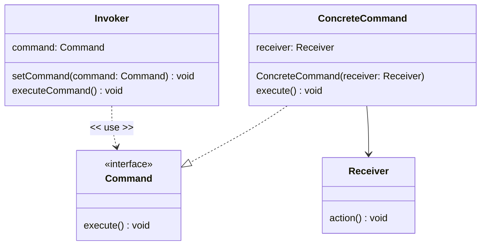
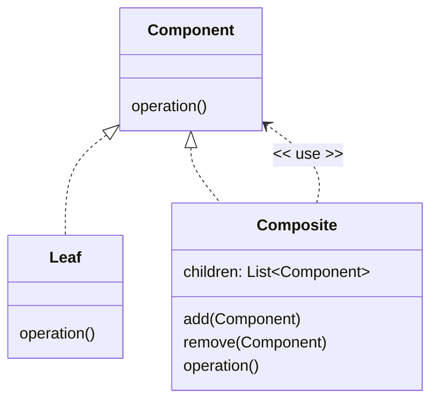

# Commands and Composites

We have categorised operations as being either **commands** (an operation which changes the state of the object) or **queries** (an operation that returns a value but does not change the object).

Sometimes we want to **undo** the effects of a command operation (Queries make no changes, there is no need to undo a Query). Applications such as text editors, word processors or graphics programs support an undo feature that allows you to undo multiple commands, possibly all the way back to the last time you saved a file.

Imagine we have a class with a method that updates a single integer value. We instantiate the class to create an object, and then request an operation to add to that value.

```Java
//Client Code

class MyClass {

    private int value = 0;

    void add(int i) {
        //some implementation
        value += i;
    }

    public int getValue() {
        return value;
    }
}


//Client Code
MyClass anInstanceOfMyClass = new MyClass();
anInstanceOfMyClass.add(2);
```
There is another way for the client code to request an operation from a supplier, which is to wrap the call in a **Command** object. This object captures the argument(s) provided to the operation, so that it has the knowledge to be able to undo the operation.

```Java

interface Command {

    void execute();
    void undo();
}

class AddCommand implements Command {

    private final MyClass receiver;
    private final int i;

    AddCommand(MyClass instanceOfMyClass, int i) {
        this.receiver = instanceOfMyClass;
        this.i = i;
    }

    @Override
    public void execute() {
        receiver.add(i);
    }

    @Override
    public void undo() {
        receiver.add(-i);
    }
}
```
Client Code usage for this is:

```Java
//Client Code
MyClass anInstanceOfMyClass = new MyClass();
Command command = new AddCommand(anInstanceOfMyClass, 2);
System.out.printf("value %d%n",anInstanceOfMyClass.getValue());
command.execute();
System.out.printf("value %d%n",anInstanceOfMyClass.getValue());
command.undo();
System.out.printf("value %d%n",anInstanceOfMyClass.getValue());

//Output
// value 0
// value 2
// value 0
```

We can create a range of different classes with the `execute` and `undo` methods, each one representing a different operation. If we keep a reference to each Command object after we have executed it, we have a history of operations and arguments.
If we run the history forward, we can repeat the sequence of operations. If we run the history backwards, we can undo a sequence of operations. This is essentially how undo and redo history works in software applications.

For example, if we store the history in a stack, we can retrieve the last operation by popping from the stack to create an undo capability.

```Java
MyClass anInstanceOfMyClass = new MyClass();
Stack<Command> history = new Stack<>();

System.out.printf("value %d%n",anInstanceOfMyClass.getValue());

Command add3 = new AddCommand(anInstanceOfMyClass, 3 );
add3.execute();
history.push(add3);
System.out.printf("value %d%n",anInstanceOfMyClass.getValue());

Command add4 = new AddCommand(anInstanceOfMyClass, 4);
add4.execute();
history.push(add4);
System.out.printf("value %d%n",anInstanceOfMyClass.getValue());

Command add5 = new AddCommand(anInstanceOfMyClass, 5);
add5.execute();
history.push(add5);
System.out.printf("value %d%n",anInstanceOfMyClass.getValue());

//Undo the command history
while(!history.empty())
{
    history.pop().undo();
    System.out.printf("value %d%n",anInstanceOfMyClass.getValue());
}

// Output
// value 0
// value 3
// value 7
// value 12
// value 7
// value 3
// value 0

```

How the undo is performed depends on the application—in this example we stored the argument(s), but the command object could capture the state of a system before the operation is executed, and then restore the system state to its previous position as an undo.

This is called the **Command** pattern. We create a class that holds a reference to the object we want to invoke the operation on (the **Receiver**) along with any argument(s) we want to use on the operation.

All these command classes implement a common interface (The `Command` interface in this example). The **Invoker** of the operation does not need to know any details of the **Receiver** or the operation being requested or the arguments being passed, it only has to call the uniform interface methods (`execute` and `undo` in this example).

The Command pattern separates making the decision about receivers and arguments from the invocation, which means that Invoker and Receiver don't need to know about each other, promoting flexibility and maintainability.

The Command pattern is widely used in textual and graphical UI menus. The menu can be created with each menu item attached to a Command object. When the user selects an item from the menu, call the `execute()` method on the attached command object.

For example, assume we have Cut, Copy and Paste classes the implement the Command interface.

```Java

//Create the Menu
Map<String, Command> menu = new HashMap<>();
menu.put("Cut", new CutCommand());
menu.put("Copy", new CopyCommand());
menu.put("Paste", new PasteCommand());

//User selects item from the menu
String selection = "Copy";

//Execute the command
menu.get(selection).execute();
```
It is the program's decision as to what menu options are shown to the user, it is the user's decision as to which command they want to be executed.

## General version of the Command pattern

In the general case the Command interface has an `execute()` method, and may have an `undo()` method. The ConcreteCommand implements the interface, and aggregates the object that will perform the operation, which is called the Receiver. The Invoker is any code that stores an instance of a ConcreteCommand for later execution.



## Composite Commands

A **Composite** command encapsulates multiple Command objects, so that the invoker is unaware if it's invoking none, one or many (`0..*`) operations.

The composite implements the same Command interface with the `execute()` and `undo()` methods, but just applies the operations to a list of Command objects. Note the use of the reversed list for the undo, as operations should be undone in the reserve order to the order they were applied.


```Java
class CompositeCommand implements Command {

    private final List<Command> commands = new ArrayList<>();

    void add(Command command) {
        commands.add(command);
    }

    @Override
    public void execute() {
        commands.forEach(Command::execute);
    }

    @Override
    public void undo() {
        commands.reversed().forEach(Command::undo);
    }
}
```
Usage:

```Java
MyClass anInstanceOfMyClass = new MyClass();
System.out.printf("value %d%n",anInstanceOfMyClass.getValue());

Command add3 = new AddCommand(anInstanceOfMyClass, 3 );
Command add4 = new AddCommand(anInstanceOfMyClass, 4);
Command add5 = new AddCommand(anInstanceOfMyClass, 5);

CompositeCommand compositeCommand = new CompositeCommand();
compositeCommand.add(add3);
compositeCommand.add(add4);
compositeCommand.add(add5);

executeCommand(compositeCommand);
System.out.printf("value %d%n",anInstanceOfMyClass.getValue());
undoCommand(add4);
System.out.printf("value %d%n",anInstanceOfMyClass.getValue());

private static void executeCommand(Command command) {
    command.execute();
}
private static void undoCommand(Command command) {
    command.undo();
}


// Output
// value 0
// value 12
// value 8
```
In this example we with work the command interface via the `executeCommand` and `undoCommand` static functions, and do not care if the concrete object is a composite command or a single command.

## The Composite Pattern
The ability for a client to work with either a single instance or list of instances in a uniform way is a common requirement.

In a tree structure, a node could be a leaf (i.e., a node without children), or a node with children. A client probably wants to deal with both types of nodes the same way.

If we take our Menu structure example, a menu item can either be a standalone menu item or a submenu (a named list of menu items) which form a tree structure.

The generic thing we want to do is display a menu item regardless if it is a leaf or a submenu. As ever, we start with an interface implemented by either leaf items or submenus.

```Java
interface MenuItem {
    void display();
}
```

The interface is implemented using an abstract superclass, and concrete leaf and composite classes.

```Java

abstract class AbstractMenuItem implements MenuItem {
    private final MenuItem parent;
    protected final String name;

    AbstractMenuItem(MenuItem parent, String name) {
        this.parent = parent;
        this.name = name;
    }

    @Override
    public abstract void display();

    @Override
    public String indent() {
        return Objects.isNull(parent) ? "" : String.format("%s%s", parent.indent(), INDENT);
    }
}

class LeafMenuItem extends AbstractMenuItem implements Command {
    private final Command command;

    LeafMenuItem(CompositeMenuItem parent, String name, Command command) {
        super(parent, name);
        this.command = command;
    }

    @Override
    public void display() {
        System.out.printf("%s%s%n", indent(), name);
    }


    @Override
    public void execute() {
        command.execute();
    }
}

class CompositeMenuItem extends AbstractMenuItem {

    private final List<MenuItem> items = new ArrayList<>();

    CompositeMenuItem(String name) {
        this(null, name);
    }

    CompositeMenuItem(CompositeMenuItem parent, String name) {
        super(parent, name);
    }

    @Override
    public void display() {
        System.out.printf("%s%s >%n", indent(), name);
        for (MenuItem item : items) {
            item.display();
        }
    }

    public void add(MenuItem newItem) {
        items.add(newItem);
    }
}
```
Usage:

```Java
CompositeMenuItem menu = new CompositeMenuItem("Edit");
LeafMenuItem cut = new LeafMenuItem(menu,"Cut", new CutCommand());
LeafMenuItem copy = new LeafMenuItem(menu,"Copy", new CopyCommand());
menu.add(cut);
menu.add(copy);

CompositeMenuItem subMenu = new CompositeMenuItem(menu,"Paste");
LeafMenuItem  pasteFormatted = new LeafMenuItem(subMenu, "Paste Formatted", new PasteFormattedCommand());
LeafMenuItem  pastePlain   = new LeafMenuItem(subMenu, "Paste as Plain Text", new PasteAsPlainTextCommand());
subMenu.add(pasteFormatted);
subMenu.add(pastePlain);

LeafMenuItem  delete = new LeafMenuItem(menu,"Delete", new DeleteCommand());
menu.add(delete);

menu.display();

// Output
// Edit >
//    Cut
//    Copy
//    Paste >
//       Paste Formatted
//       Paste as Plain Text
//    Delete
```
The general form of the Composite pattern is shown here, but in practice, there are many different ways of implementing the Composite pattern. The unifying theme is that the API that the client sees is the same regardless if the object the client is using is a leaf or a composite, and that composites can be made up of more leaves and more composites.


