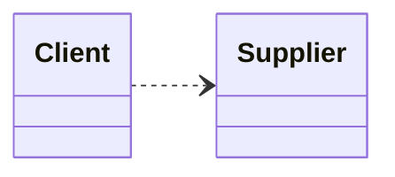
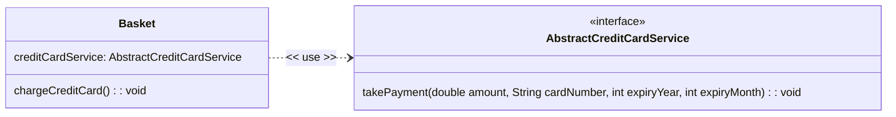
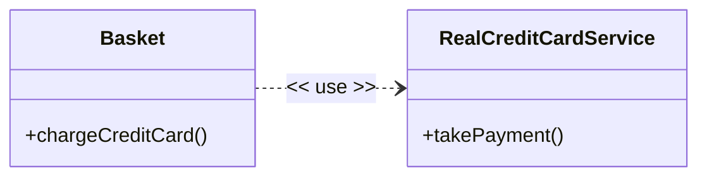
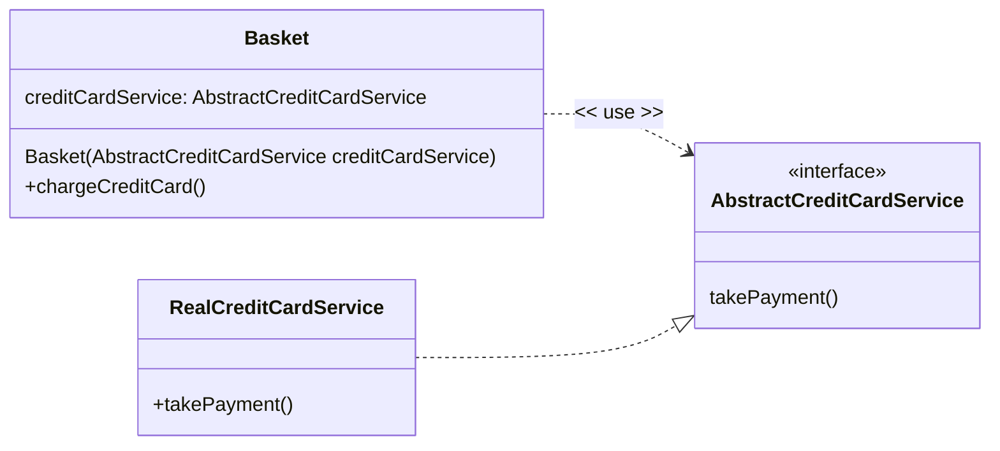
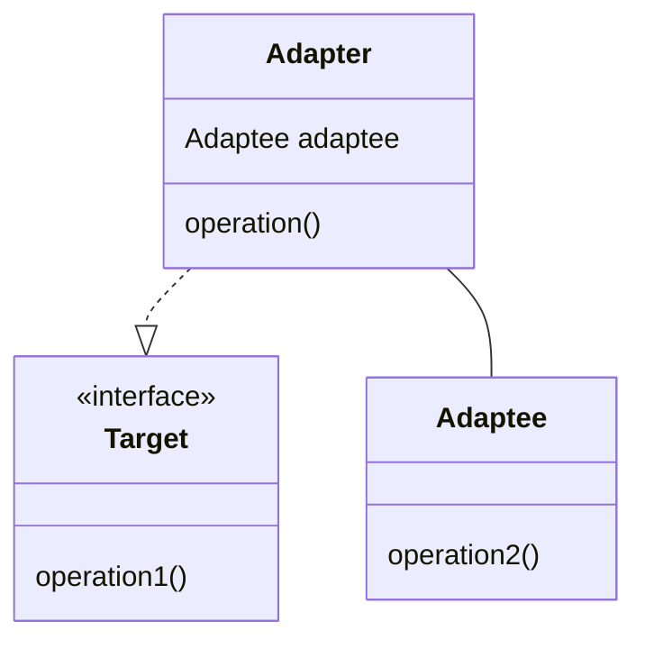
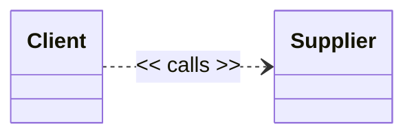
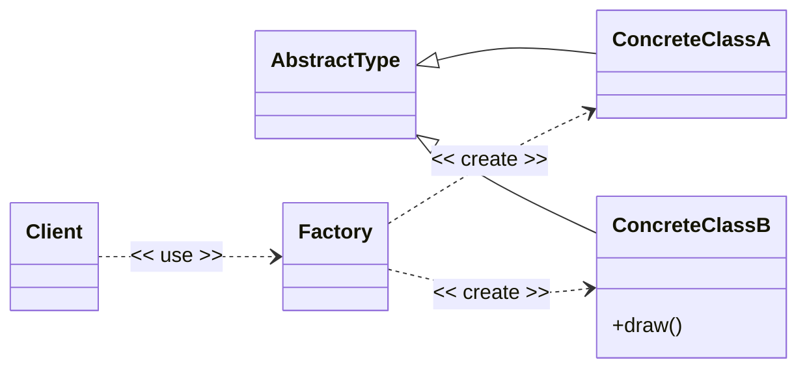
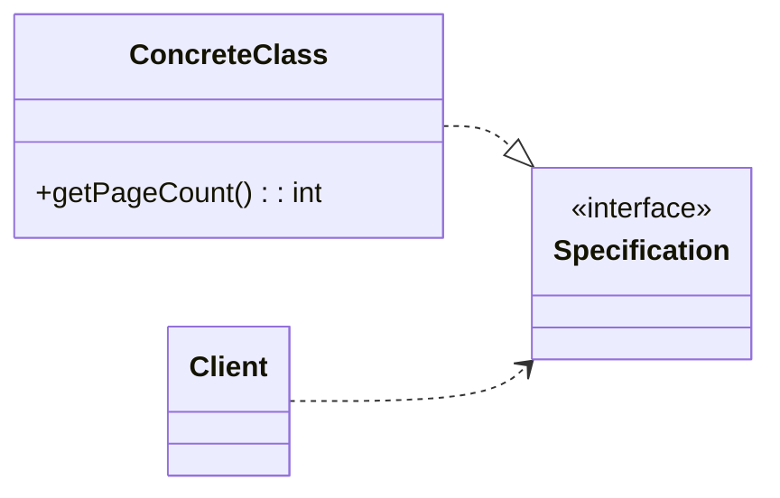
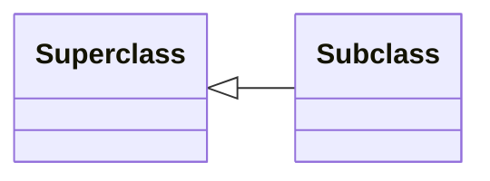
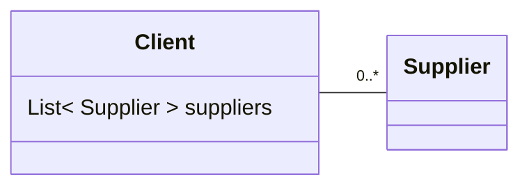

# Dependencies

A **Dependency** is a general term for any relationship between two types where the **client** type makes use of the services provided by a **supplier** type to implement its behavior.

- The **client** uses the dependency for its full implementation.
- A change in the **supplier** might require a change to the client.

> ⚠ Technically we are talking about a **usage** dependency in that the client **uses** the supplier. The UML keyword is `<<use>>`. Other kinds of dependencies exist which we cover later.

Take for example some code using the Java String class.

```Java
class aClass{
    void aMethod()
    {
    String string1 = "abc";
    String string2 = "def";
    // string3 = "abcdef"
    String string3 = string1.concat(string2);
    }
}
```

Here the code has a dependency on the String class, specifically the String constructor because behind the scenes, the compiler automatically converts `String string1 = "abc";` into something like
```Java
char data[] = {'a', 'b', 'c'};
String string1 = new String(data);
```
and also the `concat(String str)` method, which returns a string that represents the concatenation of the string and the string passed as argument.

Changes to the name of the String class or changes to the signatures of these String methods will break the client code, but would at least be picked up by the compiler. Changes to the implementation (for example, if the concat method started putting a hyphen between the two strings so it returned `abc-def`) would only be picked up in testing or when the product failed in use.

In UML a dependency is shown as a dashed arrow from the client to the supplier, the arrowhead points at the thing being depended upon (the supplier).



You cannot write any meaningful software without depending on other classes or (at a higher level) packages (libraries), so you cannot avoid dependencies, but there are some ways to mitigate the risk of using a dependency.

We have different strategies depending on if we hope the dependency won't change or if we know the dependency will change.

**Encapsulation and the SRP**

The first defense is that any code you write uses encapsulation and the single responsibility principle.

- Classes encapsulate changeable implementation detail behind long-lasting APIs that have been designed to have a contract that is less likely to change. In Java, we use the private and package private access specifiers to hide implementation detail.
- Classes that only have one reason to change (The Single Responsibility Principle) so that if a supplier class does have to change, fewer clients are affected.

**Stable Dependencies**

We use a large number of Java classes written by others. When using libraries the standard Java class library, we can assume that these dependencies are **stable**, i.e. they won't change.

For example, we don't worry about our dependency on the Java String class because is very stable. And any changes to this class are very rare and very controlled.

> Sometimes you will see a class or method has been **deprecated**, and the documentation says you should use an alternative.
> **Deprecated** means that the class or method is no longer recommended for use and may be removed in future versions of the software or API.
> This is one way that change happens in a stable way - the original code is left unchanged, but the library providers are telling developers that they should avoid using the deprecated feature and use the new alternative instead. This is also a warning and that they should migrate their existing client code to the use the new replacement instead.

**Volatile Dependencies**

Volatile dependencies are dependencies we know (or at least suspect) will change over time or will need to be swapped for different scenarios (usually differences in test and production, or because the technology will change). Will will a technique to mitigate this called **Dependency Inversion**.

Going back to our E-Commerce example, assume that having put products into an e-commerce basket, we want to take payment via a credit card.

> In a real service we would create a ValueObject representing a CreditCard that validated and held the card number and expiry properties

```Java
class RealCreditCardService {

    public RealCreditCardService() {
    }

    public void takePayment(double amount, String cardNumber, int expiryYear, int expiryMonth) {
        // Actually charge card through integration with payment processor
    }
}


class Basket {

    final RealCreditCardService creditCardService;

    public Basket() {
        this.creditCardService = new RealCreditCardService();
    }

    double getTotal() {
        //Get sum total of goods, tax and delivery
        return 100.0d;
    }

    public void chargeCreditCard(String cardNumber, int expiryYear, int expiryMonth) {
        creditCardService.takePayment(getTotal(), cardNumber, expiryYear, expiryMonth);
    }
}
```

We would create a basket as part of our process in our website code.

```Java
Basket basket = new Basket();
//put things in basket
//ask customer for credit card info
basket.chargeCreditCard(" 4111 1111 1111 1111", 2028, 12);

```
Note how the dependencies match the natural order of the calls:

`Website (the outmost controlling thing) -> Basket -> RealCreditCardService`

However, the problem comes when we want to write tests for the Basket class. The Basket has a dependency on a concrete class implementing an integration with a real credit card processor. Every time we test the checkout process, we will require a real credit card, and if we run enough tests we will use up all the credit available on the credit card. My Basket class is not very **testable** because of its dependencies.

What I want to do is create a 'fake' credit card service that I can use for testing purposes,for example writing different test-specific services that approve a card, decline a card or simulate a failure due to a network error.

Now my dependency becomes **volatile**, I know in advance that I need to change behaviour between testing and production.

We can make our classes more **testable** by making the client depend on an `interface`. When we create the dependency as an interface rather than using a concrete class, we postpone the decision as to what concrete class we are going to use as the supplier. This is invaluable in testing because:

1. You are no longer having to provide real credit card data and end up charging real credit cards.
2. You can write different test-specific concrete classes and use them to support various test scenarios.

The first step is for the client (in this case the Basket) to define the interface it wants to depend on.

``` Java
interface AbstractCreditCardService {
     void takePayment(double amount, String cardNumber, int expiryYear, int expiryMonth);
}
```

Basket now depends on the interface rather than a concrete class. The UML notation for a dependency is a dashed line from the client to the supplier with an arrowhead pointing at the supplier. There can be a keyword applied to show what kind of dependency is taken.




```Java
class Basket {

    final AbstractCreditCardService creditCardService;

    public Basket(AbstractCreditCardService creditCardService) {

        this.creditCardService = creditCardService;
    }

    double getTotal() {
        //Get sum total of goods, tax and delivery
        return 100.0d;
    }

    public void chargeCreditCard(String cardNumber, int expiryYear, int expiryMonth) {
        creditCardService.takePayment(getTotal(), cardNumber, expiryYear, expiryMonth);
    }
}
```
In the production code, we will use a concrete instance of RealCreditCardService as the supplier.

```Java
class RealCreditCardService implements AbstractCreditCardService {

    public RealCreditCardService() {
    }

    public void takePayment(double amount, String cardNumber, int expiryYear, int expiryMonth) {
        // Actually charge card through integration with payment processor
    }
}
```
but when testing we can create a Basket class using test classes which (for example) mimic failed or successful payments.

```Java

class FailingCreditCardService implements AbstractCreditCardService {

    @Override
    public void takePayment(double amount, String cardNumber, int expiryYear, int expiryMonth) {
        //simulate a failed attempt to take payment
    }
}

class SucceedingCreditCardService implements AbstractCreditCardService {

    public SucceedingCreditCardService() {
    }

    public void takePayment(double amount, String cardNumber, int expiryYear, int expiryMonth) {
        //simulates a successful attempt to take payment
    }
}
```

To test, we create an instance of Basket takes whichever concrete class makes sense for the test we are trying to perform.

```Java
AbstractCreditCardService testService = new FailingCreditCardService();
Basket basket = new Basket(testService);
//put things in basket
basket.chargeCreditCard(" 4111 1111 1111 1111", 2028, 12);
```

By making Basket depend on an `AbstractCreditCardService` we have gained the ability to vary the concrete supplier so that we can support different test cases. If this looks like the **Strategy** pattern it is -  but rather than varying concrete implementations in our production code to deal with variation in algorithm, we are varying concrete implementations to support testing by creating concrete implementations specifically for test scenarios such as the `takePayment` method call failing.

> ☑ To make classes more testable, when your class takes a dependency on a concrete class (this could be that the class is holding a reference to a concrete class, or a reference to a concrete class passed as a method parameter) consider replacing the concrete class with an interface. Then you can create different concrete classes that implement that interface to support a variety of test cases.

We only need to do this when the thing we depend upon is going to change. When we consider testability, more of our dependencies become volatile (subject to change) rather than stable because we want to provide test case specific versions of those dependencies. A good example of what would normally be stable but needs to be changed for testing is the use of time.

Going back to our basket `takePayment` method, we will want to validate the card expiry date provided as month and year. The code might look something like this.

```Java
public void takePayment(double amount, String cardNumber, int expiryYear, int expiryMonth) {

    LocalDateTime now = LocalDateTime.now();
    if (expiryYear > now.getYear() || (expiryYear == now.getYear() && expiryMonth >= now.getMonthValue())) {

    }
}
```
The problem here is that my client class (the Basket in this case) has coupled to a concrete supplier class that can only return the time in the local time zone according to the system clock of the machine the code is running. This is fine for production use where we always want to compare against current time, but bad for testing where we want to run tests with where cards pass or fail the expiry check. An analogous situation would arise if we provided a discount code that had an expiry date.

The solution is to replace the concrete class with an interface. To test for credit card expiry we only need a year and month value, so we might call the interface YearMonthProvider. As we did with the CreditCardService, we can now create real and test implementations of the YearMonthProvider interface.

```Java

interface YearMonthProvider {
    getYear();
    getMonth();
}


class TestYearMonthProvider implements YearMonthProvider {
    private final LocalDate currentDate;

    public TestYearMonthProvider(LocalDate currentDate) {
        this.currentDate = currentDate;
    }

    @Override
    public int getYear() {
        return currentDate.getYear();
    }

    @Override
    public int getMonth() {
        return currentDate.getMonthValue();
    }
}

class RealYearMonthProvider implements YearMonthProvider {

    @Override
    public int getYear() {
        return LocalDate.now().getYear();
    }

    @Override
    public int getMonth() {
        return LocalDate.now().getMonthValue();
    }
}
```
Usage

```Java
public void takePayment(double amount, String cardNumber, int expiryYear, int expiryMonth, YearMonthProvider provider) {

    if (expiryYear > provider.getYear() || (expiryYear == provider.getYear() && expiryMonth >= provider.getMonthValue())) {

    }
}
```

There is an industry term **flaky tests** for tests that sometimes pass and sometimes fail when the code under test has not changed. The cause is often that the code under test has a dependency on something that is **non-deterministic**  - has different behavior every time you run the test. Common sources of non-deterministic behavior are looking up time, looking up some form of system configuration and use of random numbers.

> ☠ Do not take dependencies on concrete classes that have **non-deterministic** behavior - time being a good example. Always create a provider interface so that you can substitute the real non-deterministic thing for a provider under your control.

> ⚠ The same principle applies when you want to support different implementations in production code. For example, you might want to support different payment processors (PayPal, Stripe, WorldPay etc.), and want to swap in a different production implementation of the `AbstractCreditCardService`.

## The Dependency Inversion Principle (DIP)

A simple interpretation of the Dependency Inversion Principle is that clients should depend on an `interface` or `abstract` classes rather than concrete classes. When a client depends on an interface then it is not coupled to any particular supplier, so we can change the concrete supplier at runtime - very useful for handling variation in algorithms (which we saw with the Strategy pattern) and substituting test versions in testing scenarios or using different production implementations depending on some system configuration or user choice.

When a client uses (depends on) a concrete supplier, the API the client uses is defined by the supplier - the client is *forced* to use the supplier's API. When we change this so that the client uses (depends on) an interface it is the client that defines the interface that it needs, and it is now the supplier class that is forced to use the client's interface declaration.

It is this inversion of the direction of the dependency that gives the principle its name. In our example the definition of `AbstractCreditCardService` is controlled by the client (in this case a Basket) because it is the Basket that determines the requirements for the interface. Now instead of the Basket having a dependency on `RealCreditCardService`, `RealCreditCardService` and all the other concrete implementations depend on  `AbstractCreditCardService`, so now the suppliers depend on the client, rather than the other way around. The normal dependency relationship is inverted.

This applies not only to individual classes but to Java packages as well. If I have a concrete dependency from Basket to RealCreditCardService, the Java package containing the `Basket` class has a concrete dependency on the package containing the `RealCreditCardService` class. You know you have a package dependency where you see an `import` statement or a fully qualified class name. If we invert the dependencies then the package with the `RealCreditCardService` depends on the package containing the `Basket` class. This means we can have different packages for real and test implementations of the `AbstractCreditCardService` interface, which keeps the two codebases separated. We can swap between real and test implementations by swapping Java packages.

The full definition of the Dependency Inversion Principle is in Martin and Martin (2007 p 154):

- High-level modules should not depend on low-level modules. Instead, they should depend on abstractions.
- Abstractions should not depend on details. Details should depend on abstractions.

In the first sentence and in our context, module means Java class or package. High-level and low-level are the positions in the call chain. In the example without dependency inversion a method in the `Basket` class methods on `RealCreditCardService` - Basket is higher in the call chain. **Abstractions** mean Java interfaces or abstract classes. By introducing AbstractCreditCardService both `Basket` and `RealCreditCardService` now depend on the abstract `AbstractCreditCardService` interface.

The second sentence is a way of saying that the abstraction we make (in Java the `interface` we design) should not be influenced by implementation detail, instead the implementation detail should depend on the abstraction we have designed. Take the example where we tested the credit card expiry date. The general idea is that we confirm the credit card date is valid, but the initial implementation was very coupled and dependent on a specific way of doing this using the `LocalDateTime` class (the detail). The idea of testing a credit card expiry date only really needs a year and month value which is reflected in the `interface`. We now write a detail class that happens to use `LocalDateTime`, but only exposes the year and month value as required by the abstraction.

>⚠ You may also see the principle being explained in terms of **Policy** and **Mechanism**, or **Policy** and **Detail**.
> A **Policy** class embodies the high-level business rules and goals. **Mechanism** or **Detail** means the lower level concrete implementation details.
> Both the **Policy** and **Mechanism** classes depend on abstractions

### Example

#### Without using Dependency  Inversion Principle (DIP)

Without using the DIP, in our example above the Basket class would have a concrete using dependency on the RealCreditCardService class



The higher level Basket class depends on the detail of the lower level RealCreditCardService class.

The direction of the dependency is from the client (Basket) to the supplier (RealCreditCardService) is the same as the flow of control in the code. i.e. the Basket class calls methods on the RealCreditCardService class.

#### Using the Dependency Inversion Principle (DIP)

With the Dependency Inversion Principle, the higher level Basket class depends on an abstraction (a Java `interface`) that _it_ defines, and the RealCreditCardService class realizes (`implements` in Java) that interface.

The Basket class now has a compile time dependency on the `AbstractCreditCardService` interface, which is an abstraction defined at the same level in the call chain as the Basket class.

The RealCreditCardService class also has a compile time dependency on the same interface, but now the lower level detail class depends on the abstraction defined by the higher level Basket class. The dependency is now inverted.

The flow of control remains the same, control flows from the Basket class to the method in the RealCreditCardService class, but now the flow is via the AbstractCreditCardService interface.



As the Basket is no longer creating a concrete instance of the AbstractCreditCardService it has to be provided with an instance one somehow.

Typically, this is done by the Basket constructor taking an instance of the AbstractCreditCardService as a parameter. This is called **Constructor Injection** because the dependency is **injected** into the Basket class via its constructor.

#### The Explicit Dependency Principle

Classes that are provided with their dependencies satisfy the **Explicit Dependency Principle** which states that a class should explicitly declare its dependencies, rather than creating them internally. By making these dependencies part of the public API of the class, the dependencies become clear and explicit.

> ⚠ Remember, not all dependencies need to be explicit or injected. Most dependencies are stable and do not change, so it is acceptable to create them internally in the class. The Dependency Inversion Principle is about making dependencies explicit when they are volatile or likely to change, such as when we want to support testing or swap different implementations of the dependency.

#### The Configurator

Clearly if the Basket is not instantiating a concrete implementation of the `AbstractCreditCardService`, then something else in the software product has to take responsibility for creating the instance and passing it to the Basket class.

This is often done by **configurator** code running in the startup of the application, for example in the `static main()` function.

```Java
AbstractCreditCardService creditCardService = new RealCreditCardService();
// The Basket is configured with a concrete instance of the AbstractCreditCardService via Constructor Injection
Basket basket = new Basket(creditCardService);
// put things in basket
basket.chargeCreditCard("4111 1111 1111 1111", 2028, 12);
```

## Using Factories

In the example above we have provided an instance of a concrete implementation of the `AbstractCreditCardService` interface to the Basket class. The instance was created elsewhere by the configurator.

If the client class needs to create instances of the abstract interface itself, we can use a **Abstract Factory**. This is still a form of dependency inversion because the client is still depending on the abstract interface, but now the client is also depending on a factory interface that creates instances of the abstract interface.

For example, the Basket still defines the `AbstractCreditCardService` interface, but now it also defines a `AbstractCreditCardServiceFactory` interface that creates instances of the `AbstractCreditCardService` interface. A concrete Factory is provided by the configurator code.

## The Adapter Pattern

If our higher level modules define Java interfaces, and we want to provide implementations using lower level detail classes such as libraries (including the Java standard library) or other code not under our control, it is highly likely that the API of the lower level detail classes you want to use will not be an exact match for the `interface` defined by the higher level module.

We can solve this problem using a common design pattern called the **Adapter Pattern**. The adapter pattern solves the problem when you want to use an existing class, but its API does not match the API you need (Gamma *et al.* 1994 p139).

Let us for example say that we have a library that contains a class that provides highly accurate real time clock information from some atomic clock source on the internet, but returns the current time as the number of milliseconds since the Unix epoch (Unix represents time as number using 0 to mean January 1, 1970, 00:00:00 UTC).

The API for the class is simple:

```Java
class AtomicTimeSource
{
    public long getTimeInMs();
}
```

We want to use this to get the current Year and Month for our credit card validation example, but the interface we require is:

```Java
interface YearMonthProvider {
    int getYear();
    int getMonth();
}
```

We write an **Adapter** class that converts from the API of the AtomicTimeSource to the API expected by our credit card validation.

```Java
class AtomicTimeSourceAdapter implements YearMonthProvider {

    private final long  timeInMs;

    public AtomicTimeSourceAdapter(AtomicTimeSource source) {
        this.timeInMs = source.getTimeInMs();
    }


    @Override
    public int getYear() {
        //logic to convert timeInMs to year
    }

    @Override
    public int getMonth() {
        //logic to convert timeInMs to month
    }
}
```

In its general form an **Adapter** adapts an **Adaptee** to a **Target** interface.



Start with the Target interface - in this example the interface has a single method `void operation1()`;

```Java
interface Target {
    void operation1();
}
```

Assume the class we want to adapt is called `Adapatee` and has a single method `void operation2()`;

```Java
class Adaptee {
     public void operation2() {
        //actual operation
    }
}
```

Create an adapter that wraps the adaptee, as we saw with the Decorator. The adapter will always forward on the call to the adaptee, but do whatever is necessary to convert the requested operation into an  operation that is legal for the adaptee.

```Java
class Adapter implements Target {

    final Adaptee adaptee;

    Adapter(Adaptee adaptee) {
        this.adaptee = adaptee;
    }

    @Override
    public void operation1() {
        //do whatever is necessary to convert the operation1() call to a call to operation2() on the adaptee interface
        adaptee.operation2();
    }
}
```

The client calls the adapter, which in turn calls the relevant method(s) on the adaptee.

```Java
Adaptee adaptee = new Adaptee();
Target target = new Adapter(adaptee);
//ends up calling operation2() on the adaptee
target.operation1();
 ```
The adapter has an aggregates the adaptee and implements whatever logic is necessary to convert between the required operations on the target and the available operations of the adaptee.

## Other kinds of dependencies in software design

There are many different kinds of dependency relationships in software. Some selected examples.

### Call Dependencies

A `<<call>>` dependency exists when a method in one class calls an operation in another. Recall that getting or setting field values and invoking methods are all operations.

For example if a method in the Client class calls an operation of the Supplier class.


You would need some additional documentation to describe which method in the Client class calls which operation of the Supplier class.

### Creation Dependencies

A `<<create>>` dependency exists when a class creates instances of another class.

For example an abstract factory class depends on the concrete classes it creates.

For example the Client class uses a Factory, the Factory has a `<<create>>` dependency on all the concrete classes it creates (in this example ConcreteClassA and ConcreteClassB)


### Instantiation Dependencies

A `<<instantiate>>` dependency exists when a method of one class creates instances of another class.

In this example a method in the Client class instantiates an instance of the Supplier class.

````mermaid
classDiagram
    direction LR

    class Client {
    }

    class Supplier {

    }

    Client ..> Supplier : << instantiate >>
````
As before you would need some additional documentation to describe which method in the Client class instantiates the Supplier class.

### Realization Dependencies

A realization dependency exists between a specification and an *implementation* of the specification. If the specification changes, then the implementations will need to change.

For example, a Java concrete class that implements an interface *realizes* the interface. The realization is shown as a dashed line with a triangle point to the supplier of the specification.


Note that both the ConcreteClass and the Client both depend on the specification. The Client uses the Specification to do some work, the ConcreteClass realizes the Specification. If the Specification changes then all concrete implementations of the specification and all clients of the specification will be affected.

This is one reason why getting the design of specifications correct is so important.

### Generalisation Dependencies

In Java, a superclass is a generalization of its subclasses. The subclass depends on all the public or protected members of all the direct superclass, and all the public or protected members of any ancestors of the superclass. Changes to any ancestor (one of the superclasses) could affect any descendants (subclasses).

In UML the generalisation relationship is shown as solid line with a hollow triangle pointing to the superclass.




### Association Dependencies

Associations are a specific type of dependency. An association between two classes indicates that a client class has a `<< use >>` dependency on the supplier class AND there a link made at runtime made between an instance of the client class and an instance of the supplier class.



In this example the client class has an association with zero to many (0..*) Suppliers.

In Java the link is maintained in an **instance variable** of type List<Supplier>.

## Package Dependencies

When you take a dependency on even a single class from another Java package, you create a dependency on the package. Furthermore, you also have a dependency on all the packages that the first package took and so on.

For example, if you take a dependency on a class from  Library A, and Library A, in turn, depends on Library B.

You have a direct dependency on Library A.
You have a **transitive** dependency on Library B.

A **transitive** relationship is a relationship that "carries through" or "passes across" indirectly through an intermediate step. In this case, we didn't directly state know that your project needs Library B, the dependency 'passes through' Library A.
