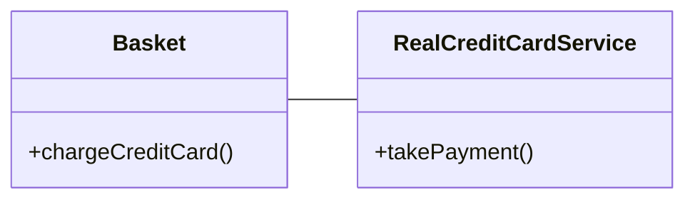
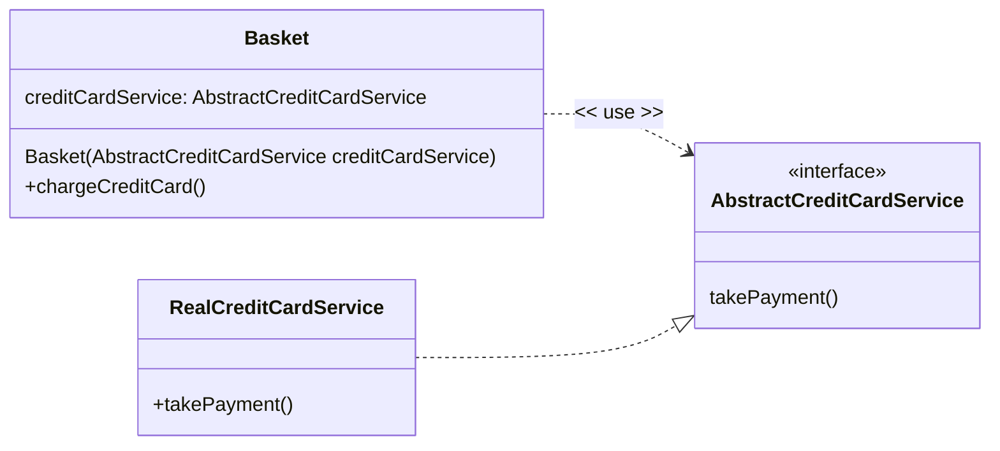

# Dependency Injection

## Recap of the Dependency Inversion Principle (DIP)

Recall previously we had an example of a `Basket` class that depended on a concrete implementation of a `RealCreditCardService` class to charge a credit card. This was a violation of the Dependency Inversion Principle (DIP) because the higher level `Basket` class depended on a lower level detail, the `RealCreditCardService`.



With the Dependency Inversion Principle, the higher level Basket class depends on an abstraction (a Java `interface`) that _it_ defines, and the RealCreditCardService class realizes (`implements` in Java) that interface. The RealCreditCardService concrete class depends on the higher level abstraction (the `AbstractCreditCardService`) defined by the Basket class.



## Dependency Injection (DI) Containers

As the Basket is no longer creating a concrete instance of the AbstractCreditCardService it has to be provided with an instance somehow. In our examples so far we have done the **dependency injection** by hand by writing the code that 'wires up' the Basket by passing the instance of the `AbstractCreditCardService` to the `Basket` class using  **constructor injection** - the **injection** of the dependency via the constructor of the class that needs the dependency. This is done in **configurator** code, as it configures the software product.


```Java
AbstractCreditCardService creditCardService = new RealCreditCardService();
// The Basket is configured with a concrete instance of the AbstractCreditCardService via Constructor Injection
Basket basket = new Basket(creditCardService);
// put things in basket
basket.chargeCreditCard("4111 1111 1111 1111", 2028, 12);
```

This is a reasonable for small applications, but as the application grows in size and complexity, it becomes harder to manage the dependencies between classes.

Software libraries called  **Dependency Injection Containers** (DI Containers) exist to take on the responsibility of creating instances of classes and injecting them into other classes. They have ways of changing which concrete implementation are instantiated at runtime, so you can have different configurations of your software product, for example to vary the composition of the product between test and production environments or to configure a software product for different markets.

> ⚠ DI Containers are also referred to as **Inversion of Control** or **IoC** Containers. **Inversion of Control** refers to the fact that control of creating and managing object dependencies moves from the application code to the container itself. Instead of your code instantiating and wiring up dependencies, the container does this automatically based on configuration or annotations.

There are many different DI Containers available for Java, and other DI Containers are available for other programming languages and platforms. Most of our examples in the module will not use a DI Container and are manually wired up. However, we can describe how we would wire up the `Basket` and `RealCreditCardService` classes using the Java Spring DI Container.

## Using the Spring DI Container

We create the AbstractCreditCard service interface, the concrete implementation, and the Basket class as before:

```Java
interface AbstractCreditCardService {
    void takePayment(double amount, String cardNumber, int expiryYear, int expiryMonth);
}

public class ConcreteCreditCardService implements AbstractCreditCardService {
    @Override
    public void takePayment(double amount, String cardNumber, int expiryYear, int expiryMonth) {
        // Simulate taking a payment (for demonstration purposes)
        System.out.println("Payment of £" + amount + " taken from card " + cardNumber + ", expiring " + expiryMonth + "/" + expiryYear);
    }
}

class Basket {

    private final AbstractCreditCardService creditCardService;

    public Basket(AbstractCreditCardService creditCardService) {
        this.creditCardService = creditCardService;
    }

    public void chargeCreditCard(String cardNumber, int expiryYear, int expiryMonth) {
        creditCardService.takePayment(100.0d, cardNumber, expiryYear, expiryMonth);
    }
}
```

We are using a command line application to demonstrate the use of the Spring DI Container.

```Java
import org.springframework.context.ConfigurableApplicationContext;
import org.springframework.context.annotation.AnnotationConfigApplicationContext;
import org.springframework.context.annotation.Bean;
import org.springframework.context.annotation.Scope;

public class DiExampleApplication {

    public static void main(String[] args) {

        try (ConfigurableApplicationContext ctx = new AnnotationConfigApplicationContext(DiExampleApplication.class)) {
            Basket basket = ctx.getBean(Basket.class);
            basket.chargeCreditCard("1234-5678-9012-3456", 2028, 6);
        }
    }

    @Bean
    @Scope("singleton")
    AbstractCreditCardService creditCardService() {
        return new ConcreteCreditCardService();
    }

    @Bean
    @Scope("prototype")
    Basket basket(AbstractCreditCardService creditCardService) {

        return new Basket(creditCardService);
    }
}
```

1. The static `main` method is the normal entry point for a Java application.
2. We create an instance of the Spring DI Container - the `AnnotationConfigApplicationContext` class using the try-with-resources pattern to ensure that the container closes gracefully.
3. Next we need to configure the Spring DI Container to tell it how create instances of classes. We do this by writing methods annotated with `@Bean` that create and return the instances we want. The `@Bean` annotation tells Spring that the method will return an instance of a class that should be managed by the Spring container. In this example we have two `@Bean` methods - one that creates and returns an instance of the `AbstractCreditCardService` interface (the concrete implementation of the abstract interface being `ConcreteCreditCardService`), and another that creates and returns an instance of the `Basket` class.
4. When it is created, the AnnotationConfigApplicationContext scans for `@Bean` methods and uses them to configure the DI Container. We have told it which class(es) to scan in by passing the `DiExampleApplication.class` to the constructor of the `AnnotationConfigApplicationContext`.
5. We ask the container to create an instance of the `Basket` class for us using `getBean()`.
6. The container uses its internal registry to find a @Bean method returning a Basket instance.
7. The container found that the `Basket` creation method required an `AbstractCreditCardService` as a parameter, so it looked for a bean of that type first, which resulted call the @Bean method that resolved (returned an instance of) the `AbstractCreditCardService` interface. The resolved interface was given to the constructor of the `Basket` class.
8. The container returned the fully constructed `Basket` instance to us.

> ☑ See the DIExample project in the Student code examples to see the full application.

Using a DI Container we just *declare* the dependencies, making it the responsibility of the DI Container to create the instances and inject them into the classes that need them.

## Lifetimes

DI containers also manage the **lifetime** of the objects they create.

In the example above we used the `@Scope` annotation to specify the lifetime of the beans.

The `@Scope("singleton")` annotation means that there will be only one instance of the `AbstractCreditCardService` class created by the DI Container, and that instance will be reused whenever an instance of that class is required.

The `@Scope("prototype")` annotation means that a new instance of the `Basket` class will be created each time it is requested from the DI Container.

By specifying the **singleton** scope the DI Container will use a form of the singleton pattern to ensure that (in this case) the same instance of the `AbstractCreditCardService` will always be provided, no matter how many basket instances the DI Container creates. This would replace any Java `static` instances in a codebase.

> ☠ In Spring's DI Container, the default scope is **singleton**. This means that if you do not specify a scope, the DI Container will provide a singleton. We would suggest always specifying the scope explicitly to make your intention clear. Other DI Containers have different defaults.

## Summary

Using a DI Container is optional - a DI container does nothing that you cannot do by hand in code. However, for large applications with hundreds or thousands of classes needing dependencies the writing and maintaining the code to manage and inject the dependencies and look after their lifetimes becomes an overhead.

The other benefit of using a DI Container is that it allows you to change the concrete implementations of the dependencies at runtime, for example to switch between a real service and a mock service for testing purposes based on if the application is running in a development, test or production environment.

For example, Spring Boot **profiles** allow you to define different configurations for different environments (e.g., development, testing, production). You can use profiles to activate specific beans based on some external signal such as an environment variable or a command line argument.

You  annotate beans or configuration classes with `@Profile("production")` to include them only when that profile is active. This helps manage environment-specific behavior without changing code.

## About Spring Boot

The example we have used is a simple command line application that creates and uses the Sprint DI container directly.

The ApplicationContext is the runtime DI container: it holds bean definitions and instances, manages lifecycle and has a getBean(...) method for requesting instances.

It is not the same as a full Spring Boot application, which is a framework for building enterprise-type applications. A `SpringApplication` will start web servers and run background tasks *as well as* managing the DI Container (an instance of an ApplicationContext).

The main use for Spring Boot is to create web applications (either serving web pages or providing REST APIs) and includes an embedded web server (such as Tomcat or Jetty) so you can run the application as a standalone Java application without needing to deploy it to a separate web server, however it can also be used for command line applications as we have done here.

Spring Boot takes care of a lot of the code that you would otherwise have to write for a production application including connecting to databases, logging and configuration management. It is large applications such at these that need the benefits of using a DI Container.

