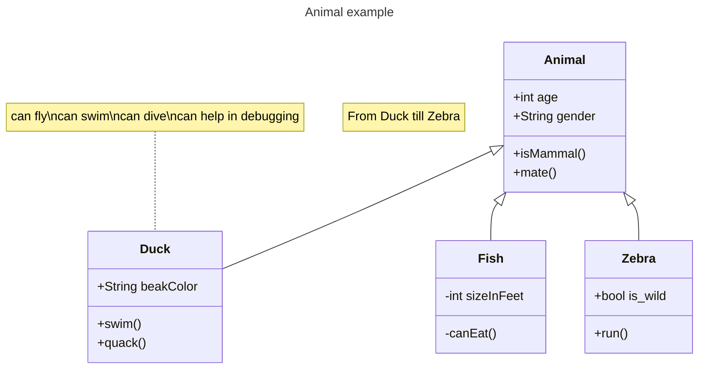
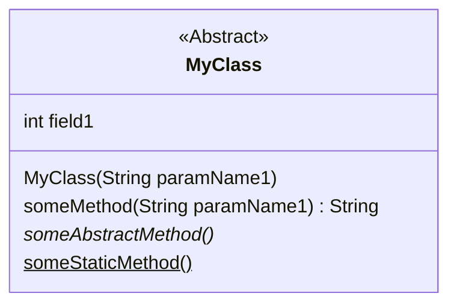
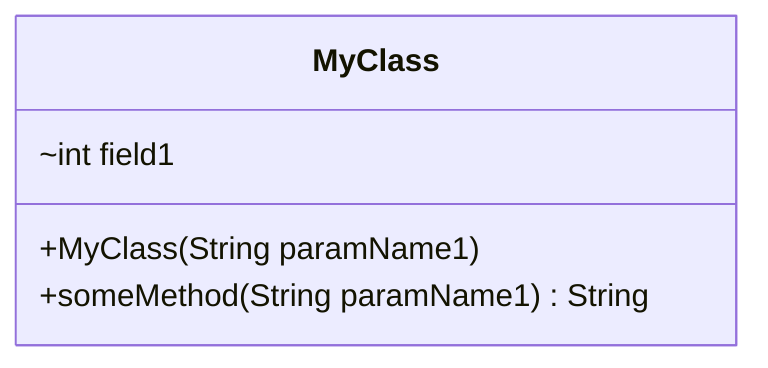
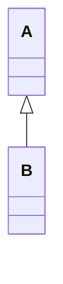
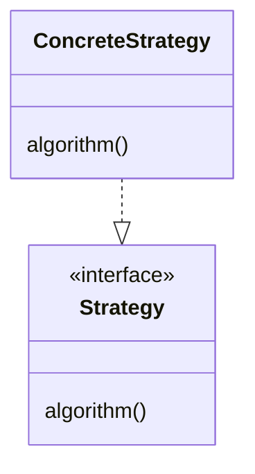
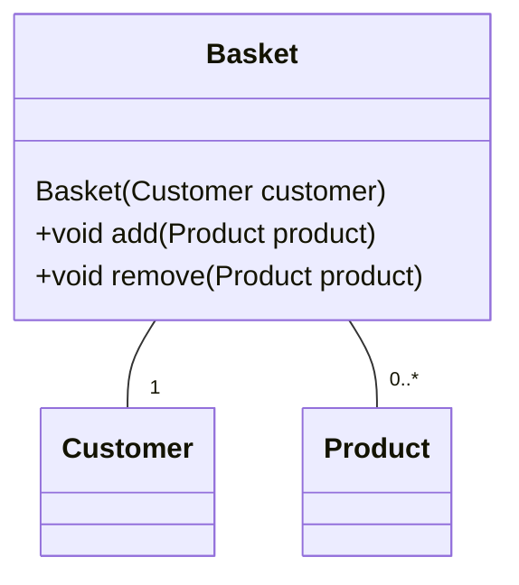

# Documenting software design

There is no single document template or structure for documenting a software design. However, we have suggested as a minimum that every project has a README.md document, written in **Markdown** and kept under source code control. The README contains the following sections.

- A description of the key classes and their responsibilities.
- An explanation of the flow through a successful program execution.
- An explanation of where and why design patterns have been used (naming the design pattern)

> ☑ Write the documentation in Markdown and keep the files with the source code and maintain it so that every time you make a change to the source code, the documentation is updated. Documentation kept somewhere else (such as a Word document) is not going to be under the same control, and you can never be sure which version of the documentation file goes with which version of the software.

> These are recommendations for student and personal projects. Professional software development organisations may have their own documentation tools, standards and expectations that you would need to conform to. Open source projects also have their own conventions for README files.

The typical location for the readme.md file is at the root of the project.

``` plain text
MyProject
  readme.md
  src/
      sourcefile1.java
      sourcefile2.java
      .
      .
      .
      sourcefileN.java
```

Documenting key classes first will tell the reader about the main concepts and relationships in the code. This is documenting the **static structure**, telling the reader the name and purpose of each class or interface and documenting its key features. To go with the text, we might draw the classes and their relationships in **UML Class Diagrams**. UML is the **Universal Modelling Language** and is a standard notation set by an independent standards group (Object Management Group 2017).   

Documenting the flow of execution tells the reader about the dynamic (changing over time) behavior of the software. Describing dynamic behavior of software is hard because of all the possible interactions and decisions, so we advise concentrating on the successful execution of the most common functionality, but documentation may also need to cover some important edge cases. Generally we would discuss behavior in terms of the communications between instances of classes at runtime. To go with the text, we might show the interactions between objects using a **UML Sequence Diagram**. If our software makes use of State Machines, then **UML State Diagrams** might be used.

All documentation projects have to balance what is described in the documentation (and must be maintained when the software changes) and what is left to the reader to work out by inspecting the source code or running the software. 

> ⚠ For small projects (such as student labs or assessment tasks), is it practical to document the entire static structure and dynamic behavior of software, but for larger systems documentation provides a higher level guide to the software with enough information for the reader to be able to navigate the code base (to look at the static structure) and run the software under the debugger (to understand the dynamic behavior). Detail is revealed by inspecting or debugging the source code, another reason for using coding conventions and consistent class layout to make the codebase more readable.


## Markdown

**Markdown** is a lightweight markup language. A Markdown file is a plain text file with added Markdown syntax. When the file is displayed in a suitable environment (such as an online GitHub or Bitbucket repository) the file is rendered with headings, ordered and unordered lists etc.  

Modern tools (such as Intelli-J or VS Code) have built in Markdown rendering so that you can observe what the rendered output looks like as you type. 

Although there is general agreement about the basic syntax for Markdown (**Commonmark**), different tools support "flavors" of Markdown with advanced features. For example, GitHub supports code blocks with syntax coloring for most development languages which greatly aids readability of code or code fragments within a Markdown document. Therefore, you will need to write your documentation in a specific flavor if you want to use those advanced features.

There is a 10-minute online tutorial on Markdown available from [https://commonmark.org/help/](https://commonmark.org/help/).

Follow the instructions at [https://www.jetbrains.com/help/idea/markdown.html](https://www.jetbrains.com/help/idea/markdown.html) to create a Markdown file in IntelliJ.

## Markdown on GitHub

GitHub will render any file with a .md extension using a Markdown renderer.

For a complete discussion on using GitHub Markdown in GitHub see [https://docs.github.com/en/get-started/writing-on-github](https://docs.github.com/en/get-started/writing-on-github).

## Diagrams in Markdown

Markdown supports the inclusion of images in a rendered page, but GitHub and other tools (including IntelliJ) support **Mermaid** code for creating diagrams. The benefit of using Mermaid syntax is similar to Markdown, Mermaid diagrams are encoded using a simple text language within a text file that can be maintained as an integral part of the source code.

For a full introduction and tutorial on the Mermaid syntax visit [https://mermaid.js.org/intro/](https://mermaid.js.org/intro/). There is a live editor that allows you to interactively develop mermaid diagrams.

> ⚠ To get mermaid diagrams displaying in IntelliJ's markdown renderer window requires installation of a plugin. Search for Mermaid in the JetBrains Marketplace or within the IDE under Settings > Plugins.

Mermaid supports UML **Class**, **Sequence** and **State** diagrams as well as Entity Relationship diagrams and other diagram types.

The following Mermaid code draws a complex class diagram.

```Plain Text
---
title: Animal example
---
classDiagram
    note "From Duck till Zebra"
    Animal <|-- Duck
    note for Duck "can fly\ncan swim\ncan dive\ncan help in debugging"
    Animal <|-- Fish
    Animal <|-- Zebra
    Animal : +int age
    Animal : +String gender
    Animal: +isMammal()
    Animal: +mate()
    class Duck{
        +String beakColor
        +swim()
        +quack()
    }
    class Fish{
        -int sizeInFeet
        -canEat()
    }
    class Zebra{
        +bool is_wild
        +run()
    }
```



## Documenting classes using Markdown and Mermaid

Markdown syntax allows you to create code blocks using **fenced code blocks**. Depending on the Markdown flavor, type three backticks (```) or three tildes (~~~) on the lines before *and* after the code block. For example, this will display code in Java syntax: 

`````
```java

```
`````

and this will display mermaid 

`````
```mermaid

```
`````

### Documenting classes

In Java a **Class** can have many **Members** and at least one **Constructor**. 

Members can be **Fields** or **Methods**.

For example, this abstract Java class has a field, a constructor, a concrete instance method, an abstract instance method and a static method. 

``` Java
public abstract class MyClass
{

    //field of primitive type
    int field_1;

    //Constructors have the same name as the class
    public MyClass(String paramName1)
    {
    }

    public String someMethod(String paramName1)
    {
        //Method body
    }
    
    abstract void someAbstractMethod();
    
    static int someStaticMethod()
    {
      //Method body
    }
} 
```
In Mermaid this would be coded as a class diagram.

`````


`````


We have also discussed accessibility of members and constructors in Java. In Mermaid, to describe the accessibility of a class member or constructor, optional notation may be placed before that feature's name:

```plain text
+ Public
- Private
# Protected
~ Package/Internal
```

We could enhance our diagram with these indicators:



> ⚠ Although it is possible to include every member and constructor and their accessibility in the diagram it makes the diagram harder to read and maintain. Our recommendation is to show only the most important features (if any) and not include the accessibility indicators. It is usually much more important to explain the role and responsibilities of the class and its relationships to other classes.

#### Subclassing

In Java, we create a specialize a class with a **subclass** using the `extends` keyword. In this example B is a **subclass** of A, A is the **superclass** of B.   

``` Java
public class A 
{
}

public class B extends A
{
}
```

In Mermaid, the relationship between A and B is described using the **Inheritance** relationship `<|--`.

`````

`````


#### Interfaces

In Java abstract interfaces are implemented by concrete classes using the `implements` keyword, in this example the ConcreteStrategy class implements the Strategy interface.

``` Java

public interface Strategy {
    void algorithm();
}

public class Context {
    
    private final Strategy strategy;

    public Context(Strategy strategy) {
        this.strategy = strategy;
    }
    
    public void operation()
    {
        strategy.algorithm();
    }
}

```
In Mermaid, interfaces are described as classes with an `<<Interface>>` annotation (called a Stereotype in UML) with a **Realization** relationship `..|>` between the concrete class and the interface. This Mermaid syntax

`````

`````
shows the interface and the realization relationship (the concrete class would use the `implements` keyword in Java) between the ConcreteStrategy class and the Strategy Interface.


#### Relationships between classes

Where there are relationships between classes, UML has a rich set of line types which are used to show the exact relationships between two or more classes. The exact meaning of the different kinds of connectors are defined in the UML standard (Object Management Group 2017), but for now we will only use the one kind, which is the **Association**: a solid line connecting two classes.

For example take a Basket class which is a relationship with a Customer class and holds multiple Products.

```Java
class Customer {
    
    String accountNumber;
    String name; 
 
    //rest of implementation omitted for clarity
}

class Product {
    String code;
    String description;
    double price;

    //rest of implementation omitted for clarity
}

class Basket {

    private final Customer customer;
    private final List<Product> products = new ArrayList<>();

    Basket(Customer customer) {
        this.customer = customer;
    }

    void add(Product product)
    {
        products.add(product);
    }
    void remove(Product product)
    {
        products.remove(product);
    }
    //rest of implementation omitted for clarity
}

```
When diagramming relationships we are probably not interested in all the detail of the fields, method or constructors in all the classes, but only want to show the relationships. The two fields in Basket:

```Java
private final Customer customer;
private final List<Product> products = new ArrayList<>();
```
are shown as associations using `--`, so there is no need to list the fields. 

`````

`````


We should show **multiplicities** on the associations. Multiplicities (also called cardinality) specify how many instances of one class can be associated with instances of another class. In the example above the Basket has a relationship with exactly one Customer and a relationship with zero or more Products. Multiplicities are important for showing if the relationship is to a single instance (in which cast the Java class will use a field) or to many instances (in which case the Java class will need to use an Array or one of the Java collection classes).

Multiplicity is expressed as `min..max` with `*` meaning an unbounded value. 

Some examples in Mermaid showing different multiplicities:

` A -- "1..1" B` (One): An instance of class A always has an association with at exactly one instance of class B.
```mermaid
classDiagram
  A -- "1..1" B
 ```

`A -- "1" B` (One): An instance of class A always has an association with at exactly one instance of class B, multiplicity abbreviated to just 1.
```mermaid
classDiagram
  A -- "1" B
 ```
`A -- "0..1" B` (Zero or One): An instance of class A can be associated with zero or one instance of class B.
```mermaid
classDiagram
    A -- "0..1" B
 ```

`A -- "0..*" B` (Zero to Many): An instance of class A can be associated with any number (including 0) of instances of class B.
```mermaid
classDiagram
    A -- "0..*" B
 ```

`A -- "*" B` (Zero to Many): An instance of class A can be associated with any number (including 0) of instances of class B, multiplicity abbreviated to *.
```mermaid
classDiagram
    A -- "*" B
 ```

`A -- "1..*" B` (One to Many): An instance of class A is associated with at least one instances of class B and possibly many.
```mermaid
classDiagram
    A -- "1..*" B
 ```

`A -- "2..3" B` (N..M): An instance of class A can be associated with at least N and at most M instances of class B (in this example 2 or 3)
```mermaid
classDiagram
    A -- "2..3" B
 ```

We would therefore draw the diagram above with the multiplicity indicators:

`````
```mermaid
classDiagram
  class Customer {
  }

  class Product {
  }

  class Basket {
    Basket(Customer customer)
    +void add(Product product)
    +void remove(Product product)
  }

  Basket  -- "1" Customer
  Basket  -- "0..*" Product
```
`````



### More about UML

The Universal Modelling Language is large and complex. However, if you want to draw diagrams to explain your code, or you want to draw diagrams to model someone else's code or any kind of software system, then the alternative is making up your own notation which will be non-standard. UML also provides standard definitions for terms used to describe software systems, and using the correct term will improve the accuracy of the documentation.

The full documentation of Mermaid code for drawing class diagrams is at [https://mermaid.js.org/syntax/classDiagram.html](https://mermaid.js.org/syntax/classDiagram.html), although other tools exist for drawing UML diagrams. Sometimes it is OK to just draw diagrams on paper and including a photo of the result.

Software engineering practitioners only use a subset of the full UML (although the exact subset will depend on the nature of the system being modelled). The book *UML Distilled : a Brief Guide to the Standard Object Modeling Language* (Fowler, 2003) describes a subset that should be known by a practicing software engineer. 

It is impractical to draw complete diagrams of anything but the most trivial software system, but diagrams that help the reader get started working with the codebase are a key part of software explanation and documentation.

Class and sequence diagrams can also be sketched out before code is written to experiment with different class structures and collaborations. This is quicker than writing code. 

## Documenting Contracts

In the examples above we showed how to include Java code and Mermaid diagrams in a Markdown document. These document physical things, being either a real or simplified representation of actual physical source code.   

We met the idea of a class or interface having a **contract**. Contracts descriptions of what a concrete or abstract class expects callers to be responsible for, and in turn what a caller can expect from the class. 

If documenting a contract, then you might describe the contract in these terms:

- The list of important **operations**. An operation is something that changes the internal state (the values of any fields) of an object or returns a value or both. Directly getting or setting field values and calling methods are both implementations of operations. You might state if an operation changes an object's state (it is a **command**) or not (a **query**). 

- The list of **pre- and post-conditions** for an operation. A **pre-condition** is an expression that must be true when an operation is called. A **post-condition** is an expression that must true when an operation completes.

- The list of **class invariants** that must be true after *any* operation has completed (including the operation that created the object).

- In Java the contract will also include the list of **checked exceptions** thrown by an operation. In Java exceptions can be either checked or unchecked. Checked exceptions are exceptions that are intended to be recoverable and the compiler enforces handling of checked exceptions. 

Again, a balance has to be struck between complete documentation of a contract (which will then have to be kept up to date with the actual source code) and letting the reader work out the contract from the actual source code.