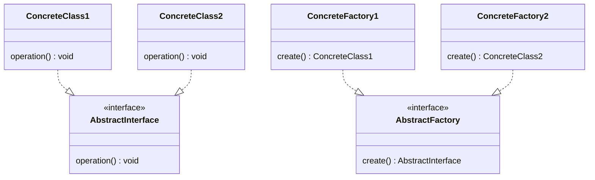
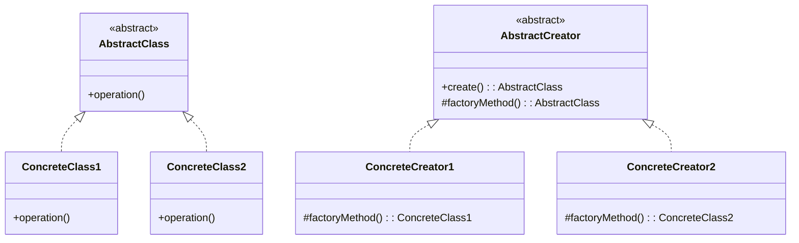
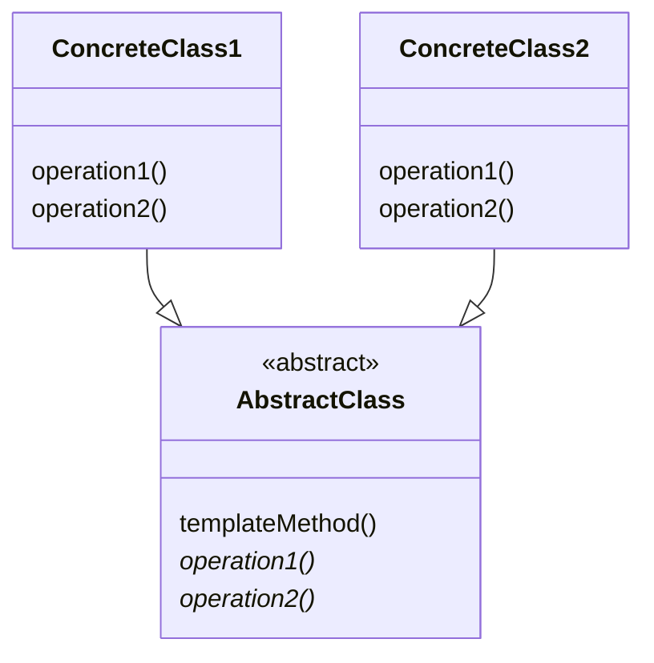

# Patterns for creating objects

## New Objects and Constructors
In Java the standard method for creating an **instance** of a class is by using the new operator. For example:

``` Java
FullPrice fullPrice = new FullPrice(100.0d);
MinimumPrice minimumPrice = new MinimumPrice(75.0d);
TaxCalculation standardTax = new StandardTax();
Product product = new AmazonProduct(new ASIN("B09P4L33SW"), fullPrice, minimumPrice, standardTax);
```

Example the code `FullPrice fullPrice = new FullPrice(100.0d);` is a **class instance creation expression** (in this case) creating a new instance of the FullPrice class.

Conceptually, when this line of code is executed:

1. Memory is allocated for the new class instance and all its fields. This means all the fields declared by the class and all the fields declared in its superclass(es) if the class. Our code assumes that there will be enough memory available - there isn’t a way to test if there is sufficient memory before calling new to create an object because the Java Virtual Machine (JVM) manages memory allocation and de-allocation dynamically and automatically. If it turns out there isn’t enough memory to allocate for a new object, the JVM will throw an `OutOfMemoryError`.
2. As each new field instance is created, it is initialized to its default value (we discussed the default values for primitive types earlier, and recall that the default value for reference types is `null`).
3. Then a **Constructor** is invoked. A Constructor is a special method which has the same name as the class. Like methods, constructors can be overloaded by providing different signatures. The specific Constructor used depends on the signature (the number and type of the parameters). The role of Constructor is to initialise any the fields belonging to the class that we want to have a non-default value. The constructors in the superclass(es) do the same for any fields belonging to the superclass(es). Invoking a constructor results in invoking at least one constructor for each superclass.
4. The value of a class instance creation expression is a **reference** to the newly created object of the specified class. In this case the variable `fullPrice` is holding the reference. You can think of a reference as holding the memory address of the object (although you cannot directly access the underlying memory through the reference). When you perform operations using a reference the runtime is responsible for performing the operations on the correct memory locations. This is why when you copy a reference, you don't create a copy of the object, all you are doing is creating another variable holding the same memory address.

The more complex example shown above is creating instance of AmazonProduct. In this case sufficient memory will need to allocated for references to the ASIN object, the FullPrice object, the MinimumPrice object and the StandardTax object.

## Garbage Collection
If we hold on to at least one reference to the object, the Java Virtual Machine (JVM) will keep the object in memory. But when all the variables holding the reference go out of scope or are set to `null` then the object becomes unreachable (there are no references to the memory in the program) and becomes the object becomes a candidate for **Garbage Collection**.

Any unreachable objects are taking up memory that cannot be used for new objects until the unreachable memory is reclaimed (the object is said to be destroyed). Every now and again the JVM stops your program execution and the JVM finds all the unreachable objects and reclaims the memory. The benefit of Garbage Collection is that memory that is no longer used is constantly being reclaimed without you having to think very much about it or write code for memory management.

This doesn't mean you can entirely forget about memory management. Creating large objects such as big arrays or lists and keeping references to them longer than necessary would be an example of poor memory management. Creating large static objects also consumes memory (memory used by static variables cannot be garbage collected).

For example, in the code

``` Java
FullPrice fullPrice = new FullPrice(100.0d);
MinimumPrice minimumPrice = new MinimumPrice(75.0d);
TaxCalculation standardTax = new StandardTax();
Product product = new AmazonProduct(new ASIN("B09P4L33SW"), fullPrice, minimumPrice, standardTax);
```
assuming we have not kept the references to the ASIN, FullPrice, MinimumPrice and TaxCalculation objects somewhere, the only references to these objects will be kept inside the AmazonProduct object. When the AmazonProduct object is garbage collected, then the references to ASIN, FullPrice, MinimumPrice and TaxCalculation objects will become unreachable, so the memory used by those objects can be reclaimed.

The implementors of Garbage collecting languages such as Java and C# have put a lot of effort into making the process as fast and efficient as possible, but Garbage Collection has a cost, and you cannot predict when the collector will freeze the operation of the program to reclaim space in memory.

Other languages (the C and C++ languages for example) make the programmer responsible for allocating and freeing memory as part of their program code. The main reason for wanting to take responsibility for memory management is that developer has complete control over when memory is freed - something that is not the case with Garbage Collection.

## Static Fields
In Java, it is possible to declare a field in a class as being `static`. If a field is declared static, there is one allocation of memory to the field contents which is referenced via class name. No instances of the class need to be created. `static` fields are initialised to their default value and can also be initialised through direct initialisation or an initialisation block. For example, these two initialisations are equivalent.

``` Java
public class MyClass {
    public final static int MY_FIELD = 42;
}

public class MyClass {
    public final static int MY_FIELD;
    static {
        myField = 42;
    }
}
```

Static fields do have a role in design:

- static fields used to hold constant primitive values (and if so use the CONSTANT_NAME naming convention)
- static fields used to create a single instance of a readonly class.

In both cases the field must be qualified with the `final` keyword to make them read only. The design of any class that is used this way must also be invariant (generally speaking all its fields are `final`).

These are examples of the **Singleton** pattern. Singletons are intended to be single primitive value or single object instance within the whole program. The main issue with Singletons is that their state can be updated by any part of the program and by any thread, unless they are immutable.

> ☠ The use of singletons is to be avoided UNLESS they are constants (immutable values or immutable objects).

Bear in mind that a singleton cannot be garbage collected, because conceptually all static variables belong to a class and not an instance, and that a class has a lifetime from first use to the complete termination of the program.

## Static Methods

A method that is declared `static` is called a **static method** or a **class method**.

A class method is always invoked *without* reference to a particular object (instance), so a class method cannot use instance fields (variables) or methods or the keywords `this` and `super`.

A class method can however reference static fields.

Conversely, a method that is not declared static is called an **instance method**.

Instance methods are always invoked *with* reference to a particular object (instance) and can use instance fields and methods, the keywords this and super as well as static fields and methods.

## Encapsulating creation logic in a creation method
Our guidance is that constructors should only contain pre-condition tests on constructor parameters and field initialisation. More complex creation logic should be moved into a static helper method.

For example, we might want to create a GTIN13 instance by parsing a string into the two components required by the GTIN13 constructor. This parsing code could get repeated multiple times in the product - string parsing code has nothing to do with initialising the GTIN fields (so we don't put that code in the constructor) and we want to follow following the DRY principle, so put the string parsing code into a static method that encapsulates all the validation and parsing logic in one place.

``` Java

public final class GTIN13 {


    public static GTIN13 parse(String s) throws InvalidException {

        s = requireValidGlobalTradeIdentifierString(s);
        CompanyPrefix prefix = new CompanyPrefix(Integer.parseInt(s.substring(0, CompanyPrefix.LENGTH)));
        ItemReference itemReference = new ItemReference(Integer.parseInt(s.substring(CompanyPrefix.LENGTH, LENGTH - 1)));
        return new GTIN13(prefix, itemReference);
    }

    public static GTIN13 tryParse(String s)
    {
        //could have written this using the conditional operator instead return isValid(s) ? parse(s) : null;

        if(isValid(s)) return parse(s);
        else return null;
    }
}

```
The other thing to note that the second of these creation methods can return `null` (something that a constructor cannot do - it either creates an object or throws an exception). We have called the method `tryParse` rather than just `parse` to indicate it could return `null`. Note also that we have two creation methods that have the same parameter lists but different names - something else you cannot do with constructors.

> ☑ Use a static creation method when you want to put complex creation logic in a single place (the Don't Repeat Yourself principle). Although these creation methods can return null, make sure the method name indicates this, as generally we expect creation to either succeed or throw an exception.

## Creating Subclasses of Abstract Products

In our system now we have concrete `RetailProduct` and `AmazonProduct` classes which are both subclasses of the abstract `Product` class. We have handled the structural variations between RetailProduct and AmazonProduct and clients can work with the common `Product` type. But we have a new problem when it comes to deciding which concrete Product class to instantiate.

We could write a method such as this which takes some form of indicator as to which concrete class is needed.

``` Java

Product create(String type, String id, FullPrice price, MinimumPrice minimumPrice, TaxCalculation taxCalculation)
{
    if(type == "Amazon"){
        return new AmazonProduct(new ASIN(id), ....);
    }
    else if (type == "Retail")
    {
        product = new RetailProduct(GTIN13.parse(id), ....);
    } else {

        //handle error
    }
}
```

As before with the tax type example, adding a new product type requires us to edit and expand the if/then statement (the same need to change or expand would be true if we had used enums and a switch statement instead of strings and an if statement). This means changing the method with the possibility of introducing an error and at the very least require a retesting of all the other options to ensure that they had not been changed accidentally.

The thing that is varying here is the creation of specific concrete classes. As before we can identify a common interface and encapsulate each different class creation method into an implementation of that interface.

This is the common interface.

``` Java
public interface ProductFactory {
    Product create(String id, FullPrice price, MinimumPrice minimumPrice, TaxCalculation taxCalculation) throws InvalidException;
}
```

We can now implement two variations of the interface, on creating an AmazonProduct, the other creating a RetailProduct.

``` Java

public class AmazonProductFactory implements  ProductFactory {
    public AmazonProduct create(String id, FullPrice price, MinimumPrice minimumPrice, TaxCalculation taxCalculation) throws InvalidException {
        ASIN asin = new ASIN(id);
        return new AmazonProduct(asin, price, minimumPrice,taxCalculation);
    }
}

public class RetailProductFactory implements  ProductFactory {
    public RetailProduct create(String id, FullPrice price, MinimumPrice minimumPrice, TaxCalculation taxCalculation) throws InvalidException {
        CompanyPrefix prefix = new CompanyPrefix(Integer.parseInt(id.substring(0, CompanyPrefix.LENGTH)));
        ItemReference itemReference = new ItemReference(Integer.parseInt(id.substring(CompanyPrefix.LENGTH, GTIN13.LENGTH - 1)));
        GTIN13 gtin13 =  new GTIN13(prefix, itemReference);
        return new RetailProduct(gtin13, price, minimumPrice,taxCalculation);
    }
}

```

Now I can instantiate either of these two concrete **factory classes** once (probably in the application start up code), and give the factory interface to my client code, and all products created via the ProductFactory interface will be either AmazonProducts or RetailProducts.


``` Java
Product product = productFactory.create("705353135569", fullPrice, minimumPrice, zeroRateTax);

```

## The Abstract Factory Pattern

This pattern is called the **Abstract Factory** pattern. The pattern allows a software system to be configured *at runtime* to create different concrete classes.

The general form.



The AbstractFactory interface defines a create method that returns some abstract interface (this could be an abstract class or a Java `interface`)

``` Java
public interface AbstractInterface {
    public void operation();
}

public interface AbstractFactory {
    AbstractInterface create();
}
```

Multiple implementations of the `AbstractFactory` interface create different concrete classes, each concrete class implements `AbstractInterface`.

``` Java
public class ConcreteClass1 implements AbstractInterface {
    @Override
    public void operation() {

    }
}

public class ConcreteFactory1 implements AbstractFactory {
    @Override
    public ConcreteClass1 create() {
        return new ConcreteClass1();
    }
}

public class ConcreteClass2 implements AbstractInterface {
    @Override
    public void operation() {
    }
}

public class ConcreteFactory2 implements AbstractFactory {
    @Override
    public ConcreteClass2 create() {
        return new ConcreteClass2();
    }
}
```
Depending on which ConcreteFactory class is used, either instances of ConcreteClass1 or ConcreteClass2 will be created.

Normally a single instance of a ConcreteFactory class is created at runtime. All clients using a given factory get new objects with the same concrete implementation. We can change which concrete implementations get created by changing to a different ConcreteFactory class (swap ConcreteFactory2 for ConcreteFactory1 for example).

This should look like the way we handled different tax calculations using [the Strategy Pattern](strategy). Using the strategy pattern we hid different implementations of the tax calculation behind a common abstract interface.

The Abstract Factory pattern is similar, but instead of putting any number of different algorithms behind an abstract interface we have put any number of class constructors behind an abstract interface. In the strategy example we can vary the tax calculation, with the abstract factory we can vary which concrete class is actually instantiated.

In this example the AbstractFactory has a single `create()` method and therefore the factory only creates a single abstract type. The AbstractFactory interface could have multiple creation methods to make a **family** of abstract types. Family in this case meaning a set of related types whose implementations need to change together.

In this example the AbstractFactory has two (and obviously could be more) create methods returning different AbstractInterfaces

``` Java
public interface AbstractInterfaceA {
    public void operationA();
}

public interface AbstractInterfaceB {
    public void operationB();
}

public interface AbstractFactory {

    AbstractInterfaceA createA();

    AbstractInterfaceB createB();
}

```

ConcreteFactory1 creates Concrete classes 1A and 1B

``` Java

public class ConcreteClass1A implements AbstractInterfaceA{
    @Override
    public void operationA() {

    }
}

public class ConcreteClass1B implements AbstractInterfaceB
{
    @Override
    public void operationB() {

    }
}

public class ConcreteFactory1 implements AbstractFactory {
    @Override
    public ConcreteClass1A createA() {
        return new ConcreteClass1A();
    }

    @Override
    public ConcreteClass1B createB() {
        return new ConcreteClass1B();
    }
}

```

ConcreteFactory2 creates Concrete classes 2A and 2B

``` Java

public class ConcreteClass2A implements AbstractInterfaceA {
    @Override
    public void operationA() {

    }
}

public class ConcreteClass2B implements AbstractInterfaceB {
    @Override
    public void operationB() {

    }
}

public class ConcreteFactory2 implements AbstractFactory {
    @Override
    public ConcreteClass2A createA() {

        return new ConcreteClass2A();
    }

    @Override
    public ConcreteClass2B createB() {

        return new ConcreteClass2B();
    }
}

```

The selected concrete factory instance is now creating a range of different objects each having particular concrete implementations. We can change an entire family of concrete implementations by changing which ConcreteFactory we use.

Most books show the AbstractFactory pattern as being used to create a family of related types, but arguably the more common implementation is that one Factory creates one type, which is just a degenerate case of the family - in effect a family of one.

> ☑ The Abstract Factory pattern encapsulates the responsibility and the process of creating objects, and isolates clients from having to pick which specific concrete implementation classes they create. Instead, clients ask for new object through a Factory and use them through their abstract interfaces.

## Using Factories for caching

There are times when object creation is expensive in terms of time or resources or both. Looking up data to create from a database or a file store would be good examples where a creation operation could be expensive. We can also use the AbstractFactory pattern to vary the way that objects are created, which is a different use case to varying the concrete implementations of an interface.

For example, assume we have a class that is expensive to create called `ExpensiveObject` because to create it we need to look up data from a file or database in order to create an instance.

The Factory interface

``` Java

public interface ExpensiveObjectAbstractFactory {

    ExpensiveObject create();
}

```

The first implementation of the ExpensiveObjectFactory interface looks up the data and creates the object as you would expect:

``` Java

public class ExpensiveObjectLookupFactory implements ExpensiveObjectAbstractFactory {

    public ExpensiveObject create()
    {
        //look up data from database or file every time
        return new ExpensiveObject(....);
    }

}

```

however a different implementation might create the object once, and when asked for another instance returns the *same* instance.


``` Java
public class ExpensiveObjectSingletonFactory implements ExpensiveObjectAbstractFactory {

    private ExpensiveObject cachedInstance = null;

    public ExpensiveObject create()
    {

        if(cachedInstance == null)
        {
            //look up data from database or file once
            cachedInstance = new ExpensiveObject(....);
        }
        return cachedInstance;

    }
}
```
This is an example of **caching** - storing an object so that future requests for that object can be served faster or use less resource to serve.

This arrangement would only work if the data that is used by `ExpensiveObject` never changes.

Usually, cache entries have a **time to live** (TTL or expiration time), expressed as a duration (expire after 5 minutes) or absolute (expire at 12:00 midnight) value. This means the object is refreshed if it has lived longer than the TTL.

Another implementation of ExpensiveObjectFactory could implement a TTL

``` Java
class ExpensiveObjectTTLFactory implements ExpensiveObjectAbstractFactory{

    private ExpensiveObject cachedInstance = null;
    private final long ttl  = 1000; //TTL is 1 second
    private long createdTime = 0; //Time that the cachedInstance was created


    //As before there are thread safety issues with this code
    public ExpensiveObject create()
    {
        long now = System.currentTimeMillis();
        if((cachedInstance == null) || ((now - createdTime) > ttl))
        {
            //look up data from database or file
            cachedInstance = new ExpensiveObject();
            //set the time the instance was created
            createdTime = now;
        }
        return cachedInstance;
    }
}
```
> 🛈 These are code examples and are not thread safe - use a caching library which deals with all the thread safety issues.

Another option is a **sliding expiry** in which refreshes the creationTime on a cache hit. This model should be combined with a maximum TTL so that frequently accessed data does not become too stale.

When we configure the software system at startup we chose which concrete `ExpensiveObjectFactory` implementation to use. The client code will use the ExpensiveObjectFactory abstract type, but depending on if the `ExpensiveObjectLookupFactory` or the `ExpensiveObjectSingletonFactory` or the `ExpensiveObjectTTLFactory` is instantiated, the client will either get a fresh instance every time, or the same instance every time, or an instance that is at most TTL seconds old.

Using the AbstractFactory pattern means that we can not only vary the concrete class being instantiated, but we can also vary the lifetime of the concrete class that gets instantiated, serving (in this example) instances of different freshness.

## Factory Method Pattern

There is problem with the way we have implemented `ExpensiveObjectLookupFactory`, `ExpensiveObjectSingletonFactory` and `ExpensiveObjectTTLFactory`. All implementations directly instantiate a concrete class (`new ExpensiveObject`). Although we can vary the lifetime, we can't vary which concrete class actually gets instantiated. We can fix this by using the **Factory Method** pattern.

As we want to vary which the concrete class is instantiated, we first need to define a common abstract interface for all these expensive objects. Let's say that the two concrete classes are `ExpensiveFileObject` and `ExpensiveDatabaseObject` and they both implement this interface.

``` Java
public interface AbstractExpensiveObject
{
    //interface methods go here
}

public class ExpensiveFileObject implements AbstractExpensiveObject
{
    //implementation
}

public class ExpensiveDatabaseObject implements AbstractExpensiveObject
{
    //implementation
}
```
Next, we change the `ExpensiveObjectSingletonFactory` to be an abstract class with an abstract method that caches and returns the AbstractExpensiveObject type rather than a concrete type.

``` Java
public abstract class ExpensiveObjectSingletonFactory {

    private AbstractExpensiveObject cachedInstance = null;

    public AbstractExpensiveObject create()
    {

        if(cachedInstance == null)
        {
            //look up data from database or file
            cachedInstance = doCreate();
        }
        return cachedInstance;

    }
    protected abstract AbstractExpensiveObject doCreate();
}
```

We can now use subclassing to provide different implementations of the `doCreate` method; in this example File and Database versions.

``` Java
public class ExpensiveFileObjectSingletonFactory extends ExpensiveObjectSingletonFactory
{
    AbstractExpensiveObject doCreate()
    {
        return new ExpensiveFileObject();
    }
}

public class ExpensiveDatabaseObjectSingletonFactory extends ExpensiveObjectSingletonFactory
{
    AbstractExpensiveObject doCreate()
    {
        return new ExpensiveDatabaseObject();
    }
}
```
If we make the same changes for the LookupFactory and TTL Factory we can now vary the concrete type AND the lifetime. The client still just calls `create` on the `ExpensiveObjectAbstractFactory` interface, for example

``` Java

//I want to create a singleton from the database
ExpensiveObjectSingletonFactory factory = new ExpensiveDatabaseObjectSingletonFactory();

AbstractExpensiveObject theInstance = factory.create();
AbstractExpensiveObject anotherInstance = factory.create();

```
## General form of the Factory Method pattern

The general form of the **Factory Method** pattern.

Assume we want to make different concrete classes inherited from an abstract superclass

```Java
abstract class AbstractClass {
    public abstract void operation();
}

class ConcreteClass1 extends AbstractClass {
    @Override
    public void operation() {
    }
}

class ConcreteClass2 extends AbstractClass {
    @Override
    public void operation() {
    }
}

```

We make an AbstractCreator which has a `public create()` method and an abstract protected `factoryMethod()`. Concrete subclasses of the AbstractCreator implement `factoryMethod()` to create concrete classes. The`public create()` method can contain any common code that runs before or after the requested object is made and before it is returned to the client.

```Java

abstract class AbstractCreator {
    public AbstractClass create()
    {
        return factoryMethod();
    }
    protected abstract AbstractClass factoryMethod();
}


class ConcreteCreator1 extends AbstractCreator {

    @Override
    protected ConcreteClass1 factoryMethod() {
        return new ConcreteClass1();
    }
}

class ConcreteCreator2 extends AbstractCreator {
    @Override
    protected ConcreteClass1 factoryMethod() {
        return new ConcreteClass1();
    }
}
```

As a UML diagram.




## The Template Method Pattern
The pattern we have described here is called the **Factory Method Pattern** because it calls the factory code (the code that creates an instance of a concrete class) from some other method. This means that we can execute common code before and after the call to the factory code that actually creates an instance.

It is also a good illustration of when to use an abstract base class because it allows common code to be put in the base class, and the customised specific code to be put in different subclasses.

The Factory Method pattern a specific case of the **Template Method** pattern.

1. Create an abstract base class with a method that contains an algorithm (recall the definition of an algorithm is a sequence of steps that solves a problem) which calls one or more abstract methods.
2. The implementation of the abstract method(s) is deferred to a subclass
3. By creating different subclasses we can implement different versions of the abstract method for different purposes.

For example, if you decided you never wanted to write a for loop again, you could use the template method pattern.

``` Java
public abstract class AbstractLoopingClass
{
    public void loop(int count)
    {

        beforeLoop();
        for(int i = 1; i < count; i++>)
        {
            doOperation();
        }
        afterLoop();
    }

    protected abstract void doOperation();
    protected abstract void beforeLoop();
    protected abstract void afterLoop();
}
```

Now you never have to write another for loop again, you just subclass the looping class

``` Java
public class ConcreteLoopingClass extends AbstractLoopingClass
{
    @Override
    protected  void beforeLoop()
    {
        //prepare for loop
    }

    @Override
    protected  void doOperation()
    {
        //my actual operation
    }

    @Override
    protected  void afterLoop()
    {
        //cleanup after loop
    }

}
```
The client code

``` java
AbstractLoopingClass looper = new ConcereteLoopingClass();
looper.loop(100);
```

> ☠ Please don't take this example too literally (writing a simple `for` loop would be much more obvious to the reader), it's just an illustration to show how you can write one common algorithm with some steps varied via subclassing. Having said that, we have written something similar to the AbstractLoopingClass to create loops with complex error recovery, retries or timeouts.

The general form for Template Method.




``` Java
abstract class AbstractClass
{
    public void templateMethod()
    {
        operation1();
        operation2();
        //add more as required

    }

    protected abstract void operation1();
    protected abstract void operation2();
}


public class ConcreteClass extends AbstractClass
{
    @Override
    protected  void operation1()
    {
        //implementation of operation
    }

    @Override
    protected  void operation2()
    {
        //implementation of operation
    }
}

```
You could also implement TemplateMethod using Strategies to supply operation1 and operation2. This would be an example of using aggregation over inheritance.
