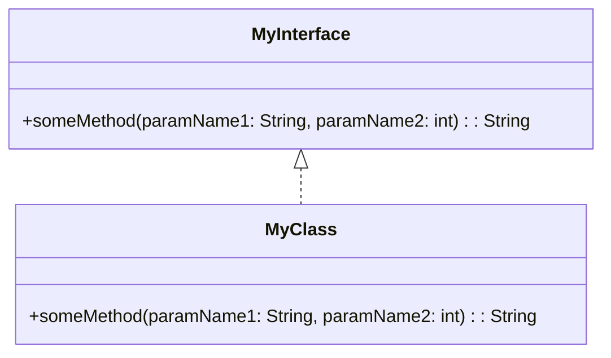
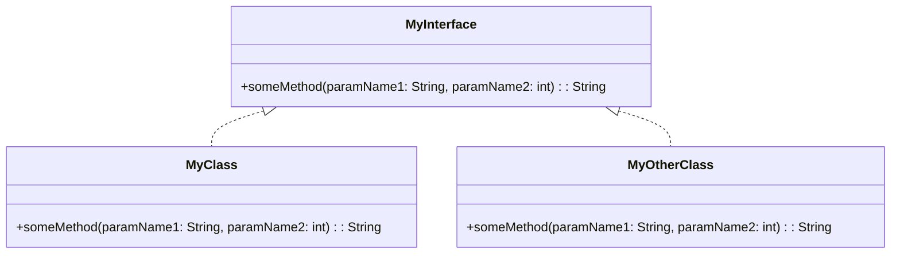
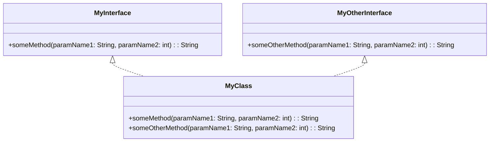

# Java recap

A very brief recap of some of the elements of the Java language that are particularly relevant to software design.

Everything in Java is written in the form of  **classes**. A class **declaration** specifies a class. Classes require unique names (at least within a package).

Classes declare **fields** which are named variables.

As well as declaring fields, Classes declare **methods**. A method declaration contains the code that defines what the class does.

Together, method declarations and any field initialization expressions make up the implementation of the class.

Java is a **statically typed** language, which means that every variable and every expression has a **type** that is known at compile time (statically means at **compile time** - when the program is compiled, rather than at **run time**, when the program is run.)

The variable's **type** is specified on the left-hand side of variable declarations. In this case x and s are the variables, the `int` and `String` are the types.

``` Java
int x = 10; //The type is int
String s = "Hello World" //The type is String
```

The Java compiler won't let you assign s to x because the types are not compatible (`int`s are not `Strings`).

``` Java
x = s; //Compilation error
```

That is because Java is a **strongly typed** language - the type given to a variable dictates the values that a variable can hold or that an expression can produce.

Strong static typing helps detect errors at compile time, but not all languages have strong static typing.

Java 10 introduced Local Variable Type Inference (LVTI) and the `var` keyword for declaring local variables (note you can only use var to declare local variables within methods, you cannot apply var to fields).


``` Java
var x = 10; //The type is still int
var s = "Hello World" //The type is String
```

Don't be fooled, the type is still there, internally the compiler is replacing var with the actual type. Because the compiler must work out (infer) the type there are rules on where you can use var (Oracle 2024, Ch 14.4) instead of specifying the type.

``` Java
var a = 1; // Legal
var b = 2, c = 3.0; // Illegal: multiple declarators
var d[] = new int[4]; // Illegal: extra bracket pairs
var e; // Illegal: no initializer
var f = { 6 }; // Illegal: array initializer
var g = (g = 7); // Illegal: self reference in initializer
```

> Generally do not use vars in production code, fully specify the type so that anyone reading your code doesn't have to guess.

Java also has the concept of a `final` variable. Once assigned a `final` always contains the same value and the compiler will prevent a re-assignment.

``` Java
final int x = 10; //final has been assigned a value
x = 11; //compiler error.
```
A **constant variable** is a final variable of primitive type or type String that is initialized with a constant expression. Constants are usually declared as being `static final` and by convention are named using UPPERCASE_WITH_UNDERSCORES. For example:

``` Java
static final double VALUE_OF_PI = 3.1415d;
```

The `static` keyword means that a single copy of the field exists within the entire program and therefore there can only be one value for the field in the entire program. Contrast this to a non-static, per-instance field. Every new instance gets its own copy of the field,

> Be very wary of `static` fields that are not `final`.

We also specify the **type** on method parameters.

``` Java
class Student
{

    public void setName(String name) //Parameter types are specified as part of the method signature
    {

    }
}
```


Again the compiler will check that any arguments passed are of a compatible type

``` Java
Student studentA = new Student();
String name = "ABC"
studentA.SetName(name); //Compiles OK
```

``` Java
Student studentA = new Student();
int age = 21;
studentA.SetName(age);
```
Changing the name of the variable won't help

``` Java
Student studentA = new Student();
int name = 21;
studentA.SetName(name);
```
This will fail not because the variable name doesn't match the parameter name, but because int and String are incompatible types.

A method that does not return anything is declared as void.

``` Java
class Student
{

    public void enroll() //no return type is specified
    {

    }
}
```
The compiler wll prevent you from assigning the return of a `void` method to a variable.

``` Java
Student studentA = new Student();
int age = studentA.enroll(); //Compiler error
```

The method return **type** is specified on methods that return non-void values

``` Java
class Student
{

    public String getName() //return type is specified as part of the method signature
    {

    }
}
```
Again the compiler will check that the return type is compatible with any assignment.

``` Java
Student studentA = new Student();
int age = studentA.getName(); //Compiler error
```

Java **types** are either **primitive** or **reference** types. **Reference** types are **classes**, **interfaces** or Java  **arrays**

We can discuss design in terms of **types**, without having to specify if the actual type is a primitive or a class or an interface.


## Java Primitives ##

You cannot define new primitives in Java, they are part of the language. From the point of view of software design, it is important to be aware of their min and max values.

- `byte`: 8-bit signed two's complement integer with a minimum value of -128 and a maximum value of 127 (inclusive). Default value is (byte)0.

- `short`: 16-bit signed two's complement integer with a minimum value of -32,768 and a maximum value of 32,767 (inclusive). Default value is (short)0.

- `int`: 32-bit signed two's complement integer with minimum value of -2^31 and a maximum value of 2^31-1. Default value is 0.

- `long`: 64-bit two's complement integer with a minimum value of -2^63 and a maximum value of 2^63-1. Default value is 0L.

- `float`: single-precision 32-bit IEEE 754 floating point. Default value is 0.0f.

- `double`: double-precision 64-bit IEEE 754 floating point. Default value is 0.0d

- `boolean`: single bit of information true or false. The "size" of a boolean in terms of memory is not defined. Default value is false.

- `char`: single 16-bit Unicode character. It has a minimum value of '\u0000' (or 0) and a maximum value of '\uffff' (or 65,535 inclusive). The default value is the null character `\u0000`.

> Be wary of under or overflowing the min and max values for primitive types, Java does not protect you against this.

 Java allows some automatic conversions, for example it is OK to assign an `int` to `long` because long is *wider* than int (a long can safely contain all the int values)

> Do not use float or double for precise values such as currency or money - use `java.math.BigDecimal` which is a class, not a primitive.

## Classes

The general form of a class **declaration**.

``` Java
class TypeIdentifier
{

    TypeIdentifier field_1;
    .
    .
    .
    TypeIdentifier field_n;

    TypeIdentifier(TypeIdentifier paramName1, TypeIdentifier paramName2, ...)
    {

    }

    TypeIdentifier  methodName(TypeIdentifier paramName1, TypeIdentifier paramName2, ... )
    {
        //Method body
    }

    //This style of method is called a Property or Getter
    public TypeIdentifier getFieldN()
    {
        return field_n;
    }
    //This style of method is called a Property or Setter
    public TypeIdentifier setFieldN(TypeIdentifier value)
    {
        field_n = value;
    }

}
```

A class declaration consists of

- a **TypeIdentifier** (the name of the class)
- 0 or more (written as `0..*`) **field** declarations, which can be any type (reference types or primitive types). **Fields** are the named variables of a class - how it holds its data. The initial values for fields can be set by initialization expressions. If there is no initialization then fields take their default values, which is 0 for primitive types and `null` for reference types.
- `0..*` **method** declarations. **Methods** contain the executable code within the class. When a client calls a method was say that a **method** is **invoked**. A method declares a `0..*` parameters, and the caller passes the same number of values as **arguments**.
- `0..*` **constructors**. **Constructors** look like methods in that they take `0..*` parameters, but constructors are only used when we create an instance of a class - the executable code in constructor is used to initialize the fields in a new instance. Constructors have the same name as the class.

 There is a special style of method referred to as a **Property** which gets or sets a single value. In Java, a property is not part of language definition and doesn't exist as a keyword.  Instead, in Java there is a programming convention to write methods that get and set a single value with a naming convention `getPropertyName()` and `setPropertyName(newValue)`. These are referred to as **Getters and Setters**. The purposes of getters and setters is to replace direct access to a field and allow you to add logic (for validation, calculations or other purpose) when getting or setting a property's value.

Usually, properties just get and set values in private fields, but they don't have to - being methods (executable code) they can perform calculations or transformations before or after accessing an actual field.

A property that does not directly get a field value but instead returns the result of an expression or calculation on a field value is called a **derived** property.

for example:

``` Java
public class MyClass
{

    //field of primitive type
    int field_1;
    .
    .
    .
    //field of reference type
    SomeOtherClass field_n;

    //Constructors have the same name as the class
    public MyClass(String paramName1, int paramName2, ...)
    {

    }

    public String someMethod(String paramName1, int paramName2, ... )
    {
        //Method body
    }

    public SomeOtherClass getFieldN()
    {
        return field_n;
    }

    public SomeOtherClass setFieldN(SomeOtherClass value)
    {
        field_n = value;
    }

}
```
Methods take parameters. You can apply the `final` keyword as a qualifier on method parameters, for example

```Java
class MyClass
{

    public void aMethod(final int x)
    {
        x = 10; //Error cannot assign a value to final variable x
    }
}
```

Using the `final` keyword in design tells the reader (and the compiler) something about your intentions and prevents someone maintaining your code accidentally changing a variable's value you did not intend to be changed.

> For simplicity, we will not apply the final qualifier to method parameters in examples just to reduce line length in the code examples


The fields and methods (including any getter and setter methods) declared in the class are the **members** of the class.

> Methods can also be called **member functions**.
>
> Constructors not members because they are not inherited. Constructors are special in other ways. They are responsible for initializing the state of an instance when it's created. You cannot call a constructor directly (requires the new operator) and you cannot call a constructor again on an already existing object.

The type of the fields must be specified (you cannot use the `var` keyword) and the field names must be unique.

Both fields and methods can be declared `static` which means that they belong to the class.

> In the case of static fields this means that that field is shared amongst all instances of the class and is a form of **global state**, generally not a good thing unless you know what you are doing. It is hard to track and debug changes to global state, and unless coded correctly, updating global state is not thread-safe.
>
> Non-static fields can be called **instance variables** as memory is allocated for the field for each instance. Static fields can be called **class variables** because memory is allocated once when the class is initialized.

Two or more method declarations can have the same method name, if the list of parameter types is unique.

``` Java
void methodA(int a, int b);
void methodA(int x, int y); //Not allowed, conflicts with the previous declaration, even though the parameter names are different
void methodA(int x, String y); //OK, different list of parameter types
void methodA(String x, int y); //OK, different list of parameter types
```

This is called method **overloading** and the compiler works out which method to call based on the unique list of parameter types.

Java also offers two other ways of declaring classes with special syntax for special purposes.

An `enum` class is a class that defines a set of named class instances.

A `record` class is a defines a simple aggregate of values.


## Objects

An **object** is an **instance** of a class or an array.
A class instance is explicitly created by a class instance creation expression **new**;

``` Java
MyClass myInstance = new MyClass("Arg1", 10);
```
We say that a class is **instantiated** when an instance of the class is created using the **new** expression.

Construction returns a **reference** to the newly created object. For all reference types, the default value for a reference is `null`.

The value(s) of any instance variables is called the object's **state**.

A simplified description of the instantiation process (Oracle, 2024 Ch 12.5)

1) Create a new structure in memory of sufficient size to all the fields declared in the specified class and all its superclasses. As each new field instance is created, it is initialized to its default value. If there is insufficient space available in memory then the new expression with throw an OutOfMemoryError.
2) Execute any instance initializers and instance variable initializers.
3) Execute either the default constructor (a constructor with no parameters) or a constructor that matches the list of supplied parameter types.
4) Return a reference to the object.

A reference is just a pointer, copying the reference does not create a new object, it just means you have two references pointing at the same object.

``` Java
MyClass myInstance = new MyClass("Arg1", 10);

//myInstance and copyOfMyInstance are referencing the same object
MyClass copyOfMyInstance = myInstance;
```

In Java the Equality operator `==` tests whether two object references point to the same memory location (i.e., the same object). `==` also tests for value equality with primitive types.

In Java the *content equality* is tested using the `equals()` method which compares the values (content) of two objects. The `==` operator is handled by the Java language - you have to write the `equals()` method.

An `array` object is created by an array creation expression.

``` Java
//create an instance of an array sized to hold 10 instances
MyClass[] myInstances = new MyClass[10];

````

We could if we want assign every element of the array to reference the same instance.

``` Java
//create a single instance
MyClass myInstance = new MyClass("Arg1", 10);
//create an instance of an array sized to hold 10 instances
MyClass[] myInstances = new MyClass[10];

myInstances[0] = myInstance;
myInstances[1] = myInstance;
myInstances[2] = myInstance;
.
.
.
myInstances[9] = myInstance;

````

When an object is created, each non-static field becomes an **instance variable** created in memory uniquely belong to that object.

The **state** of an object is the current value of all the instance variables at a point in time.


## Class Inheritance

There are times when we want to specialize or generalize classes.

**Specialization** - we want to add new members to an existing class or override its existing behavior in a **subclass**.

**Generalization** - we want to extract common members from two or more classes into a common **superclass**.

In Java, we create a specialize a class into a **subclass** using the `extends` keyword.


``` Java
public class A
{


}


public class B extends A
{

}
```

In UML `extends` is shown as an arrow pointing from the subclass to the superclass (generalization).


B is a **subclass** of A, A is the **superclass** of B.

The members (i.e. the fields and methods) of class B include:

- All the members inherited from its direct superclass type A
- All the members declared in the body of class B

There are some rules (Oracle 2024, Ch 8.2).

- Members of a class that are declared private are not inherited by subclasses of that class.
- Only members of a class that are declared protected or public are inherited by subclasses declared in a package other than the one in which the class is declared.
- Constructors, static initializers, and instance initializers are not members and therefore are not inherited.

By design a Java class can only extend one superclass (this is referred to as single inheritance).

Taking the example above and subclassing B.

``` Java

public class C extends B
{

}

```
Then B and C are subclasses of A, and A and B are superclasses of C.


### Abstract and Concrete Classes, Abstract Methods

An **abstract** class is a class that is incomplete (abstract means it is lacking one or more fields, or implementation of one or more methods) and requires a subclass to extend the abstract class to implement the missing methods.

This is why you can declare abstract classes, but not actually instantiate one - because an abstract has an incomplete implementation.

A method declaration lacking an implementation is abstract. In Java, you can declare methods abstract to force subclasses to implement methods with a specific signature. Abstract methods just consist of their method specification (name, parameter types and return types).

Method declarations without implementations in interfaces are implicitly abstract (the abstract keyword is not necessary in this case).

A class with a complete implementation is called a **concrete** class. You can only **instantiate** (create objects) concrete classes.

``` Java

abstract class AbstractA {
    public abstract void methodA();
}


//B is a concrete class because it has a full implementation
class ConcreteB extends AbstractA {

    @Override
    public void methodA() {
        //implementation
    }
}
```

## Interface Implementations

The fields and methods declared in the interface are the **members** of the interface. Any interface fields must be constants.

An `interface` is an abstract type (abstract meaning that it is lacking implementation of one or more methods).

Interfaces are abstract because they do not have instance variables  (only constants allowed) and declare one or more abstract methods (methods without an implementation body - the method defines a method signature only). Note that the `abstract` keyword is unnecessary on the interface declaration because interfaces are *implicitly* abstract. Any methods without an implementation are also implicitly abstract and do not require the `abstract` keyword. These methods are also implicitly public (we will discuss the accessibility of classes, constructors and methods later).

``` Java
interface MyInterface {
    String someMethod(String paramName1, int paramName2);
}
```
Being abstract, interfaces cannot be instantiated. Instead, the methods of the interface must be **implemented** by either an abstract or concrete class using the `implements` keyword. A class must provide the complete set of methods required by the interface, but each class can have its own implementation. This makes an interface a **specification** to be fulfilled by classes that implement the interface.

``` Java
class MyClass implements MyInterface {
    @Override
    public String someMethod(String paramName1, int paramName2) {
        return "";
    }
}
```
In UML `implements` is shown as a dotted arrow pointing from the implementation to the interface. This is called a **realization** relationship. In this diagram `MyClass` is implementing (realizing) `MyInterface`.




Interfaces are key to writing extensible and flexible code because:

- one interface can be implemented by many different and unrelated classes, each of which has a unique implementation of the interface specification.
- the choice of which concrete type supplies the interface implementation can be made at runtime, allowing us to vary behavior based on some runtime condition (such as user input, choice of operating system, production or test mode...)

``` Java
class MyClass implements MyInterface
{

    @Override
    public String someMethod(String paramName1, int paramName2) {
        // one implementation
    }

}

class MyOtherClass implements MyInterface
{

    @Override
    public String someMethod(String paramName1, int paramName2) {
        // a completely different implementation
    }
}
```
Drawn in UML:



A reference of type MyInterface can refer to (point to) any object that implements the interface, and we can choose the implementation at runtime.

``` Java
//Declare a variable of type MyInterface
MyInterface a = null;

a = new MyClass();
a.someMethod(); //invokes the implementation provided by MyClass

a = new MyOtherClass();
a.someMethod(); //invokes the implementation provided by MyOtherClass

```

This gives the programmer (and the program) a number of benefits

- The program defines what it wants via an interface, and implementation can be written later.
- The implementation used can be changed at runtime
- New implementations can be added to the codebase and used **without the program code changing**.


## Interface Inheritance

Like classes, interfaces can be inherited.

``` Java
public interface IA
{


}


public interface IB extends IA
{

}
```
IB is a **subinterface** of IA, IA is the **superinterface** of IB.

Classes can also implement *multiple* interfaces.

``` Java
public interface MyInterface
{

  String someMethod(String paramName1, int paramName2);

}

public interface MyOtherInterface
{
    String someOtherMethod(String paramName1, int paramName2);

}


public class MyClass implements MyInterface, MyOtherInterface {
    @Override
    public String someMethod(String paramName1, int paramName2) {
        //implementation
    }

    @Override
    public String someOtherMethod(String paramName1, int paramName2) {
        //implementation
    }
}

```
In this example `MyClass` implements (realizes) both `MyInterface` and `MyOtherInterface`.



## Abstract and Concrete

The terms **abstract** and **concrete** are widely used when discussing design - remember that **abstract** means something without all of its implementation.

Java has the `abstract` keyword, but there is no equivalent keyword for concrete (a non-abstract class is, by definition, concrete). A Java `interface` is implicitly abstract.

> The term **abstraction** is widely used when discussing software systems, and has a different meaning to the Java `abstract` keyword which can be confusing. An **abstraction** means that we are focussed just the essential things about something and ignoring some or all of the implementation details. The higher the level of abstraction, the less implementation detail is included in the discussion.

> Remember that the terms **abstract** and **abstraction** are different (sorry) - but both imply a lack of implementation detail.

## Operations

We have seen that when we are writing a Java class, methods can be either abstract (without an implementation) or concrete (with an implementation). If we are writing a Java interface, all its methods are abstract.

We can discuss design in terms of **operations**, without having to specify if the operation is abstract or concrete.

We can say that clients of an object request **operations**. Getting or setting field values, and invoking methods are all operations.

If the operation is abstract because it is defined as an abstract class method or within a Java interface, then it's up to the Java runtime to map the requested operation to the correct method of a concrete class.

### Command Operations and Query Operations

Operations can be **commands** (an operation which changes the state of the object) or **queries** (an operation that returns a value but does not change the state of an object).

Whilst it may seem an academic distinction to make, a true query does not have **side effects** because it doesn't change the state of the object - sometimes referred to as a **read only** operation, which means that a client can call a query knowing it won't change the state of the object. Knowing that an operation is read only is actually very useful, because you know you can call the operation as many times as you like, and it will not change the state of the object.

In Java is there is no language mechanism to say if an operation is a command or a query. By convention in Java the method `int getX()` method would return the value of the field x as an integer. Anyone calling that method would be very surprised if `int getX()` had changed the object state. You should follow that convention.

> Be aware that you could call the same query twice in different parts of the program and there is no guarantee it would get the same value returned, because a command (a state changing operation) could have been requested between the two query operations.

> Where possible write your code so that operations that return values are **queries** and all **command** (state altering) operations are written as void methods. If you do write a command (state altering method) that returns a value, ensure you document that it is state altering.

## Typed References

The **Type** of the reference to an object determines which operations are available.

``` Java
interface MyInterface {
    void interfaceMethodA();
}


//D implements MyInterface
public class D implements MyInterface {
    @Override
    public void interfaceMethodA() {
        System.out.printf("Hello from D.interfaceMethodA%n");
    }

    public void methodA() {
        System.out.printf("Hello from D.methodA%n");
    }
}

//E is a subtype of D and MyInterface
public class E extends D {
  @Override
  public void methodA() {
    System.out.printf("Hello from E.methodA%n");
  }

  public void methodB() {
    System.out.printf("Hello from E.methodB%n");
  }

  public void methodC() {
    System.out.printf("Hello from E.methodC%n");
  }
}


//Operations available to the variable of type MyInterface are just interfaceMethodA()
MyInterface myInterface = new E();
myInterface.interfaceMethodA(); //prints Hello from D.interfaceMethodA

//Operations available to the variable of type D are interfaceMethodA() and methodA()
D d = new E();
d.interfaceMethodA(); //Hello from D.interfaceMethodA
d.methodA(); //Hello from E.methodA

//Operations available to the variable of type E interfaceMethodA(), methodA() and methodB();
E e = new E();
e.interfaceMethodA(); //Hello from D.interfaceMethodA
e.methodA(); //Hello from E.methodA
e.methodB(); //Hello from E.methodB

```

The type of the variable determines the set of operations available to the client. The set of operations available to the client are the public operations defined by the type and all its supertypes.

To put this in more theoretical terms,

- E is a subtype of MyInterface because MyInterface has a subset of the operations of E.
- E is a subtype of D because D has a subset of the operations of E.
- E is a subtype of itself because E has a subset of the operations of E (the same set of operations).


Therefore

- You can create and assign an instance of E to a variable of type MyInterface (MyInterface has a subset of the operations of E, E is a subtype of MyInterface)
- You can create and assign an instance of E to a variable of type D (D has a subset of the operations of E, E is a subtype of D)
- You can create and assign an instance of E to a variable of type E (E has a subset of the operations of E, E is a subtype of itself)
- You can't create and assign an instance of D to a variable of type E because E does not have a subset of the operations of D, and D is not a subtype of E.


In Java all reference types are subtypes of `Object`. This is why you can assign an instance of any Reference Type to `Object` because Object has a subset of the operations of any reference type.

## Isn't this a bit theoretical ?
Understanding how Java interfaces and abstract classes work is important because these are the language mechanics we need for writing flexible, extensible and maintainable code - one of the main goals of software design and software engineering.
