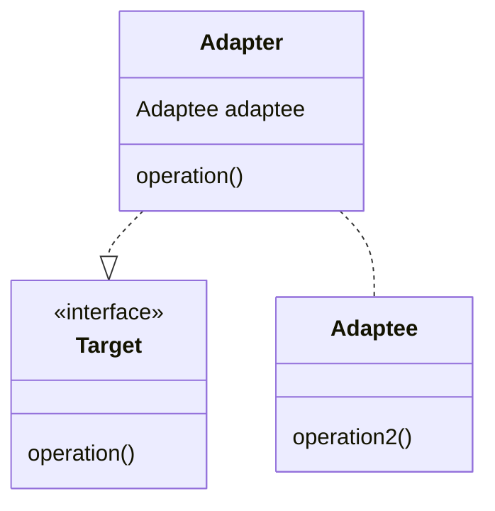

# Designing with multiple classes - Maintainable code, the Single Responsibility and Dependency Inversion principles.

## What is Maintainable Code

We use the term **Software Product**  to mean any software bigger than a few classes that must meet requirements set by a stakeholder. Student assignments (on this module anyway) count as software products (the stakeholder is the module leader). Industrial and commercial products can comprise hundreds or thousands of classes - their definition of a software product would expand to include data, communications with external services and the means of deploying the software. Large software products cost GBP millions over their lifetime.

We use the term **Software Project** to mean the organisational effort and resources (in our case generally people) that goes into creating the product. Projects are the means of production: Products are what you produce.

Amongst many other things, running a software project is about making **trade-offs** - prioritising one product characteristic over another. You might prioritise creating a new feature (enhancing product functionality) instead of spending time improving the speed of an existing feature (enhancing product performance). As another example of a trade-off, yoi might choose to prioritise product security (for example by building in 2-Factor Authentication) over product usability (the extra authentication step is hard for people to understand, requires them to carry a 2FA device and slows them down when logging in).

There is an ISO Standards document BS ISO/IEC 25010:2023 (British Standards Institution, 2023) which defines 9 quality characteristics of a software product that you might need to consider as someone responsible for a Software Product. As this is a technical standard it is not an easy read, but it names and defines a set of product characteristics (instead making up your own names and definitions) and provides a checklist when thinking about what your qualities your software product needs to be successful in the eyes of your users.

The standard defines 9 characteristics of product quality (each one has sub-characteristics)

1. Functional Suitability
2. Performance Efficiency
3. Compatibility
4. Interaction Capability
5. Reliability
6. Security
7. Maintainability
8. Flexibility
9. Safety

Every product will have different a different balance between these characteristics, and it is not possible to say which characteristics will be most important on any given project, but it is a pretty safe bet that regardless of the type of product or project you end up working on, your product quality and the lifetime cost of the product will be enhanced by writing **maintainable** software.

The reason for this is that all software in use by real users is constantly being modified - because of bug fixing,  corrections to mis-understood requirements, improvements to existing functions, new functional and non-functional requirements or changes in the deployment environment.

The more maintainable your software product is the more capable it is of being modified within reasonable cost and time constraints. All software is ultimately modifiable by throwing it away and re-writing it - we are describing the ability to be modified **efficiently** - using the fewest resources and least amount of time.

It is most likely that as an early career (a first or second job) software engineer you will be expected to not only write code that meets functional requirements, but that you can demonstrate you know how to write in a way that is maintainable because all commercial projects will want their product to be maintainable over a long period of time. As your career progresses, you will need to master the other characteristics (read the ISO Standard for more detail), but we are suggesting that maintainability is one of the most important and widely desired characteristics of a software product.

We have selected some sub-characteristics from the standard (British Standards Institution, 2023, 3.7) that we will focus on when discussing design involving multiple classes and discuss principles and patterns that can improve these characteristics in your code and hence improve the maintainability.

**Modularity**  being the capability of a product to limit changes from one component from affecting other components. In software engineering literature the terms **module** and **component** are widely. **Module** could mean (depending on the context) an individual class, a group of classes working together (a component), a Java package, an entire program or a suite of programs working together - it depends on what level you are discussing.  **Component** usually means multiple classes hidden behind an external interface. The standard says the desirable characteristic of modularity implies "modules or components with cohesive content and minimal coupling to other modules or components". We will explore what cohesion and coupling mean later on.

**Analysability** being the capability of a product to be assessed for impact of change and to identify parts to be modified. Put simply, the easier it is to read the codebase, the easier it is to understand it and predict where to change code and what the consequences will be.

**Modifiability**  being the capability of a product to be modified without degrading existing quality or introducing defects. We are looking for designs where we can make a successful change that doesn't break existing code. Analysability and Modularity influence Modifiability.  You might say that Modifiability = Analysability +  Modularity - improving either or both of those characteristics improves Modifiability.

**Testability** being the capability of a product to enable a test to be designed and performed. Being able to write and execute a set of automated tests at various levels supports getting feedback quickly (quicker than manual testing) about how code meets its functional requirements and whether changes have broken other parts of the system. The more testable our software is, the easier it is to write tests.

These are all desirable characteristics of a program or set of programs. The question is how practically do you go about writing code that has these desirable characteristics?


## The Single Responsibility Principle (SRP)

The term **cohesion** refers to the degree to which the members of a class belong together and how well they relate to each other. The term was coined by Larry Constantine in the 1960s when he was working on structured programming.

- A class with high cohesion has elements that are all focused on a single, well-defined responsibility - all the fields and methods of the class are related to that responsibility.
- A class with low cohesion has elements that are not related to each other - the fields and methods of the class are not related to a single responsibility.

Responsibility is the duty or role of a class in an application. A class might have a

- knowing responsibility - it knows something about the domain (for example a Product class in an e-commerce system knows about product code, name, description and price).
- service responsibility - it provides a service to other classes (for example a TaxCalculator class in an e-commerce system provides a service to calculate tax on a monetary amount).
- controlling responsibility - it controls the flow of an operation (for example a CheckoutController class in an e-commerce system controls the sequence of operations when a customer checks out).

A class with a single responsibility has one reason to change. A class with multiple responsibilities has multiple reasons to change.

The smaller the number of responsibilities (ideally one) then more likely it is that all the members of a class related to each and are  working towards the same goal - **high cohesion**.

We can now refine our discussion about why giving classes a single responsibility is important.

- We said that the problem with classes that take on multiple responsibilities is that this makes the class more likely to require change (more responsibilities = more chance of requiring a change as the overall system evolves).
- A multi-responsibility class is not only more likely to need change, but the consequences of the change are likely to be greater because a multi-responsibility class will have more clients and a larger quantity of code that is coupled to the multi-responsibility class.  The change will cause a greater "ripple effect" in the rest of the code base.
- A single responsibility class is more likely to limit the effect of changes (improves modularity).
- A single responsibility class is easier to understand because it just has one role in the program and has fewer lines of code (improves analysability).

The SRP sounds a simple principle, but it is hard to identify and assign responsibilities into classes.

There is a tendency when coding to add functionality to classes we already have, rather than asking if this is a separate responsibility. We also have many technical, cross-cutting concerns to deal with when producing real systems.

Making sure your classes have as few responsibilities as possible is an iterative process which requires a critical look at what you have written (see - [Design Thinking - OODA Loops](oodaloops) for one way to do this), and deciding if your class does, in fact, violate the SRP. If your class does violate SRP, then you need to refactor into multiple classes.

The code patterns we have seen so far are useful in terms of giving you somewhere to move responsibilities to.

- Value Objects have responsibility for managing everything about a value. For example, a Money class might be responsible for handling currency representation, formatting, and currency conversions. A Money class prevent those responsibilities from being scattered across other parts of your codebase.
- The Strategy and Bridge patterns helped us encapsulate an algorithm (such as a tax calculation) so that we can handle variations by writing new classes. But in to doing that we have also moved the responsibility for tax calculation from our main class into a separate class.
- Factory patterns move responsibility for class instantiation or object lifetime into separate Factory classes.
- The Decorator and Chain of Responsibility Patterns allow us to move common responsibilities such as logging or checking authorisation (cross-cutting concerns) into separate classes.
- The Observer Pattern allows to move unrelated consequences of an operation into separate observer classes.

## The Interface Segregation Principle (ISP)
Sometimes you cannot help but end up with a large class with a lot of features. You have a lot of different client classes that only use a subset of these features. Unfortunately this means each client has a coupling to all the available public methods of the big class.

```Java
class BigClass
{
    public void methodA();
    public void methodB();
    //...
    public void methodY();
    public void methodZ();
}

class ClientClass1
{
    public void doSomething(BigClass bigClass)
    {
        //Client only depends on methodA and methodB, but has access to all the other methods of BigClass
        bigClass.methodA();
        bigClass.methodB();
    }
}
class ClientClass2
{
    public void doSomethingElse(BigClass bigClass)
    {
       //Client only depends on methodX and methodY, but has access to all the other methods of BigClass
        bigClass.methodY();
        bigClass.methodZ();
    }
}
```
Clients should only need to depend on the properties and methods they call. We can break up this coupling by segregating the interface of BigClass into smaller interfaces, each interface becomes client-specific and only contains a subset of methods.

```Java
interface Interface1
{
    public void methodA();
    public void methodB();
}

interface Interface2
{
    public void methodY();
    public void methodZ();
}

class BigClass implements Interface1, Interface2
{
    public void methodA();
    public void methodB();
    ...
    public void methodY();
    public void methodZ();
}

class ClientClass1
{
    public void doSomething(Interface1 smallInterface)
    {
        //Client can only depend methodA and methodB, has NO access to all the other methods of BigClass
        smallInterface.methodA();
        smallInterface.methodB();
    }
}
class ClientClass2
{
    public void doSomethingElse(Interface2 smallInterface)
    {
        //Client can only depend on methodX and methodY
        bigClass.methodY();
        bigClass.methodZ();
    }
}

//Usage

BigClass bigClass = new BigClass();

ClientClass1 client1 = new ClientClass1();
client1.doSomething(bigClass); //Although we use an instance of BigClass, the implementation of doSomething can only see methods of Interface1

ClientClass2 client2 = new ClientClass2();
client2.doSomething(bigClass); //Although we use an instance of BigClass, the implementation of doSomething can only see methods of Interface2
```
Not only have we restricted the visibility of BigClass methods, but we can also break up BigClass into other classes that implement Interface1 and Interface2 at some point in the future without having to change Client1 or Client2.

## Writing Small Classes with Short Methods

Although there will always be exceptions, aim for writing small classes with small methods.

- Large, single responsibility may classes benefit from refactoring into multiple classes.
- Long or complex methods need to split into private helper methods.
- Modern IDEs support refactoring your classes with *Extract Method* or *Extract into Class* refactoring features (see your IDE documentation).

## Don't talk to strangers - Classes that aggregate other classes

In Java, classes have fields, which are either of primitive type or reference types. We know that it is good design practice to hide these fields by making them private and only allowing read or update via the operations defined by the public API.

Some classes have mostly 'knowing' responsibilities - they exist to hold data and have very little behavior. Some classes are mostly behavioral - for example a Facade class (see later) would probably have very few fields (they know very little), its entire responsibility is to provide simple methods that perform complex networks of operations on different classes.

Hiding fields presents a problem for classes whose responsibilities are primarily about holding and exposing data. Take the example of a class holding data about a Product for an eCommerce site. For example, an ecommerce application needs to hold data on a product's code, name and description. In addition, our hypothetical ecommerce system may also put products into Categories (Shirts, Jackets, Dresses, Cushions etc.) and Categories into Departments (Men's, Women's, Homeware etc.).
```Java
class Department {
    private final String code;
    private final String name;

    Department(String code, String name) {
        this.code = code;
        this.name = name;
    }

    public String getName() {
        return name;
    }

    public String getCode() {
        return code;
    }
}


class Category {
    private final Department department;
    private final String code;
    private final String name;

    Category(String code, String name, Department department) {
        this.department = department;
        this.code = code;
        this.name = name;
    }

    public Department getDepartment() {
        return department;
    }

    public String getName() {
        return name;
    }

    public String getCode() {
        return code;
    }
}

class Product
{
    private final String code;
    private final String name;
    private final String description;
    private final Category category;

    Product(String code, String name, String description, Category category)
    {
        this.code = code;
        this.name = name;
        this.description = description;
        this.category = category;
    }

    String getCode() {
        return code;
    }

    String getName() {
        return name;
    }

    String getDescription() {
        return description;
    }

    Category getCategory() {
        return category;
    }
}
```
There are a couple of observations to make about the Product class. Although we provided getters for all the fields, we are still exposing a lot of internal structure. This is inevitable because we *need* to expose that information to a client. For example

```Java
Product product = new Product(...)
String productCode  = product.getCode();
String productDescription  = product.getDescription();
```

But for a client to display the category and department, the client code needs to access a chain of objects

```Java
Product product = new Product(...)
String departmentName = product.getCategory().getDepartment().getName();
```

The problem here is that the client is not only dependent on Product, but also dependent on the Category class, which is in turn dependent on Department class. Our client code is now dependent on three classes instead of just Product. The author of the client code needs to read the API documentation for three classes rather than one.

How much of a problem this is going to be depends on how likely Category and Department are to change. Note that we have baked in the decision that the Department that a Product belongs to is determined by the Category (the Category class aggregates and exposes an instance of the  Department class in this design). That will be a problem if later on we want to set a Product's Department independently of its Category. We have made assumptions about *structure*.

Generally, the more the client code has to traverse a chain of objects, the more brittle the client code is going to be under change. This line of code `String departmentName = product.getCategory().getDepartment().getName();` relies on the structure of Product and the Structure of Category remaining constant.

The design solution is to not expose these assumptions and provide a public API for Product that hides the Category and Department structure. If there are changes to the Category and Department class structure, we can deal with that change in one place rather than breaking all the clients. We write wrapper methods around the aggregated Category and Department classes to hide the structure.

```Java
class BetterCategory {
    private final Department department;
    private final String code;
    private final String name;

    BetterCategory(String code, String name, Department department) {
        this.department = department;
        this.code = code;
        this.name = name;
    }

    public String getDepartmentName() {
        return department.getName();
    }
    public String getDepartmentCode() {
        return department.getCode();
    }

    public String getName() {
        return name;
    }

    public String getCode() {
        return code;
    }
}

class BetterProduct
{
    private final String code;
    private final String name;
    private final String description;
    private final BetterCategory category;

    BetterProduct(String code, String name, String description, BetterCategory category)
    {
        this.code = code;
        this.name = name;
        this.description = description;
        this.category = category;
    }

    String getCode() {
        return code;
    }

    String getName() {
        return name;
    }

    String getDescription() {
        return description;
    }

    String  getCategoryCode() {
        return category.getCode();
    }

    String  getCategoryName() {
        return category.getName();
    }

    String  getDepartmentCode () {
        return category.getDepartmentCode();
    }

    String  getDepartmentName () {
        return category.getDepartmentName();
    }
}

```

This is another design principle, called **Don't talk to Strangers** or more formally **The Law of Demeter**, even though it is a principle rather than a law. The principle is that classes should not expose the other classes they aggregate (like the `Category getCategory()` method in the example) because this exposes structure.

Put more fully, a method should only call:

- Methods of the class the method is defined in.
- Methods of objects held in fields within the class the method is defined in.
- Methods of objects held in collections within the class the method is defined in.
- Methods of objects passed as parameters to the method.
- Methods of any objects it instantiates.

Any of the methods listed above are *familiars* rather than *strangers*. Talk to familiars, don't talk to strangers.

In the example above,
```Java
//Code instantiates the Product object, so OK to call methods of Product
Product product = new Product(...)
//getCategory is a method of Product, but getName() isn't a method of Product, here we are talking to a Stranger
String categoryName = product.getCategory().getName();
```
We have used getters in the example, but the principle applies to reaching any method, for example:

```Java
ClassA a = new ClassA();
a.getB().getC().doZ();
```
It is better to provide a doZ() operation on the API for ClassB and ClassA, rather than exposing the intermediate structure.

```Java
public class ClassB {

    private final ClassC c = new ClassC();

    void doZ()
    {
        c.doZ();
    }
}

class ClassA {

    private final ClassB b = new ClassB();
    public void doZ()
    {
        b.doZ();
    }
}

ClassA a = new ClassA();
a.doZ();
```

> The 'Don't talk to Strangers' principle is a good idea but does increase the size of a class API - if you do expose aggregated classes on your public API, ensure this is justified, and not just being lazy because you can't be bothered to write some wrapper methods. Bock (no date) has further discussion on when and how to apply the principle.

## Increase testability by depending on interfaces rather than concrete classes

If classes can be tested then they become more maintainable simply because it is easier to create and maintain a comprehensive suite of tests that we can run every time was make a change. But what do we mean by making classes more testable?

Recall that when one class calls a member of another class, the class making the call is the **client class** and the class being used is a **supplier class**.

We have said that when a client class calls makes use of a supplier class then the client class takes a **dependency** on the supplier class. For example:

```Java
class SupplierClass
{
    public void DoSomethingElse()
    {
      //implementation
    }
}


class ClientClass
{
    private final Supplier supplier = new Supplier();

    public void DoSomething()
    {
     //make a call to a method on the supplier class
     supplier.DoSomethingElse();
    }

}
```

In this example the ClientClass has a dependency on the concrete SupplierClass.

Going back to our E-Commerce example, assume that having put products into an e-commerce basket, we want to take payment via a credit card.

> In a real service we would create a ValueObject representing a CreditCard that validated and held the card number and expiry properties

```Java
class RealCreditCardService {

    public RealCreditCardService() {
    }

    public void takePayment(double amount, String cardNumber, int expiryYear, int expiryMonth) {
        // Actually charge card through integration with payment processor
    }
}


class Basket {

    final RealCreditCardService creditCardService;

    public Basket() {
        this.creditCardService = new RealCreditCardService();
    }

    double getTotal() {
        //Get sum total of goods, tax and delivery
        return 100.0d;
    }

    public void chargeCreditCard(String cardNumber, int expiryYear, int expiryMonth) {
        creditCardService.takePayment(getTotal(), cardNumber, expiryYear, expiryMonth);
    }
}
```

We would create a basket as part of our process in our website code.

```Java
Basket basket = new Basket();
//put things in basket
//ask customer for credit card info
basket.chargeCreditCard(" 4111 1111 1111 1111", 2028, 12);

```
Note how the dependencies match the natural order of the calls:

`Website (the outmost controlling thing) -> Basket -> CreditCardService`

However, the problem comes when we want to write tests for the Basket class. The Basket has a dependency on a concrete class implementing an integration with a real credit card processor. Every time we test the checkout process, we will require a real credit card, and if we run enough tests we will use up all the credit available on the credit card. My Basket class is not very **testable** because of its dependencies.

We can make our classes more **testable** by making the client depend on an `interface`. When we create the dependency as an interface rather than using a concrete class, we postpone the decision as to what concrete class we are going to use as the supplier. This is invaluable in testing because:

1. You are no longer having to provide real credit card data and end up charging real credit cards.
2. You can write different test-specific concrete classes and use them to support various test scenarios.

The first step is for the client (in this case the Basket) to define the interface it wants to depend on.

``` Java
interface AbstractCreditCardService {
     void takePayment(double amount, String cardNumber, int expiryYear, int expiryMonth);
}
```

Basket now depends on the interface rather than a concrete class.

```Java
class Basket {

    final AbstractCreditCardService creditCardService;

    public Basket(AbstractCreditCardService creditCardService) {

        this.creditCardService = creditCardService;
    }

    double getTotal() {
        //Get sum total of goods, tax and delivery
        return 100.0d;
    }

    public void chargeCreditCard(String cardNumber, int expiryYear, int expiryMonth) {
        creditCardService.takePayment(getTotal(), cardNumber, expiryYear, expiryMonth);
    }
}
```
In the production code, we will use a concrete instance of ReadCreditCardService as the supplier.

```Java
class RealCreditCardService implements AbstractCreditCardService {

    public RealCreditCardService() {
    }

    public void takePayment(double amount, String cardNumber, int expiryYear, int expiryMonth) {
        // Actually charge card through integration with payment processor
    }
}
```
but when testing we can create a Basket class using test classes which (for example) mimic failed or successful payments.

```Java

class FailingCreditCardService implements AbstractCreditCardService {

    @Override
    public void takePayment(double amount, String cardNumber, int expiryYear, int expiryMonth) {
        //simulate a failed attempt to take payment
    }
}

class SucceedingCreditCardService implements AbstractCreditCardService {

    public SucceedingCreditCardService() {
    }

    public void takePayment(double amount, String cardNumber, int expiryYear, int expiryMonth) {
        //simulates a successful attempt to take payment
    }
}
```

To test, we create an instance of Basket takes whichever concrete class makes sense for the test we are trying to perform.

```Java
AbstractCreditCardService testService = new FailingCreditCardService();
Basket basket = new Basket(testService);
//put things in basket
basket.chargeCreditCard(" 4111 1111 1111 1111", 2028, 12);
```

By making Basket depend on an `AbstractCreditCardService` we have gained the ability to vary the concrete supplier so that we can support different test cases. If this looks like the **Strategy** pattern it is -  but rather than varying concrete implementations in our production code to deal with variation in algorithm, we are varying concrete implementations to support testing by creating concrete implementations specifically for test scenarios such as the `takePayment` method call failing.

> To make classes more testable, when your class takes a dependency on a concrete class (this could be that the class is holding a reference to a concrete class, or a reference to a concrete class passed as a method parameter) consider replacing the concrete class with an interface. Then you can create different concrete classes that implement that interface to support a variety of test cases.

We only need to do this when the thing we depend upon is going to change. When we consider testability, more of our dependencies become volatile (subject to change) rather than stable because we want to provide test case specific versions of those dependencies. A good example of what would normally be stable but needs to be changed for testing is the use of time.

Going back to our basket `takePayment` method, we will want to validate the card expiry date provided as month and year. The code might look something like this.

```Java
public void takePayment(double amount, String cardNumber, int expiryYear, int expiryMonth) {

    LocalDateTime now = LocalDateTime.now();
    if (expiryYear > now.getYear() || (expiryYear == now.getYear() && expiryMonth >= now.getMonthValue())) {

    }
}
```
The problem here is that my client class (the Basket in this case) has coupled to a concrete supplier class that can only return the time in the local time zone according to the system clock of the machine the code is running. This is fine for production use where we always want to compare against current time, but bad for testing where we want to run tests with where cards pass or fail the expiry check. An analogous situation would arise if we provided a discount code that had an expiry date.

The solution is to replace the concrete class with an interface. To test for credit card expiry we only need a year and month value, so we might call the interface YearMonthProvider. As we did with the CreditCardService, we can now create real and test implementations of the YearMonthProvider interface.

```Java

interface YearMonthProvider {
    getYear();
    getMonth();
}


class TestYearMonthProvider implements YearMonthProvider {
    private final LocalDate currentDate;

    public TestYearMonthProvider(LocalDate currentDate) {
        this.currentDate = currentDate;
    }

    @Override
    public int getYear() {
        return currentDate.getYear();
    }

    @Override
    public int getMonth() {
        return currentDate.getMonthValue();
    }
}

class RealYearMonthProvider implements YearMonthProvider {

    @Override
    public int getYear() {
        return LocalDate.now().getYear();
    }

    @Override
    public int getMonth() {
        return LocalDate.now().getMonthValue();
    }
}
```
Usage

```Java
public void takePayment(double amount, String cardNumber, int expiryYear, int expiryMonth, YearMonthProvider provider) {

    if (expiryYear > provider.getYear() || (expiryYear == provider.getYear() && expiryMonth >= provider.getMonthValue())) {

    }
}
```

There is an industry term **flaky tests** for tests that sometimes pass and sometimes fail when the code under test has not changed. The cause is often that the code under test has a dependency on something that is **non-deterministic**  - has different behavior every time you run the test. Common sources of non-deterministic behavior are looking up time, looking up some form of system configuration and use of random numbers.

> Do not take dependencies on concrete classes that have **non-deterministic** behavior - time being a good example. Always create a provider interface so that you can substitute the real non-deterministic thing for a provider under your control.

## The Dependency Inversion Principle (DIP)

A simple interpretation of the Dependency Inversion Principle is that clients should depend on an `interface` or `abstract` classes rather than concrete classes. When a client depends on an interface then it is not coupled to any particular supplier, so we can change the concrete supplier at runtime - very useful for handling variation in algorithms (which we saw with the Strategy pattern) and substituting test versions in testing scenarios.

When a client uses (depends on) a concrete supplier, the API the client uses is defined by the supplier - the client is *forced* to use the supplier's API. When we change this so that the client uses (depends on) an interface it is the client that defines the interface that it needs, and it is now the supplier class that is forced to use the client's interface declaration.

It is this inversion of the direction of the dependency that gives the principle its name. In our example the definition of `AbstractCreditCardService` is controlled by the client (in this case a Basket) because it is the Basket that determines the requirements for the interface. Now instead of the Basket having a dependency on `RealCreditCardService`, `RealCreditCardService` and all the other concrete implementations depend on  `AbstractCreditCardService`, so now the suppliers depend on the client, rather than the other way around. The normal dependency relationship is inverted.

This applies not only to individual classes but to Java packages as well. If I have a concrete dependency from Basket to RealCreditCardService, the Java package containing the `Basket` class has a concrete dependency on the package containing the `RealCreditCardService` class. You know you have a package dependency where you see an `import` statement or a fully qualified class name. If we invert the dependencies then the package with the `RealCreditCardService` depends on the package containing the `Basket` class. This means we can have different packages for real and test implementations of the `AbstractCreditCardService` interface, which keeps the two codebases separated. We can swap between real and test implementations by swapping Java packages.

The full definition of the Dependency Inversion Principle is in Martin and Martin (2007 p 154):

- High-level modules should not depend on low-level modules. Instead, they should depend on abstractions.
- Abstractions should not depend on details. Details should depend on abstractions.

In the first sentence and in our context, module means Java class or package. High-level and low-level are the positions in the call chain. In the example without dependency inversion a method in the `Basket` class methods on `RealCreditCardService` - Basket is higher in the call chain. **Abstractions** mean Java interfaces or abstract classes. By introducing AbstractCreditCardService both `Basket` and `RealCreditCardService` now depend on the abstract `AbstractCreditCardService` interface.

The second sentence is a way of saying that the abstraction we make (in Java the `interface` we design) should not be influenced by implementation detail, instead the implementation detail should depend on the abstraction we have designed. Take the example where we tested the credit card expiry date. The general idea is that we confirm the credit card date is valid, but the initial implementation was very coupled and dependent on a specific way of doing this using the `LocalDateTime` class (the detail). The idea of testing a credit card expiry date only really needs a year and month value which is reflected in the `interface`. We now write a detail class that happens to use `LocalDateTime`, but only exposes the year and month value as required by the abstraction.

>You may also see the principle being explained in terms of **Policy** and **Mechanism**, or **Policy** and **Detail**. **Policy** is the same as **Abstraction** - a Policy class embodies the high-level business rules and goals. **Mechanism** or **Detail** means the lower level concrete implementation details.

## The Adapter Pattern

If our higher level modules define Java interfaces, and we want to provide implementations using lower level detail classes such as libraries (including the Java standard library) or other code not under our control, it is highly likely that the API of the lower level detail classes you want to use will not be an exact match for the `interface` defined by the higher level module.

We can solve this problem using a common design pattern called the **Adapter Pattern**. The adapter pattern solves the problem when you want to use an existing class, but its API does not match the API you need (Gamma *et al.* 1994 p139).

Let us for example say that we have a library that contains a class that provides highly accurate real time clock information from some atomic clock source on the internet, but returns the current time as the number of milliseconds since the Unix epoch (Unix represents time as number using 0 to mean January 1, 1970, 00:00:00 UTC).

The API for the class is simple:

```Java
class AtomicTimeSource
{
    public long getTimeInMs();
}
```

We want to use this to get the current Year and Month for our credit card validation example, but the interface we require is:

```Java
interface YearMonthProvider {
    int getYear();
    int getMonth();
}
```

We write an **Adapter** class that converts from the API of the AtomicTimeSource to the API expected by our credit card validation.

```Java
class AtomicTimeSourceAdapter implements YearMonthProvider {

    private final AtomicTimeSource source;

    public AtomicTimeSourceAdapter(AtomicTimeSource source) {
        this.source = source;
    }


    @Override
    public int getYear() {
        long  timeInMs  = source.getTimeInMs();
        //logic to convert to year
        return 0;
    }

    @Override
    public int getMonth() {
        long timeInMs = source.getTimeInMs();
        //logic to convert to month
        return 0;
    }
}
```

In its general form an **Adapter** adapts an **Adaptee** to a **Target** interface.



Start with the Target interface - in this example the interface has a single method `void operation()`;

```Java
interface Target {
    void operation();
}
```

Assume the class we want to adapt is called `Adapatee` and has a single method `void operation2()`;

```Java
class Adaptee {
     public void operation2() {
        //actual operation
    }
}
```

Create an adapter that aggregates the adaptee, as we saw with the Decorator. The adapter will always forward on the call to the adaptee, but do whatever is necessary to convert the requested operation into an  operation that is legal for the adaptee.

```Java
class Adapter implements Target {

    final Adaptee adaptee;

    Adapter(Adaptee adaptee) {
        this.adaptee = adaptee;
    }

    @Override
    public void operation() {
        //do whatever is necessary to convert the operation() call to a call to operation2() on the adaptee interface
        adaptee.operation2();
    }
}
```

The client calls the adapter, which in turn calls the relevant method(s) on the adaptee.

```Java
Adaptee adaptee = new Adaptee();
Target target = new Adapter(adaptee);
//ends up calling operation2() on the adaptee
target.operation();
 ```
The adapter aggregates the adaptee and implements whatever logic is necessary to convert between the required operations on the target and the available operations of the adaptee.
