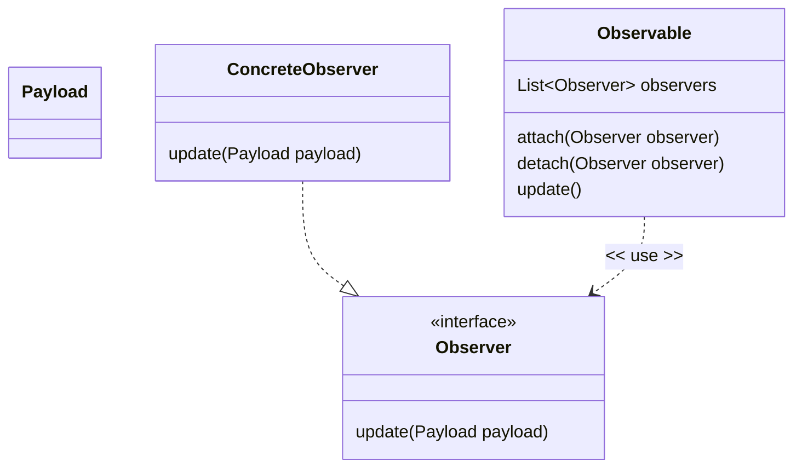
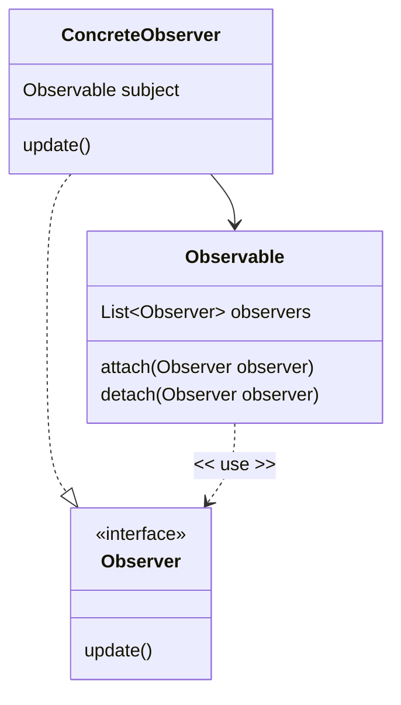

# Adding or changing behavior of closed classes using Observers

You have probably written code which outputs strings to the console window for debugging or testing.

```Java
class MyClass
{
    void myOperation(String parameter)
    {
       System.out.format("myOperation() called with parameter  %s\n", parameter);
    }
}
```
This should feel a bit uncomfortable by now, firstly because writing text to the console is very unlikely to be a core responsibility of the class, and secondly because requires modifying a closed class to change it. The objective (to write to the terminal) is a consequence of the `operation()` method being called, not an integral part of the responsibility of the class. We can move this "consequence of" behavior outside the class using the **Observer pattern**. As the name suggests we can create Observer classes that receive notifications from an object of interest (the **Observable**). The Observer now becomes responsible for processing the notification.

If we wanted to convert the example above to use the Observer pattern, we could implement it this way.

First start with an interface that has a single method declaration, which is a notification that the operation has been called.

```Java
interface MyClassObserver {
    void onOperationCalled(String parameter);
}
```
The class is changed to take a MyClassObserver as a constructor parameter. The Observer's OnOperationCalled method is invoked when `myOperation` completes.

```Java
class MyClass {

    final MyClassObserver observer;

    MyClass(MyClassObserver observer) {
        this.observer = observer;
    }

    void myOperation(String operationParameter) {
        //do the operation
        //notify the observer
        observer.onOperationCalled(operationParameter);
    }
}
```
Finally, we can implement an actual (concrete) Observer that outputs a message to the terminal.

``` Java
class ConsoleObserver implements MyClassObserver {
    @Override
    public void onOperationCalled(String parameter) {
        System.out.format("myOperation() called with parameter %s\n", parameter);
    }
}
```
The Console Observer is given to the class we want to observe when it is created.

```Java
MyClassObserver observer = new ConsoleObserver();
MyClass myClass = new MyClass(observer);
myClass.myOperation("ABC123");

// Outputs
// myOperation() called with parameter ABC123
```

If we don't want any messages printed, we can swap the ConsoleObserver instance for an instance of a different Observer. For example, this NullObserver just does nothing.

```Java
class NullObserver implements MyClassObserver{
    @Override
    public void onOperationCalled(String parameter) {
        //do nothing
    }
}

MyClassObserver observer = new NullObserver();
MyClass myClass = new MyClass(observer);
myClass.myOperation("ABC123");
//No output
```

There are some important things to note about this arrangement:

- MyClass now does not have to include code that is not relevant to its core responsibility - it just notifies its Observer, and the Observer implementation decides what to do with the notification. Handling the notification is now the core responsibility of the Observer.
- We can provide alternative Observers implementations which change how the notification is handled, without changing code inside MyClass - we can extend functionality by adding new classes, which is one of our key design goals. For example, I could write a different Observer implementation that sent me an SMS message when it handled the `onOperationCalled` notification.
- This looks similar to the **Strategy** pattern, but instead providing a strategy to be used inside the class under observation, the class under observation is *pushing* notifications outside the class.

In practice, we need our Observable classes to support `0..*` Observers. As well as supporting more than one Observer, we do not have to attach any Observers to the Observable (and then we do not have to write null observers).

The example with changes to support a list of Observers.

```Java
class MyClass {

    final List<MyClassObserver> observers = new ArrayList<>();

    void addObserver(MyClassObserver observer) {
        observers.add(observer);
    }


    void myOperation(String operationParameter) {
        //do the operation
        //notify the observers
        for (MyClassObserver observer : observers) {
            observer.onOperationCalled(operationParameter);
        }
    }
}
```
The usage changes to:

```Java
MyClass myClass = new MyClass();
myClass.addObserver(new ConsoleObserver());
myClass.addObserver(...); //Add more observers as required doing different things with the notification
myClass.myOperation("ABC123");

// Outputs
// myOperation() called with parameter ABC123
```

> The Observer/Observable pattern is so useful that there is a general purpose implementation of the pattern in the java.util package. However, it has some drawbacks, including the fact that your class must inherit from the abstract Observable class. Our guidance would be not to use the general purpose implementation and to write specific implementations to suit your particular problem.

For a (slightly) more realistic example, let us return to our Pizza Restaurant. We previously looked at a way of describing a pizza and calculating its price. We now need to save an order containing multiple pizzas together with other details such as the order number.

We will still use the Decorator pattern to build our pizza descriptions and prices, but first, let us create a Pizza class that holds the Pizza components.

```Java
class Pizza {

    PizzaComponent components;

    public Pizza(String baseName, double price) {

        this(new PizzaBase(baseName, price));
    }

    private Pizza(PizzaBase base) {
        components = base;
    }

    public Pizza addSauce(String name, double price) {
        components = new Sauce(components, name, price);
        return this;
    }

    public Pizza addTopping(String name, double price) {
        components = new Topping(components, name, price);
        return this;
    }

    public Pizza addCheese(String name, double price) {
        components = new Cheese(components, name, price);
        return this;
    }

    public String getDescription() {
        return components.getDescription();
    }

    public double getPrice() {
        return components.getPrice();
    }
}
```

Next, create an Order class that holds multiple Pizzas. When we create the Order we want to assign it a table number, so we can deliver the correct order to the correct restaurant table, and when we save the Order we will use Observers to handle the consequences of taking an order.

The OrderObserver interface has a single `onSave()` method with the Pizza object as its parameter. In this case we are not making any decisions about what we are going to provide our Observers as a notification, we are going to give the Observer the whole Pizza object.

```Java
interface OrderObserver {
    void orderTaken(Order order);
}

class Order {

    final int tableNumber;
    final List<Pizza> items = new ArrayList<>();
    final List<OrderObserver> observers = new ArrayList<>();

    Order(int tableNumber) {
        this.tableNumber = tableNumber;
    }

    public void addPizza(Pizza pizza) {
        items.add(pizza);
    }

    public void addObserver(OrderObserver observer) {
        observers.add(observer);
    }

    public int getTableNumber() {
        return tableNumber;
    }

    public List<Pizza> getItems() {
        return Collections.unmodifiableList(items);
    }

    public double getPrice() {
        return items.stream().mapToDouble(Pizza::getPrice).sum();
    }

    public void save() {
        //save the order to a database
        //notify the Observers that an order has been taken
        for (OrderObserver observer : observers) {
            observer.orderTaken(this);
        }
    }
}
```
Our requirements are that when a customer places an order, we want to save it to a database and tell the kitchen to start preparing the food. The kitchen has a printer and when the order is saved we want to print a **dupe** of the order on the kitchen printer. In the restaurant business, a **dupe** is a duplicate of an order receipt provided to the kitchen staff. The printed dupe is how the order details get passed from the front of house (where customers are) to the kitchen. When the food is ready the kitchen puts the dupe with the dishes, so when the server picks up the food, they know which table the food is for.

The KitchenPrinter class converts an Order object into a printed representation.

> In a real system this code is having to deal with all the complexities of an actual mechanical printer. Search "Star Micronics Kitchen Printer" to see specifications for a typical printer. Other printer types are available.

```Java
class KitchenPrinter implements OrderObserver {
    @Override
    public void orderTaken(Order order) {
        int lineNumber = 1;
        System.out.format("Table Number %d\n", order.getTableNumber());
        for (String line : getDescriptions(order)) {
            System.out.format("%d. %s\n", lineNumber++, line);
        }
        System.out.format("==============\n");
    }

    static List<String> getDescriptions(Order order) {
        return order.getItems().stream().map(Pizza::getDescription).toList();
    }
}
```

The completed example.

```Java
Order order = new Order(10);
KitchenPrinter kitchenPrinter = new KitchenPrinter();
order.addObserver(kitchenPrinter);

Pizza pizza1 = new Pizza("Italian", 2.25d);
pizza1.addSauce("Tomato", 1.25d).addTopping("Pineapple", 2.30d).addCheese("Cheddar", 1.45d);
order.addPizza(pizza1);

Pizza pizza2 = new Pizza("Stuffed Crust", 4.70d);
pizza2.addSauce("Tomato", 1.25d).addTopping("Mushroom", 2.30d);
order.addPizza(pizza2);

order.save();

//The KitchenPrinter object prints
// Table Number 10
// 1. Italian Base, Tomato Sauce, Pineapple Topping, Cheddar Cheese
// 2. Stuffed Crust Base, Tomato Sauce, Mushroom Topping
// ==============
```
Here we have used the Observer pattern to handle a business event - the taking of a restaurant order. We have separated out the code for saving an order from the code that prints the duplicate, and indeed any code that we want to run as a side effect of taking an order.

The Decorator pattern allowed us to change or augment the behavior of class without having to changing its source code, the Observer pattern allows us to add side effects (actions that are consequences of a change in the class state) to a class without changing its source code.

Unlike Decorators which must implement the same interface as the class being decorated, the observer pattern allows you to many different notifications to the Observer interface at runtime (for example we would need different Observer classes depending on the model of Kitchen Printer in use in that particular restaurant). Adding new Observers at runtime is also simple. For example, we might want to sound a buzzer in the kitchen to alert them that a new order has been taken, so the Kitchen staff knows they need to check the printer.

When applying the Observer pattern, we are in effect allowing the class to describe significant events that have occurred to it. We have an extensible mechanism whereby other code can subscribe to and execute their own logic in response to these events. The class and the Observers that handle the event are decoupled. The Observers know about the class, but the class does not know about the Observers. Furthermore, the number and behavior of event handlers can be varied at runtime by attaching (subscribing) different Observers to an object.

Adding Observers to a class is a good way of making it closed for modification and open for extensibility. You only need to change the source code if you need to add new events.

The Observer pattern is common in GUI frameworks. The Observable object might be something like a button. When a user clicks the button it coverts the mouse actions into events such as OnButtonDown and OnButtonUp. The button implements the Observer pattern. Observers (which might be called **Event Handlers**, **Event Listeners** or **Callbacks**) register themselves with the Button instance, and are notified of all the button events. This way the GUI framework can exist without any knowledge of how your program will react to button events.

> The C# language for example has the Observer pattern built into the language using the `event` keyword, and .NET GUI frameworks use events extensively.

## A general Observer Pattern

There are lots of ways to implementing the pattern, but here are a couple of general versions.

Start with the Observer interface.

```Java
class Payload
{
}

interface Observer {
    void update(Payload payload);
}

```

Concrete implementations.

The Observable class has a list of `Observers`.

```Java
class Observable  {
    final List<Observer> observers = new ArrayList<>();

    public void attach(Observer observer) {
        observers.add(observer);
    }

    public void detach(Observer observer) {
        observers.remove(observer);
    }

    public void update() {
        Payload payload = new Payload();
        for (Observer observer : observers) {
            observer.update(payload);
        }
    }
}
```


```Java
class ConcreteObserver implements Observer{
    @Override
    public void update(Payload payload) {
        //Do something with the payload
    }
}

```
Observers are attached to the Observable
```Java
Observable observable = new Observable();
Observer observer = new ConcreteObserver();
observable.attach(observer);
observable.update();
```




This style is called a **Push** Observer, because the Observable pushes data as a **payload** to Observer's update method

An alternative is the **Pull** style. In the Pull style, the Observer's update method does not have a payload, instead the ConcreteObserver is created with a reference to an Observable.

When the state of the Observable is update, the  Observer are simply notified (no payload in the update method), and the Observer pulls the data it needs from its reference to the Observable.

```Java
interface Observer {
    void update();
}

```
The ConcreteObserver class takes a reference to the instance of Observable being observed. When the Observable is updated, the Observer is notified and can pull any data it needs from the Observable.

```Java
class ConcreteObserver implements Observer {

    private final Observable subject;

    ConcreteObserver(Observable subject) {
        this.subject = subject;
    }

    @Override
    public void update() {
        //read state from this.subject
    }
}

class Observable  {
    final List<Observer> observers = new ArrayList<>();

    public void attach(Observer observer) {
        observers.add(observer);
    }

    public void detach(Observer observer) {
        observers.remove(observer);
    }

    public void changeState(){
        // Something happens to hange the state of the observable
        //Notify the observers
        update();
    }
    void update() {
        for (Observer observer : observers) {
            observer.update();
        }
    }
}
```
Example usage.

```java
        Observable observable = new Observable();
        Observer observer = new ConcreteObserver(observable);
        observable.attach(observer);
        observable.changeState();
        observable.detach(observer);
```
The class diagram for the Pull style is:

> Using the Push style you can control what is exposed to the Observer by designing the payload, otherwise you might need to make class internals public. Also, there is no circular reference set up between the Observer and the Observable, which requires you to remember to detach Observes once you have finished with them.

## Publish and subscribe
The Observer pattern is an example of a **Publish-Subscribe** (often abbreviated to **PubSub**) architecture, which is a common architecture in multiple areas of computing.

The **Publisher** publishes a range of different events. `0..*` **Subscribers**  subscribe to events of interest are notified by the publisher when the event occurs. From the discussion above the Observable is the publisher and Observers are the subscribers.

The benefits of the Pub-Sub style is that the publisher and subscribers are decoupled. Components can publish messages without knowing how many consumers or what kinds of consumers are listening to the events.
