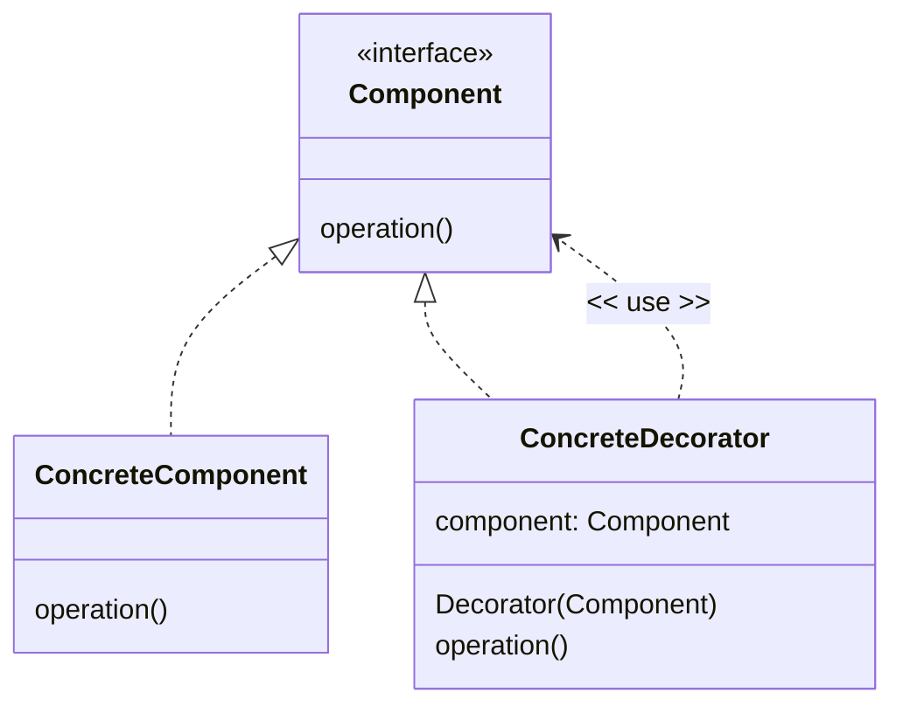
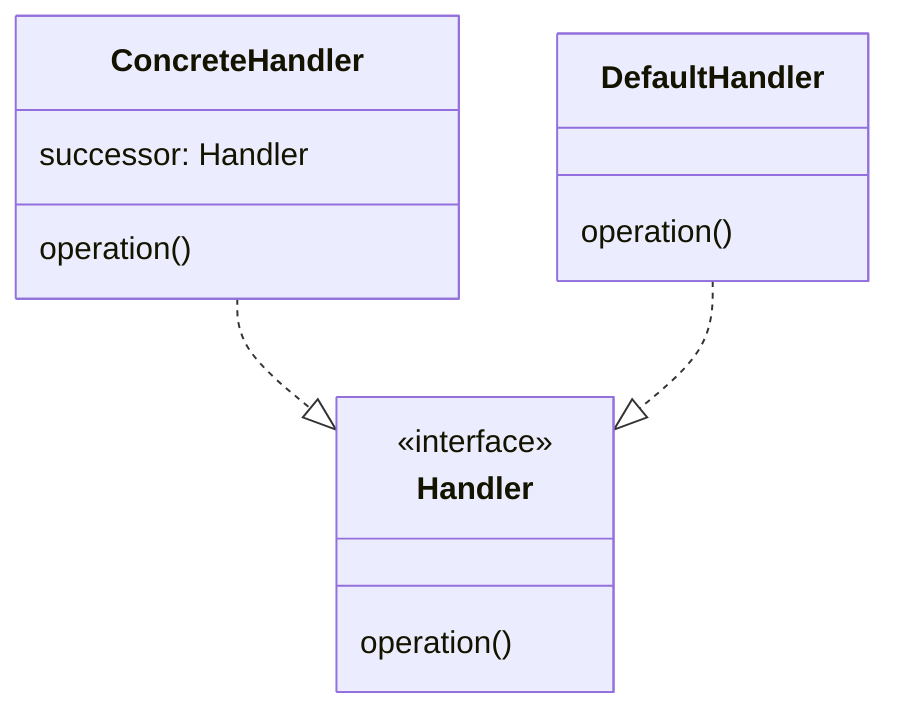

# Adding or changing behavior of closed classes with Pipelines

We have discussed that classes that a subject to variation are open for extension but closed for modification - the open/closed principle (OCP).

An ideal design would allow you to extend (introduce another variation) by writing only new code, rather than modifying existing code. Classes and methods are "open for extension" (open meaning available to be extended) by having a mechanism for adding a variation and "closed for modification" (closed meaning completed and forbidden to be changed) which means that extension does not require the original source code to change.

There are other ways to change or add to the behavior of an existing class.

## Utility Classes and Helper Methods

There may be times when you need to add additional functionality to a class, and you do not have the ability to extend or change the source code for the original class.

For example, you are given the Price class and cannot change it, but want to split the Price into Pounds and Pence. We can write **Helper Methods** in a utility class.

``` Java
final class PriceUtility {


    private PriceUtility()
    {
    }

    public static double getPounds(Price price)
    {
        return Math.floor(price.get());
    }

    public static double getPence(Price price)
    {
        return price.get() - getPounds(price);
    }
}

//Usage

PriceUtility.getPounds(product.getPrice());
PriceUtility.getPence(product.getPrice());

```

There are some specific features about this utility class. It is never intended to be instantiated because we just need a class to hold some static helper methods. To achieve this:

- The utility class entirely consists of `static` methods and has no fields.
- The class has a private default constructor, so no code can ever create an instance of the class.
- The class is declared `final`. The `final` keyword prevents anyone from inheriting (subclassing using the `extends` keyword) the class.
- Because a final class never has any subclasses, the methods of a final class can never be overridden.

## Adding Methods to Interfaces and providing a default implementation

We have already discussed that any methods defined by a Java interface are inherently abstract, and that any class that implements the interface must provide concrete implementations of all the abstract methods.

If we add another abstract method to the interface, then all classes that implement the interface will have to implement the new method.

It is possible to write concrete methods as part of a Java interface with an implementation, providing these methods are `private`, `static` or `default`.

A default method is a method declared in an interface with the `default` modifier and provides a default implementation for any class that implements the interface. Default methods can only use their parameters or other methods declared within the interface.

Default methods on interfaces therefore allow you to add a method to the interface without having to change (re-open) all implementing classes, providing the default behavior can be implemented entirely using other members of the interface. Default methods can be overridden by concrete classes if the concrete class needs a different implementation to the default.

## Adding to or Changing behaviors using Decorators

In a previous example we had a Product class that represented a product we might sell in a store or on Amazon. These products have the characteristic that they have a fixed specification which never changes - customers would not want to order a product from a website based on its description and a photo and get something different.

If the product specification changed, then we would create a new product identity (a new GTIN13 or ASIN code) and a new product record. For example the specification of a T-Shirt is its style, its colour and its size. If we change any one of those attributes, then it becomes a different version of the T-Shirt. In our warehouse we would be careful to keep the stocks of the old product version, and the new product version separate.

Some products do not have a fixed specification. In this example we will consider a pizza restaurant. In our pizza restaurant, pizzas are very variable because customers can choose their preferred pizza base, sauce, toppings and cheese. This presents a challenge for designing a point of sale (POS) software that takes the order, prices it and prints a paper ticket for the kitchen to make up the order.

We could try to create a GTIN or other product code and matching description to represent every combination, but this would be potentially hundreds or thousands of product codes and is not a good solution - adding just one new option would create the need for adding many new product codes.

Instead, we can design a description of the product that builds up in layers, a bit like a pizza is built in layers.

Analysis of pizza as a product shows that a pizza is a layered product

- There is exactly one (written as `1..1`) pizza base - examples Italian, Thin and Stuffed Crust.
- There is zero or one (written as `0..1`) sauces - examples no sauce, tomato and BBQ.
- There are zero to many (written as `0..*`) toppings - options are no toppings, pepperoni, mushrooms, onion, pineapple, chilli, etc
- There is `0..1` cheese option - no cheese, Mozzarella or Cheddar

We can see from this analysis only the base is mandatory (in theory a customer could order just a base without sauce, topping or cheese) and all the other layers are optional. As a (sort of) diagram we can show the layers

```text
0..1 cheese
0..* toppings
0..1 sauce
1..1 base
```

- We require a method of building an object that represents a pizza order by adding and removing optional elements.
- We need a getDescription() method to return a description of the pizza for printing on the customer's bill and on the order sent to the kitchen.
- We need a getPrice() method to determines the price of the Pizza based on the options the customer has selected.

We start with an interface that describes the behavior we require and a helper method to display the result.

> Following the guidance for class design, examples should really use Value Objects for descriptions and prices, but have used primitives for now to simplify the example

``` Java
interface PizzaComponent {
    String getDescription();
    double getPrice();
}

private static void show(PizzaComponent pizza) {
    System.out.format("Order for %s\n", pizza.getDescription());
    System.out.format("Price %.2f\n", pizza.getPrice());
}
```
A pizza starts with a base, so we create a class representing a PizzaBase that implements the PizzaComponent interface.

```Java
class PizzaBase implements PizzaComponent {

    private final String name;
    private final double price;

    PizzaBase(String name, double price) {
        this.name = name;
        this.price = price;
    }

    @Override
    public String getDescription() {
        return String.format("%s Base", name);
    }

    @Override
    public double getPrice() {
        return price;
    }
}
```
Exercising the interface produces the expected result, even if we do not get a very exciting Pizza.

``` Java
PizzaComponent base = new PizzaBase("Italian",2.50d);
show(base);

//Output
Order for Italian Base
Price 2.50
```
We can create another class representing the sauce, that aggregates the previous PizzaComponent and 'layers' the sauce around the previous component.

```Java
class Sauce implements PizzaComponent {

    private final PizzaComponent component;
    private final String name;
    private final double price;

    public Sauce(PizzaComponent component, String name, double price) {
        this.component = component;
        this.name = name;
        this.price = price;
    }


    @Override
    public String getDescription() {
        return String.format("%s, %s Sauce", component.getDescription(), name);
    }

    @Override
    public double getPrice() {
        return component.getPrice() + price;
    }
}
```
Now we can build our Pizza out of components

``` Java
    PizzaComponent base = new PizzaBase("Italian",2.50d);
    PizzaComponent sauce = new Sauce(base, "Tomato", 2.00);
    show(sauce);

//Output
Order for Italian Base, Tomato Sauce
Price 4.50
```

- The `Sauce` class **aggregates** (wraps) a `PizzaComponentInterface`, so when we call any of the `PizzaComponentInterface` operations on the instance of the Sauce class it can call the same method on the wrapped instance, adding to or changing the output of the call to the previous component. In this case we are adding to the result of the call to the previous component in the case of `getPrice()` and modifying the result in the case of `getDescription()`;
- Both the `PizzaBase` and `Sauce` classes implement the `PizzaComponentInterface`, so the client code (in this example the `show()` function) works with the `PizzaComponentInterface`, so it doesn't know which actual (concrete) component it is talking to. Therefore, we can build an order that just comprises a PizzaBase instance or comprises instances of Sauce and PizzaBase. Where we have wrapped the PizzaBase component, we have added functionality to our PizzaBase.
- For this to work all the components must implement the `PizzaComponentInterface`.

Toppings and cheeses are more implementations of the PizzaComponent interface, again wrapping (aggregating) the previous chain of components.

```Java

class Topping implements PizzaComponent {

    private final PizzaComponent component;
    private final String name;
    private final double price;

    public Topping(PizzaComponent component, String name, double price) {
        this.component = component;
        this.name = name;
        this.price = price;
    }


    @Override
    public String getDescription() {
        return String.format("%s, %s Topping", component.getDescription(), name);
    }

    @Override
    public double getPrice() {
        return component.getPrice() + price;
    }
}

class Cheese implements PizzaComponent {

    private final PizzaComponent component;
    private final String description;
    private final double price;

    public Cheese(PizzaComponent component, String description, double price) {
        this.component = component;
        this.description = description;
        this.price = price;
    }


    @Override
    public String getDescription() {
        return String.format("%s, %s Cheese", component.getDescription(), description);
    }

    @Override
    public double getPrice() {
        return component.getPrice() + price;
    }
}
```
Now we can build our Pizza out of more components.

``` Java
PizzaComponent base = new PizzaBase("Italian",2.50d);
PizzaComponent sauce = new Sauce(base, "Tomato", 2.00);
PizzaComponent topping =  new Topping(sauce, "Pepperoni", 0.75d);
PizzaComponent cheese = new Cheese(topping,"Mozzarella", 1.30d);
show(cheese);

//Output
Order for Italian Base, Tomato Sauce, Pepperoni Topping, Mozzarella Cheese
Price 6.55
```
We could even format the code to resemble the actual layering in real Pizzas.

```Java

 PizzaComponent pizza = new Cheese(
                                    new Topping(
                                        new Sauce(
                                            new PizzaBase("Stuffed Crust", 3.80d),
                                                "BBQ", 2.50d
                                        ), "Mushroom", 0.50d
                                    ), "Cheddar", 1.50d
                                );

show(pizza);

//Output
Order for Stuffed Crust Base, BBQ Sauce, Mushroom Topping, Cheddar Cheese
Price 8.30
```
Depending on how many components have been linked together, the client code (in this case show()) will call a chain of `1..*` implementations of the PizzaComponent interface.

This design pattern is called the **Decorator** (or sometimes the **Wrapper**) pattern, and allows one implementation of the interface to add to or change the call being made to a previous implementation of the interface.

In its general form the Decorator pattern looks like this:



Define the interface for the component that needs decorating.
```Java
 interface Component {
     void operation();
}
```
Then implement one or more concrete components that implement the Component interface and write the component functionality.
```Java
public class ConcreteComponent implements Component {
    @Override
    public void operation() {
        //component functionality here
    }
}

```
Create one or more concrete Decorators that also implement the Component interface. Decorators can add functionality before the call or after the call to the inner component. As the Decorator aggregates a Component interface, then one concrete Decorator could be calling another Decorator(s) or the original Concrete Component.

```Java
class ConcreteDecorator implements Component{
    private final Component component;

    public ConcreteDecorator(Component component) {
        this.component = component;
    }

    @Override
    public void operation() {
        //Decorator can add functionality before the call to the inner component
        //including changing any parameters
        component.operation();
        //Decorator can add functionality after the call to the inner component
        //including changing the return from the inner component
    }
}
```

The client code is unaware if they are referencing the original component or a decorator.
```Java
Component component = new ConcreteComponent();
component  = new ConcreteDecorator(component);
component.operation();
```

Decorators provide a form of subclassing. In Java subclassing the subclass extends the superclass and can add or replace functionality provided by the superclass. Using conventional subclassing the functionality is decided at compile time. With decorators, the functionality is decided dynamically at runtime by adding one or more decorators.

## Changing Decorators into Chains of Responsibility
In the pizza example, the operation implementation in the Decorator (in the example 'getPrice' or 'getDescription' operations) always called the same operation on the inner component, so it always passed the call from the client down the chain of Decorators until the call chain ended on the original component we wanted to decorate.

We could write a form of decorator that **handled** the operation itself and does not pass it on to the inner component. For example, imagine we wanted to look something up in a database, but we have two or more databases that might contain the record (looking up academic references would be an example, there are potentially many databases to search). We would assemble a chain of components as before, but in this case:

1. The outermost component looks up in the first database, if it succeeds, it returns the result and does not pass the call on to its inner component.
2. If outermost component looks up in the first database and the lookup fails, the outermost component passes the call onto to its inner component to try.
3. The next component looks up in the second database and again, the lookup either succeeds or fails, so the component either returns the result or passes onto its inner component.
4. Any unhandled calls go down the chain until it reaches the final component. The final component is the last chance, so if the call chain reaches the final component, then this is either an error or the final component implements some default behavior.

For this example, we start by defining the interface to look up a **Digital Object Identifier** (**DOI**). A DOI is a permanent identifier for digital artifacts such as journal articles, research reports, data sets, and official publications. See [https://www.doi.org/the-identifier/what-is-a-doi/](https://www.doi.org/the-identifier/what-is-a-doi/). DOIs are another globally unique identity system like the GTIN identifier we used earlier, and again should be represented using a Value Object in real software.

```Java
interface SearchHandler {
    boolean hasDigitalObject(String doi);
}
```
Write a concrete class that looks up the DOI in a particular database. We would write one of these for each database we want to consult. If the reference was not found in the database, pass on to the next implementation of `SearchHandler`.

```Java
class DatabaseHandler implements SearchHandler {
    private final SearchHandler successor;

    public DatabaseHandler(SearchHandler successor) {
        this.successor = successor;
    }

    @Override
    public boolean hasDigitalObject(String doi) {
        boolean lookup = lookupInDatabase(doi);
        if (lookup) return true;
            //Failed to handle the call, pass on to successor
        else return successor.hasDigitalObject(doi);
    }

    private boolean lookupInDatabase(String doi) {
        //look up from database, return true or false if exists
        return false;
    }
}
```
The final handler in the chain must process the call because there are no more successors to pass to call on to. In this case we just return false. The last one in the chain is called a **Default Handler**. In this case there must be no more databases to look in, so we just return false.

```Java

class DefaultHandler implements SearchHandler{
    @Override
    public boolean hasDigitalObject(String doi) {
        return false;
    }
}
```
At runtime, we can assemble a chain of these database lookups, each responsible for a particular database. The final DefaultHandler at the end of the chain just returns false.

```Java
SearchHandler handler = new DatabaseHandler(new DefaultHandler());
handler.hasDigitalObject("10.1000/182");
```
This pattern is called the **Chain of Responsibility** pattern - the code structure is almost the same as the Decorator pattern, the difference between the Decorator Pattern and the Chain of Responsibility is that Decorators *always* pass on the call to the next component in the chain (the successor), whereas with this pattern the handler *sometimes* passes on the call to the successor, depending on if the handler could handle the call themselves or not.

The general form for the Chain of Responsibility pattern:



The interface definition is the same as we had with the decorator
```Java
interface Handler {
    void operation();
}
```
We must have a default handler

```Java
class DefaultHandler implements Handler {
    @Override
    public void operation() {
        //Final chance to handle the operation
    }
}
```
and one or more ConcreteHandlers

```Java
class ConcreteHandler implements Handler {

    private final Handler successor;

    ConcreteHandler(Handler successor) {
        this.successor = successor;
    }

    @Override
    public void operation() {
        //if I can handle the operation, do so, else pass onto my successor
        successor.operation();
    }
}
```

> You may be thinking that you could use a chain of handlers to ensure preconditions before a call and postConditions and class invariants after the call - general advice is that that is not what the pattern is for - Ensuring pre-conditions, post-conditions and the class invariant is an integral part of the class design. Decorators and Handlers are for managing additional responsibilities for a class, whereas pre-conditions, post-conditions and the class invariant are a core responsibility of the class which should not be delegated to other components.


## Chains and Pipelines

Decorators provide us with a way of enhancing (adding or changing functionality) an operation. Chains of Responsibility allow different classes to handle an operation. These components can be chained together to make a **Pipeline** for handling an operation requested by a client.

In large-scale software systems there is often functionality that we want to add to our code that has nothing to do with the core business functionality. Chaining components can help us satisfy these requirements.


| Concern                    | Requirement                                                                                                                                                                                                                                                                                                                                                                                                          | Pattern to use                                                                                                                                                                                                                                                                                                                                              |
|----------------------------|----------------------------------------------------------------------------------------------------------------------------------------------------------------------------------------------------------------------------------------------------------------------------------------------------------------------------------------------------------------------------------------------------------------------|-------------------------------------------------------------------------------------------------------------------------------------------------------------------------------------------------------------------------------------------------------------------------------------------------------------------------------------------------------------|
| Security 	                 | Checking if the user has been authenticated and has permission (is authorised) to call the method.                                                                                                                                                                                                                                                                                                                   | Chain of Responsibility - if the user is not authenticated or authorised the call chain terminates in the authentication or authorisation handler and is not passed down the chain to the requested service.                                                                                                                                                |
| Logging 	                  | Logging methods have been called, what parameters were used and what the method call returned.                                                                                                                                                                                                                                                                                                                       | Decorator - call is always passed down the chain, logging is  additional functionality added to the method call.                                                                                                                                                                                                                                            |
| Monitoring                 | Like logging, but instead of recording details about the call, record how many times the method is called or how long it takes to execute. For example, when the performance of a system slows, we need to understand performance at the method level to see which parts of the system are being slow to respond                                                                                                     | Decorator because the call is always passed down the chain, monitoring is additional functionality added to the method call.                                                                                                                                                                                                                                |
| Error handling and retry 	 | Catching errors and retrying the call. This is particularly useful when we are calling a service over a network or the internet  which can have temporary service interruptions due to temporary network loss, temporary service availability due to maintenance, or just being too busy. These are all examples of **Transient Errors**, errors that might correct themselves, so that another attempt may succeed. | Usually Decorator because the call is always passed down the chain and any errors returned to the caller after a number of retries. A **Circuit Breaker** refuses to pass the call down the chain if more then a certain number of errors have occurred, which is more of a Chain of Responsibility. Circuit Breakers usually reset after some time period. |
| Timeouts 	                 | Operations that take over a particular time are unlikely to succeed. Terminate the call if it takes longer than required.                                                                                                                                                                                                                                                                                            | A Chain of Responsibility Component that always forwards the call but can return to its client before the successor call completes.                                                                                                                                                                                                                         |
| Rate Limiting 	            | One way of protecting a system under high load is to limit the rate of calls to prevent a system from failing completely under high load.                                                                                                                                                                                                                                                                            | A Decorator that counts the number of calls made per second and waits if the rate limit is exceeded or a Chain of Responsibility if the component returns an error back to the client when the rate is exceeded.                                                                                                                                            |
| Caching                    | Optimizing performance by storing frequently accessed data. For example, once we had looked up an DOI in a database and the database said it existed, we could cache that result, so if the same DOI was queried, we would return the result from a cache and save a slow and expensive call to the database.                                                                                                        | Chain of Responsibility - the cache handler may be able return the required data without passing the call down the chain.                                                                                                                                                                                                                                   |
| Privacy                    | We might scan returns from method calls for confidential information in text such as passwords or other security sensitive information and obscure it.                                                                                                                                                                                                                                                               | Decorator - call is always passed down the chain, but the parameters or return values are altered.                                                                                                                                                                                                                                                          |

This kind of functionality is called  a **Cross Cutting Concern**. They are cross-cutting because they apply to lots (potentially all) of the method calls in a software system. Error Handling, Retry, Rate Limiting and Caching functionality might all need to be applied when calling a system we do not control or is reached over a network (calling web services being a good example) in improve the **Resilience** - the ability to continue to provide a service to a client, even if a downstream service is degraded, despite adverse events and conditions in the rest of the system.

The problem with including cross-cutting functionality into the actual method calls is that it adds additional responsibilities to classes which are completely different to their core business responsibility. Using Decorators or Chains of Responsibility separate out these non-business concerns into their own classes. This is an example of following the **Single Responsibility Principle** that we will cover in more detail later, but put simply it means that each class in the chain only has to have one responsibility, and we are not mixing up the code that handles business responsibilities satisfying functional requirements with the technical responsibilities satisfying non-functional requirements.

### HTTP Pipelines

Creating a pipeline of components is a common design for making HTTP requests (you are calling someone else's HTTP service) or responding to HTTP requests (you are a server, serving someone else's request).

An HTTP request has an optional document body (for example some JSON) with `0..*` message headers. Headers provide additional details about the request such authentication **tokens** - bits of text that contain data about the user's identity.

The structure of an HTTP request is:

| Request Part | Contents                                                                       |
|--------------|--------------------------------------------------------------------------------|
| Start Line   | The HTTP Method (GET, POST etc.) and the request URI                           |
| 0..* Headers | Headers are key:value pairs that provide additional details about the request. |
| 0..1 Body    | An optional body, for example a JSON document                                  |

The response looks very similar, except  the Status Line which holds the HTTP Response Status Code (such as 2xx codes indicating the request was successfully received, understood, and accepted, or 4xx codes to indicate the request has bad syntax or cannot be fulfilled for some reason).

| Response Part | Contents                                                            |
|---------------|---------------------------------------------------------------------|
| Status Line   | The HTTP Status Code                                                |
| 0..* Headers  | Key:value pairs that provide additional details about the response. |
| 0..1 Body     | An optional body, for example a JSON document or HTML Page          |

- Request Pipelines (at the client) add additional HTTP headers (such as an authentication token) before the request is sent and then check the value of the HTTP response code, throwing an exception if the response code is not valid (2xx).
- Response Pipelines (at the server) inspect HTTP headers (for example checking an authentication token) before the request is handled and convert exceptions into a 4xx or 5xx response code. If the requested resource cannot be found, the last handler in the pipeline is a handler that returns a 404 (resource not found) error.
