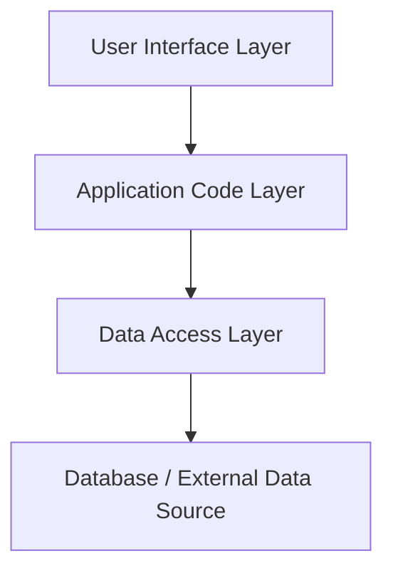
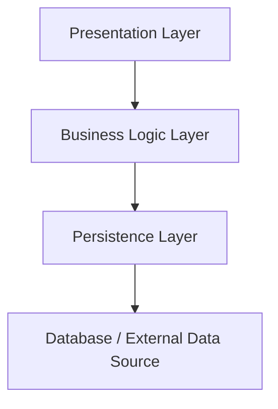
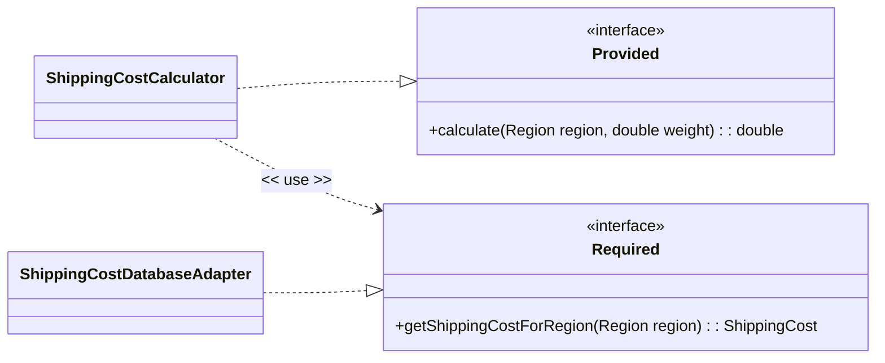
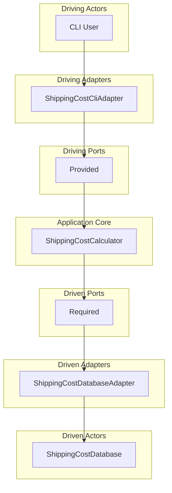
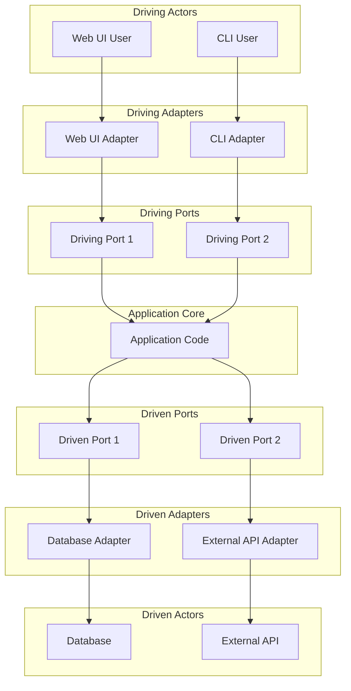
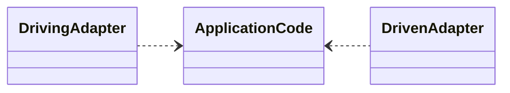

# Ports and Adapters (Hexagonal Architecture)

## The mixing of application code and technology code
We can now look at dependencies from an architectural standpoint. Architectural means looking at a higher level of than the individual class or a small group of classes, but instead think about whole sets of classes that work together to achieve a higher level of functionality.

Let us define the term **application code** to mean the 'business logic', the classes and methods that implement just the business functionality.

To be useful however, our application needs to deal with other technologies for things like user interfaces, databases, files or REST APIs. These technologies are the **infrastructure** we need to build a functional software product.

Together the application code, the technology and any 'glue' code make up a **software product**.

A problem arises when our application code becomes dependent on specific technologies because changing the database we are using or changing our user interface could require a change in the application code.

For example, take this piece of code from the Full Stack module.

```javaScript
const addNewAttendee = (event_id, user_id, done) => {
    const sql = 'INSERT INTO `attendees` (event_id, user_id) VALUES (?, ?)';
    let values = [event_id, user_id];

    db.run(sql, values, function (err) {
        if (err) return done(err);
        return done(null);
    })
}
```
the `addNewAttendee` is business logic but the implementation mixed up with the technology code (the code to INSERT INTO the database which is SQL database technology). We can't change the database, or replace the database with file storage without affecting the application code. The application code is dependent on the technology. Furthermore, you can't test the application code without a database.

This kind of code typically follows this organisation, which is that code is layered according to its functionality:


an alternative terminology for the layers is:


The user interface (aka presentation) code makes direct calls to the business logic layer, which in turn makes direct calls to the data access layer (aka persistence). Each layer is tightly coupled to the layer below it.

We want an application an architecture that is

- Independent of any particular UI, so your application code could have a different ways of interacting with the world (example web UI, a REST API and a command line UI).
- Independent of any database technology, or indeed any technology for persisting data.
- Independent of any technology that the application code might want to use to talk to the outside world (sending email or SMS messages, taking payment from a credit card for example).

In short, we want to change any infrastructure elements of the overall software product without changing any of our application code.

To do this, we are going to use the **Ports and Adapters** architecture (Cockburn and Paz, 2025). The Ports and Adapters architecture is also known as **Hexagonal Architecture**.

> ⚠ There are two spellings of the word *adapter* in use, the American spelling "adapter" and the British spelling "adaptor". The Ports and Adapters architecture uses the American spelling.

The way we achieve this is using Dependency Inversion. Instead of the application code depending on the technology code, the dependency is inverted and the application code defines and owns it's interfaces to the outside world. The infrastructure code depends on these interfaces.

## Example

Using the shipping charges example from earlier, here is an implementation that mixes the application code with the technology code.

```java
class ShippingCharge {
    final static double UK_CHARGE_PER_KG = 0.0;
    final static double EUR_CHARGE_PER_KG = 1.25d;
    final static double ROW_CHARGE_PER_KG = 5.5d;
    final static double ROW_MIN_CHARGE = 10.0d;


    public static void main(String[] args) {
        Scanner scanner = new Scanner(System.in); // Create a Scanner object

        System.out.print("Select a region to ship to (UK, EUR, ROW): ");
        String region = scanner.nextLine();
        System.out.print("Enter the weight of the package in kg: ");
        double weight = scanner.nextDouble();

        switch (region.toLowerCase()) {
            case "uk":
                System.out.format("Shipping cost to %s: %f%n", region, UK_CHARGE_PER_KG);
                break;
            case "eur":
                System.out.format("Shipping cost to %s: %f%n", region, EUR_CHARGE_PER_KG * weight);
                break;
            case "row":
                System.out.format("Shipping cost to %s: %f%n", region, Math.max(ROW_MIN_CHARGE, weight * ROW_CHARGE_PER_KG));
                break;
            default:
                System.out.println("Shipping to this region is not available.");
        }
        scanner.close(); // Close the scanner
    }
}
```
The **application** code is the business logic that calculates the shipping charge based on the country and weight of the package.

The **infrastructure** code is the code that reads input from the user and prints output to the console, as well as the code that implements the database of shipping charges, in this case expressed as constants in the code. Although that might not look like a database, it is still technology code because it is a way of storing data and not part of the business logic of the application.

The mixing of application code and technology code means that if we want to change the way we read input (for example, to read from a file or a REST API) or change the way we keep the shipping charges (for example, to use a database or a configuration file), we have to change the application code.

### Step 1: Define the interface *provided* by the application code

> ⚠ See the complete *ShippingCostPortsAdapters* example code from the Student GitHub repository.

The first step is to define the interface that the application code provides to the outside world. This interface defines the services that the application offers. In this case the interface is very simple, it just takes a country and a weight and returns the shipping charge.

For now, we call the interface `Provided` because this is the interface that is provided the outside world.

> ⚠ a provided interface is the set of public operations that the application code offers to the outside environment.

```java
public enum Region {
    UK,
    EUR,
    ROW
}

public interface Provided {
    double calculate(Region region, double weight);
}
```
Note that the `Region` enum is used to define the regions that the application supports and is part of the public provided interface.

### Step 2: Define the interface *required* by the application code
The next step is to define what the application code requires from the outside world. In this case, the application needs to be able to look up the shipping charges and any minimum charge for each country.
We define the services the application needs as an interface, and for now lets call this the `Required` service.

First create a class that represents the shipping cost data for a region.

``` java
public class ShippingCost {
    private final Region region;
    private final double minCharge;
    private final double costPerKg;

    public ShippingCost(Region region, double minCharge, double costPerKg) {
        this.region = region;
        this.minCharge = minCharge;
        this.costPerKg = costPerKg;
    }

    public double getMinCharge() {
        return minCharge;
    }
    public double getCostPerKg() {
        return costPerKg;
    }
    public Region getRegion() { return region;  }
}
```

Next, we define the `Required` interface that the application code will use to look up the shipping charges.

> ⚠ a **required** interface is the set of public operations used (required) by the application code that the application code expects the outside environment to handle on its behalf.

```java
public interface Required {
    ShippingCost getShippingCostForRegion(Region region);
}
```

Again note that the `Region` enum is used to define the regions that the application supports and that both the `Region` enum and `ShippingCost` class are part of the public required interface.

### Step 3: Create the class that will contain the application code and implements the `Provided` interface

In this example, the application code is so simple we can implement it in a single class.

The class that implements the `Provided` interface (the interface it offers to the outside world). The class depends on and uses the `Required` interface to look up the shipping charge data from the outside world.


```java
class ShippingCostCalculator implements Provided {
    private final Required required;

    public ShippingCostCalculator(Required required) {
        this.required = required;
    }
}

```

Having set up our basic class structure, we can now implement the `calculate` method that provides the shipping charge calculation.

```java
 double calculate(Region region, double weight) {
    ShippingCost shippingCost = required.getShippingCostForRegion(region);
    switch (region) {
        case UK:
        case EUR:
            double costPerKg = shippingCost.getCostPerKg();
            return weight * costPerKg;
        case ROW:
            double rowCostPerKg = shippingCost.getCostPerKg();
            double minCharge = shippingCost.getMinCharge();
            double cost = weight * rowCostPerKg;
            return Math.max(cost, minCharge);
        default:
            throw new IllegalArgumentException("Unknown region: " + region);
    }
}
```
We would be better off refactoring the `calculate` method to use a strategy pattern, so that each country has its own strategy for calculating the shipping charge.

First define a package private strategy interface that defines the method for calculating the shipping charge. Its private because it is only used within the `ShippingCalculator` class, and is not part of the public interface.

```java
interface ShippingCostStrategy {
    double calculate(double weight);
}
```
Next, we implement the strategy for each country:

```java
class UKShippingStrategy implements ShippingCostStrategy {
    private static final double ZERO = 0.0d;

    UKShippingStrategy() {
    }

    @Override
    public double calculate(double weight) {
        return ZERO;
    }
}

class EURShippingStrategy implements ShippingCostStrategy {
    private final double costPerKg;

    EURShippingStrategy(double costPerKg) {
        this.costPerKg = costPerKg;
    }

    @Override
    public double calculate(double weight) {
        return weight * costPerKg;
    }
}

class ROWShippingStrategy implements ShippingCostStrategy {
    private final double minCharge;
    private final double costPerKg;

    ROWShippingStrategy(double minCharge, double costPerKg) {
        this.minCharge = minCharge;
        this.costPerKg = costPerKg;
    }

    @Override
    public double calculate(double weight) {
        return Math.max(minCharge, weight * costPerKg);
    }
}
```
Now our `calculate` method can use these strategies to calculate the shipping charge:

```java
@Override
public double calculate(Region region, double weight) {
    return getStrategy(region).calculate(weight);
}


ShippingCostStrategy getStrategy(Region region) {
    ShippingCost shippingCost = required.getShippingCostForRegion(region);
    return  switch (region) {
        case UK -> new UKShippingStrategy();
        case EUR -> new EURShippingStrategy(shippingCost.getCostPerKg());
        // Note: The ROW strategy uses both min charge and cost per kg
        case ROW -> new ROWShippingStrategy(shippingCost.getMinCharge(), shippingCost.getCostPerKg());
        default -> throw new IllegalArgumentException("Unknown region: " + region);
    };
}
```
We now have a class that implements the `Provided` interface and uses the `Required` interface to look up the shipping charges. The application code is now independent of any particular technology.

### Step 4: Hide the concrete implementation of the application code
We obviously need a way to create the concrete `ShippingCalculator` class and provide it with the `Required` interface, but the client should only know about the `Provided` interface.

This is done by creating a factory that privately creates the `ShippingCalculator` class and provides it with the `Required` interface. This hides the detail of which concrete class is used from the client and allows the client to depend only on the `Provided` interface and the factory.

In this example, we have used the Java feature of allowing an interface to have a static method to create an instance of the interface. This is a helper method that creates the `ShippingCalculator` class and provides it with the `Required` interface. The `Required` interface has to be public, but the `ShippingCalculator` class and its constructor can now be private.

The client code is unaware of the implementation details and only needs to depend on the `Provided` interface.

```java
public interface Provided {
    double calculate(Country country, double weight);

    static Provided create(Required required) {
        return new ShippingCostCalculator(required);
    }
}
```
### Step 5: Implement the `Required` interface
The `Required` interface needs to be implemented by a class that looks up the shipping charges.

This class can use any technology to store the shipping charges, in this case we will use a simple class that provides the shipping charges from a map, but this could easily be replaced with a file or database lookup.

```Java
 public class ShippingCostDatabase {

    final Map<Region, Double> costPerKgMap = new EnumMap<>(Region.class);
    final Map<Region, Double> minChargeMap = new EnumMap<>(Region.class);


    public ShippingCostDatabase() {
        costPerKgMap.put(Region.UK, 0.0);
        costPerKgMap.put(Region.EUR, 1.25d);
        costPerKgMap.put(Region.ROW, 5.5d);

        minChargeMap.put(Region.UK, 0.0);
        minChargeMap.put(Region.EUR, 0.0);
        minChargeMap.put(Region.ROW, 10.0);
    }
}
```

The database class has a different API to the one required by the application code, so we provide an **adapter** that implements the `Required` interface and adapts the `ShippingCostDatabase` class.

```Java
 public class ShippingCostDatabaseAdapter implements Required {

    private final ShippingCostDatabase database;

    public ShippingCostDatabaseAdapter(ShippingCostDatabase database) {
        this.database = database;
    }

    @Override
    public ShippingCost getShippingCostForRegion(Region region) {
        return new ShippingCost(
                region,
                database.minChargeMap.get(region),
                database.costPerKgMap.get(region)
        );
    }
}
```
### Step 6: Adapt a Command Line Interface (CLI) to the Provided interface

To interact with the application code, we need a way for the user to provide input and see the output. In this example, we will use a simple command line interface (CLI) that prompts the user for input and displays the output.

We are adapting the `Provided` interface to the needs of the user of the CLI.

```Java
  public class ShippingCostCliAdapter {
    private final Provided shippingCostCalculator;

    public ShippingCostCliAdapter(Provided shippingCostCalculator) {
        this.shippingCostCalculator = shippingCostCalculator;
    }

    public void run() {

        Scanner scanner = new Scanner(System.in); // Create a Scanner object

        System.out.print("Select a region to ship to (UK, EUR, ROW): ");
        String region = scanner.nextLine();
        System.out.print("Enter the weight of the package in kg: ");
        double weight = scanner.nextDouble();

        switch (region.toLowerCase()) {
            case "uk":
                System.out.format("Shipping cost to %s: %f%n", region, shippingCostCalculator.calculate(Region.UK, weight));
                break;
            case "eur":
                System.out.format("Shipping cost to %s: %f%n", region, shippingCostCalculator.calculate(Region.EUR, weight));
                break;
            case "row":
                System.out.format("Shipping cost to %s: %f%n", region, shippingCostCalculator.calculate(Region.ROW, weight));
                break;
            default:
                System.out.println("Shipping to this region is not available.");
        }
        scanner.close(); // Close the scanner
    }
}
```

### Step 7: Configure the software product

We need another piece of code to decide which implementation of the `Required` interface to use, and to glue the provided interface up with a user interface. This is the code that configures the software product and is not part of the application code, nor is it part of the code that implements the `Required` interfaces - it is configuration code.

In this example we are going to use the classic main() method to configure the software product.

```java
 public static void main(String[] args) {
    ShippingCostDatabase shippingCostDatabase = new ShippingCostDatabase(); // Create an instance of ShippingCostDatabase
    Required shippingCostDatabaseAdapter = new ShippingCostDatabaseAdapter(shippingCostDatabase); // Create an adapter for the database
    Provided shippingCostCalculator = Provided.create(shippingCostDatabaseAdapter); // Create an instance of Provided with the shipping cost database
    ShippingCostCliAdapter cli = new ShippingCostCliAdapter(shippingCostCalculator); // Create an instance of the CLI
    cli.run();
}

```
The `ShippingCostCalculator` application code becomes a technology independent component, it **realizes** the `Provided` interface and **depends on** the `Required` interface.

Both the `Provided` and `Required` interfaces are the public interfaces to and from the application code, and they are defined and owned by the application code.



## The Ports and Adapters Architecture defined

### Ports

In the Ports and Adapters architecture (Cockburn and Paz, 2025)  **ports** are the boundary of the application code. The application code is only allowed to interact with the outside world via these ports. In Java, we would define the ports as Java interfaces using the `interface` keyword (as we did in the example above).

A **driving** port is a port **provided** by the application code and called by the outside world, it is the entry point into the application code and requests the application code do something. Typically, it is some form of user interface or REST API that interacts with the driving port, but in all cases the application code doesn't know about what is using the port.

Typical driving ports are for configuring the application code, performing administration tasks, or providing some business functionality.

> ⚠ You may find descriptions of Ports and Adapters that use the terms *primary* or *inbound* port instead of *driving* port. The terms are interchangeable.

A **driven** port is a port that is defined and **required** by the application code to request services from the outside world.

Typical driven ports are for getting data from a database, calling an external API or sending a notification (such as an email or SMS message).

> ⚠ You may find descriptions of Ports and Adapters that use the terms *secondary* or *outbound* port instead of *driven* port. The terms are interchangeable.

The term **port** means something provided or required by the application code. in Java, ports are realized as a Java `interface` defined by the application code. Not all programming languages have the concept of an interface as a declared type, so they have to realize ports some other way (abstract classes or other constructs that define a contract).

> ⚠ An interface is not just a set of methods, but includes any application specific types (including Exceptions) that are used in the methods. For example, in the Shipping Charges example, the `Region` enum is part of the port interface and is used in the methods of the port. These types all need to be defined by the application code.

Driving ports are realized as **provided** interfaces - a provided interface is an interface defined and implemented by the application code.

Driven ports are realized as **required** interfaces - a required interface is an interface defined and used by the application code. The interface is realized by something else (another class) which provides the services needed by the application code.


### Actors and Adapters
In the Ports and Adapters architecture, an **actor** is anything that interacts with the application code via a port.

A **driving actor** is often the person using the application for a specific purpose, but it can also be another software application, a hardware device, or even a test harness that wants some action from the application code.

A **driven actor** is an actor that the application code will make service requests to communicate with the outside world. Databases and filesystems are examples of driven actors, but other systems or applications could be driven actors using their APIs.

The application code defines the interfaces that make up the ports, and usually these interfaces are not directly used by the actors.

Instead, the actors interact with the ports code via **adapters**.

A command line interface (CLI) or a Web user interface (GUI) are examples of driving adapters that allow a person actor to interact with the application code via the driving port. A driving adapter depends on and uses the interfaces provided by the application code.

Code that generates SQL Select, Insert, Update and Delete commands and passes them to a database is would be an  example of driven adapters that allow the application code to interact with a database via the driven port. A driven adapter realizes (implements) the interfaces required by the application code.

## The Configurator

The final piece of the Ports and Adapters architecture is the **Configurator**. The configurator is responsible for instantiating the application code and the adapters, and wiring them together. The configurator is not part of the application code, nor is it part of the adapter code.

It is a separate piece of code that is responsible for configuring the software product.

Once the configurator has wired the application code and the adapters together, the application code can be used.

## Shipping Charges as an example of Ports and Adapters Architecture

In our example of Shipping Charge calculation

The `Driving Actor` is someone wanting to calculate a shipping charge via the command line

The `ShippingCostCliAdapter` class is the Driving Adapter, it interacts with the CLI user and calls the Driving Port to calculate the shipping charge.

The `Provided` interface type is the Driving Port and defines the services that the application code provides to the outside world. In this example there is only one Java interface making up the Driving Port, but there could be multiple interfaces if the application code provides multiple services.

The `ShippingCostCalculator` class is the Application Code, it implements the `Provided` interface and includes all the business logic to calculate the shipping charge.

The `Required` interface type is the Driven Port, it adapts the interface that the application code defines to the needs of the Driven Actor. In this example there is only one Java interface making up the Driven Port, but there could be multiple interfaces if the application code needs multiple services from the outside world.

The `ShippingCostDatabaseAdapter` class is the Driven Adapter, it implements the `Required` interface and adapts the `Required` interface to the needs of the Driven Actors.

The `ShippingCostDatabase` class is the Driven Actor, it provides the shipping charges for each country. In this example, it is a simple class that uses a Map to store the shipping charges, but it could easily be replaced with a database or a file by writing a different Driven Adapter.

The `Configurator`  is the configurator code responsible for instantiating the application code and the adapters, and wiring them together. It creates an instance of the `ShippingCostDatabase`, creates an instance of the `ShippingCostDatabaseAdapter`, creates an instance of the `ShippingCalculator` and finally creates an instance of the `ShippingCostCli` and runs it.

Once the Configurator has wired everything together the flow of execution starts with the Driving Actor `CLI user`, which uses the Driving Adapter `ShippingCostCli`, which uses the Driving Port (the `Provided` interface), which in turn calls the Application Code `Shipping Calculator`. The application code then calls the Driven Port (the `Required` interface), which is implemented by a Driven Adapter `ShippingCostDatabaseAdapter` that interacts with the Driven Actor `ShippingCostDatabase`.



## Flow of execution

We can generalise the flow of execution in the Ports and Adapters architecture as follows:

The flow of execution starts with the driving actor, which uses a driving adapter, which calls the driving ports, which in turn calls the application code. The application code then calls the driven ports, which are implemented by driven adapters that interacts with the driven actor.



## Relationship to Hexagonal Architecture

Originally, the Ports and Adapters architecture was called the **Hexagonal Architecture** and you may find references to Hexagonal Architecture in the literature.

Many drawings use a Hexagon to represent the architecture, with the application code being inside in hexagon, the left hand side faces of the hexagon representing the driving ports and the right hand side faces of the hexagon representing the driven ports. It should not be taken that this means that there must be 3 driving ports and 3 driven ports the actual number depends on the complexity of the application (as we have discussed) - Cockburn says he chose a hexagon because he wanted something with multiple faces, and it was easier to draw than a pentagon.

## Relationship to Dependency Inversion Principle

The Ports and Adapters architecture is a practical application of the Dependency Inversion Principle (DIP) we met earlier.

The full definition of the Dependency Inversion Principle is in Martin and Martin (2007 p 154):

- High-level modules should not depend on low-level modules. Instead, they should depend on abstractions.
- Abstractions should not depend on details. Details should depend on abstractions.

In our example above module means Java class or package. High-level and low-level are the positions in the call chain.

The second sentence is a way of saying that the abstraction we make (in Java the `interface` we design) should not be influenced by implementation detail, instead the implementation detail should depend on the abstraction we have designed.

The `ShippingCostCliAdapter` is higher (comes before) in the call chain than the `ShippingCostCalculator` class, but it does not depend on the concrete `ShippingCostCalculator` class, it depends on the `Provided` interface which is an abstraction defined by the application code. Both `ShippingCostCli` and the `ShippingCalculator` classes are details which depend on the abstract `Provided` interface. `ShippingCostCli` requires the `Provided` interface, `ShippingCalculator` realizes the `Provided` interface.

The `ShippingCostCalculator` is higher (comes before) in the call chain than the `ShippingCostDatabaseAdapter`, but it does not depend on the concrete `ShippingCostDatabaseAdapter` class, it depends on the `Required` interface which is an abstraction defined by the application code. Both `ShippingCalculator` and the `ShippingCostDatabaseAdapter` classes are details which depend on the abstract `Required` interface. `ShippingCalculator` requires the `Required` interface, `ShippingCostDatabaseAdapter` realizes the `Required` interface.

The Ports and Adapters architecture is a way of applying the Dependency Inversion Principle to the whole software product, not just to individual classes. It recognises adapters as a way of adapting different concrete implementations to the abstract interfaces defined by the application code.

## Ports and Adapters and Separation of Concerns

You might make the argument that you are never going to change the user interface or the database technology, so why bother with the Ports and Adapters architecture?

- The architecture separates **concerns**. Separation of concerns is a design principle in software engineering that involves organizing the code so that each related collected of classes addresses a distinct responsibility or concern. This is the Single Responsibility Principle (SRP) but applied to larger sets of code, such as sets of classes in an architecture. The Ports and Adapters architecture is a way of achieving separation of the application code from the technology code. A developer working on a concern can focus on that just that concern, for example working purely on the application logic, without needing to understand how the user interface or database technology works.
- If you want to test any non-trivial piece of application code, you want to automate some element of the testing rather than having to manually run the user interface or provide a 'real' database. The Ports and Adapters architecture working with a testing framework (such as JUnit) allows you to create tests against the driving ports and write test doubles (mocks, stubs, fakes) for the driven ports, allowing you to test the application code in isolation from any specific technology. The testing framework becomes the driving actor, and individual tests become driving adapters.

The downside of the architecture is that it takes time to set up and adds more classes to the codebase, and so might be over complex for very simple applications. However, for any application that is going to grow in complexity or size these separation of concerns and testing benefits outweigh the initial complexity.


## Implementation questions

In a real application, you will have to make some decisions about how many ports you need. In Java, you could define 1 `interface` as the driving port and 1 `interface` as driven port, but very quickly the interfaces would become large, general purpose interfaces that do many things, which we know is a violation of the Interface Segregation Principle (ISP).

Cockburn and Paz (2025 p. 72) suggest instead that you should have one port per **actor**, where actor has a specific meaning which is "An actor specifies a role played by a user or any other system that interacts with the subject." (Object Management Group, 2017 18.2.1). This suggests that there is at least one driven port for each role that uses the application (for example a single person could take on the normal user role and the administrator role when working with a software product - it might be the same person but from they are still two different actors).

You would define at least one driving port for each external system or technology that interacts with the application code.

The Interface Segregation Principle (ISP) provides guidance on how to design the ports, so that they are small and focused on a specific actor.

## Dependencies and Code structure for P&A
Ports and Adapters architecture separates the application code from the "everything else" needed to make the software product.


Both the driving and driven adapters (the outside) depend on the application code (the inside), but the application code does not depend on either the driving or driven adapters.

A very simple package and folder structure in Java might look like this if we put all the driving and driven adapters in a package called `infrastructure` and put the provided and required interfaces and the application code in a package called `applicationcode`.

```C-like
applicationcode
infrastructure
SoftwareProduct (class)
```
The `applicationcode` package contains the application code and the ports (the `Provided` and `Required` interfaces). The `applicationcode` package does not depend on any other package.

The `infrastructure` package imports (depends) on the `applicationcode` package.

The `SoftwareProduct` class is responsible for the configuration and running of the product (in this case our `main()` function ) and depends on both `applicationcode` and `infrastructurecode` packages.

This folder and package structure clearly separates the 'inside' application code from the 'outside' infrastructure code.

A slightly more complex structure might separate the driving and driven adapters into separate packages.

```C-like
applicationcode
infrastructure
  driving
  driven
SoftwareProduct (class)
```

Cockburn and Paz (2025 p. 76) suggests different folder structures depending on if the ports are declared with the application or (so that adapters only have to depend on the ports) declared separately.
```C-like
applicationcode
-- drivenports
-- drivingports
-- application
drivendadapters
drivingadapters
```
An alternative structure with separated port declarations

```C-like
applicationcode
ports
-- drivenports
-- privingports
drivenadapters
drivingAdapters
```

Alternative names for Driving and Driven Ports and Adapters would be Inbound/Outbound
```C-like
applicationcode
ports
-- inboundports
-- outboundports
inboundadapters
outboundadapters
```
There is no  right answer to the project structure - it will all depend on the complexity of the application and the complexity of the infrastructure surrounding it, but the important thing is that the structure clearly separates the application code from the infrastructure code.


## Persistence Ports and Persistence Adapters -The Repository Pattern

One of the most common requirements for an application is to **persist** (save to permanent storage that survives without power) and **query** (fetch from permanent storage) data using technologies such as relational (SQL) databases or files stored on a filesystems.

> ⚠ A filesystem is the technology implemented by the operating system for reading and writing files on some form of persistent storage. The filesystem determines how files are organised, secured and accessed, either locally or over a network. The filesystem also imposes limits on the size of an individual file and the number of files that can be stored. Modern operating systems support multiple filesystems. For example Windows supports CDFS (for reading files from CD-ROM), FAT (legacy file system supported by other operating systems, flash drives and memory cards), NTFS (the default filesystem for Windows), and ReFS (Resilient File System) which supports larger volumes than NTFS. Fortunately the Java standard library working together with the operating system provides a common API for reading and writing files that works across all these filesystems.

In the example the object we are persisting and querying for is the `ShippingCost` class. We could add methods to this class for persisting and querying the data

```Java
public class ShippingCost {
    private final Region region;
    private final double minCharge;
    private final double costPerKg;

    public ShippingCost(Region region, double minCharge, double costPerKg) {
        this.region = region;
        this.minCharge = minCharge;
        this.costPerKg = costPerKg;
    }

    public Region getRegion() {
        return region;
    }
    public double getMinCharge() {
        return minCharge;
    }

    public double getCostPerKg() {
        return costPerKg;
    }

    public void save()
    {
        //implementation for creating a shipping cost record
    }

    public void update()
    {
        //implementation for updating a shipping cost record
    }

    public void delete()
    {
        //implementation for deleting a shipping cost record
    }

    public static ShippingCost fetch(Region region) {
        //implementation for fetching a shipping cost record
    }

}
```
but that would mix the application code with the technology code, which we want to avoid.

Instead, we can define a driven **persistence port**  as a required Java `interface` that defines the services that the application code needs to persist and query the data.

The interface might look like this:

```Java
public interface Required {
    void addShippingCost(ShippingCost shippingCost);
    void updateShippingCost(ShippingCost shippingCost);
    void deleteShippingCost(Region region);
    List<ShippingCost> getAllShippingCosts();
}
```
It is now up to the adapter to implement this interface using the technology of choice, such as a relational database or a file system.

The requirement to persist and query data is so common that this interface pattern is commonly called the **Repository Pattern**. Initially described in Fowler (2002 p. 322) the original description was of a class that mediates between the application code and a data store, the API of the class mimicking an in-memory object collection such as a Java `Map`.

You might see the repository pattern used in codebases that do not follow the strict Ports and Adapters architecture as it has become a common pattern for separating out application code from persistence code.

Arguably 'repository' has become an overloaded word being used for any data persistence mechanism, but for our purpose a repository is a contract that attempts to make the actual storage look like an in-memory collection of objects.

The Ports and Adapters architecture has no restrictions on the contract defined by the driven persistence port other than the contract is designed wholly for the convenience of the application and expresses the services required by the application code, and it is probable that your contract is most conveniently expressed as a repository-style interface.

> ⚠ Your required interface should not expose any implementation details of the persistence mechanism, such as SQL queries or file formats. The interface should be designed purely for the convenience of the application code.

If you look at the `Required` interface above, it handles both reading (query) operations and writing (add, update, delete) operations. Reading and writing are not really similar operations, so you could also split the interface into two separate interfaces, one for reading and one for writing. In real applications, querying (especially ad-hoc queries) can get very complex and so it is common to have a separate driven port for reading data, which might be called a **Query Service**.


