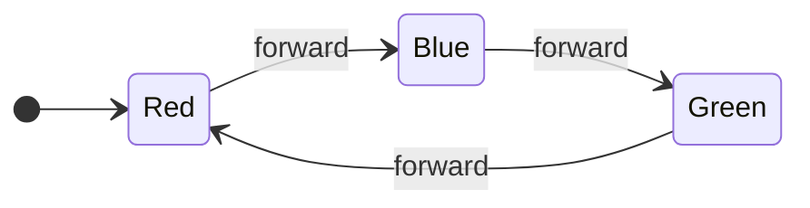
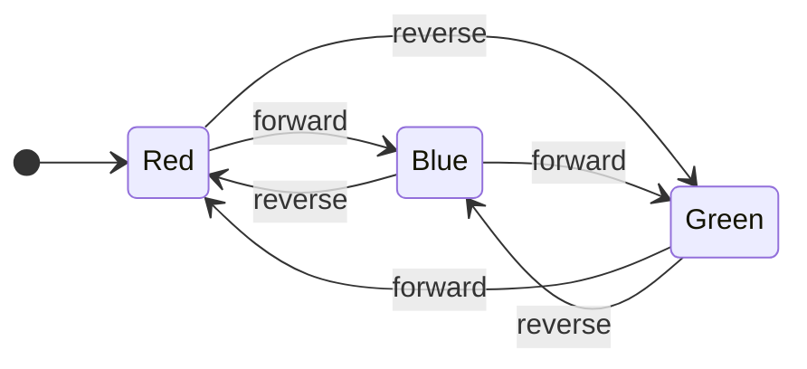
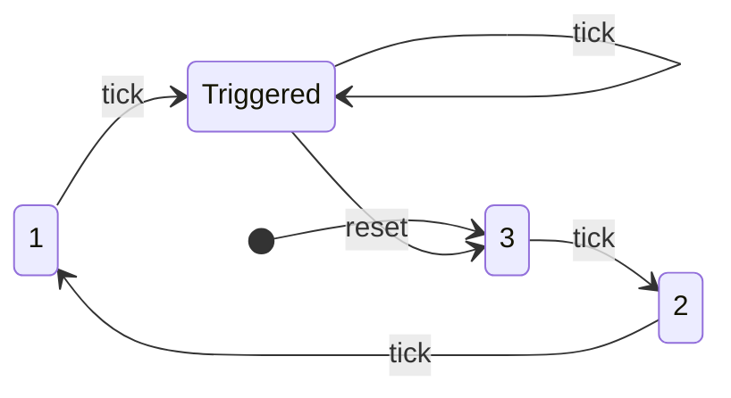
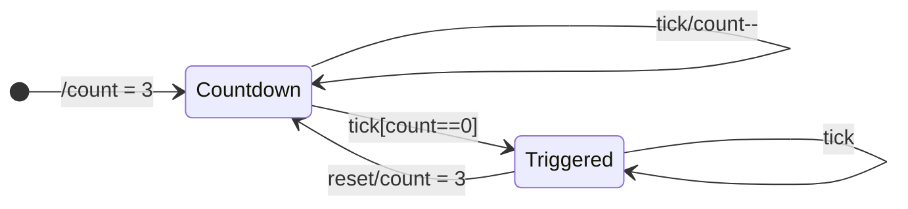
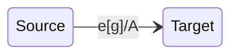
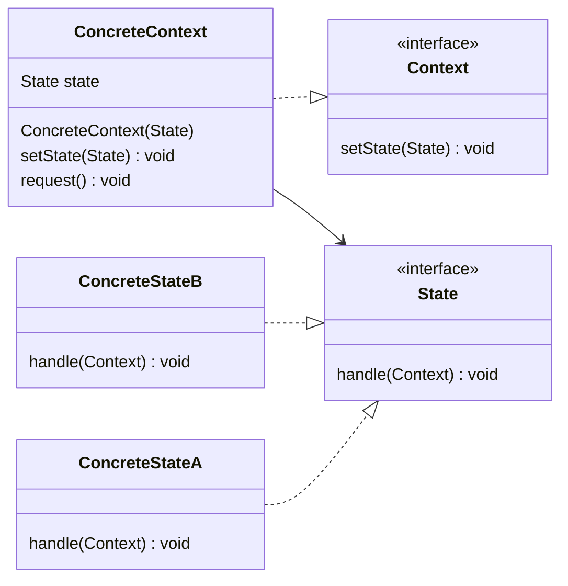

# Managing state

Previously we defined the *state* of an object as being the value(s) of its instance variables at a point in time. It is your responsibility as a developer to ensure that on the completion of every operation, the object's state is valid.

A common requirement in software design is to represent things that have a lifecycle, and for an object to have a lifecycle state that varies over time. This is a different use of the word "state", and when discussing state machines means a discrete, named point in the lifecycle of an object.

When we are thinking about lifecycle state we are concerned that any change from one lifecycle state to another is legal (i.e. allowed by the business rules).

It is a very useful design technique to model the sequence of states as a **State Machine**.

For example, as a consumer of Ecommerce, you experience the lifecycle of an Ecommerce order through a couple of emails - an order confirmation email when the order is placed and then another email when the order is dispatched.  However, an order has a more complex lifecycle than this.

Order confirmation emails typically state the order number and list the item(s) that make up the order. If the retailer is brave, they will estimate the delivery date.

| Order Number NNNNNNNN                                                                                                               |
|-------------------------------------------------------------------------------------------------------------------------------------|
| Thanks for your order. We’ll email you to let you know once your item(s) have dispatched. The estimated delivery date is DD/MM/YYYY |
| Order Details (Item, Quantity, Line Price and Total)                                                                                |
| Terms and Conditions                                                                                                                |

The Terms and Conditions section usually has something like, "Please note that your order is not finally confirmed until we have sent you a dispatch confirmation". This is because the retailer may need to cancel or change the order. Cancellation reasons include having insufficient stock or discovering problems with the payment. Hence, although we have called it an order confirmation email, it is actually an order acknowledgement.

When an order is received, the warehouse team needs to **pick** the order. **Picking** requires **pickers** to walk around the warehouse locating and collecting the ordered items. Usually, pickers have some form of barcode scanner which scans the EAN13 or other barcode on the product to confirm that the product they have picked is the one on the order. The picked order is then sent to a **packing** station for wrapping, boxing and labelling with the customer delivery address. Packed orders are then collected by a courier or delivery company. At the point the order leaves the warehouse, it is **dispatched**.

> If a warehouse sends out orders directly to customers, then it may be called a Distribution Centre or Fulfilment Centre, but we will use the term warehouse for this example.

A Dispatch confirmation email is sent when the order leaves the warehouse. Emails typically include details of the courier and details of how to return the order.

| Order Number NNNNNNNN                                     |
|-----------------------------------------------------------|
| We have now dispatched your order.                        |
| Order Details (Item, Quantity, Line Price and Total)      |
| Courier Details, Tracking Numbers, Estimated Arrival Date |
| Returns information.                                      |


An ecommerce order has different **states** as it can take through its lifecycle. A very simplified example the states of an Ecommerce order are:

- Received - order captured in the database.
- Paid - payment has been confirmed.
- Picked - all items have been picked in the warehouse ready for packing
- Packed - packing complete and ready for collection
- Dispatched - order has left the warehouse
- Cancelled - the order is cancelled because of a problem with payment, item out of stock, item damaged or similar.
- Returned - A previously dispatched order has been returned to the Warehouse by the customer.

The process of leaving one state and arriving at another is called a **State Transition**, so the change in state from Picked to Packed is a transition. There are rules about which transitions are legal - you cannot transition directly from Received to Packed for example, but it is legal to transition to the one of the Cancelled state directly from the Received state.

We can use a **state machine** as a model to design and represent things that exhibit distinct states, transitions between those states, and actions triggered by those transitions. In real world, the combination of the number of states, the rules around which state transitions are legal, and what happens when we transition between states gets very complicated, so using State Machines is a great way to manage the complexity and ensure that all the code lives in one place (DRY and SRP principles).

## Modelling the order process using a state transition table

One way of modelling our order process is using a **state transition table**. There are different ways of organising a state transition table, but the basic concept is that it shows the current state, an event that triggers a transition, the next (or target) state and any actions taken because of the transition from the current state to the next state.

Our order starts in the Received state. Possible triggers to change state are a payment confirmation (say from the credit card provider) or a customer cancellation (the customer declined to pay or was unable to pay). If payment is confirmed the Order goes into the Paid state, and the transition from Received to Paid results in sending an order confirmation email (an action taken because of the transition). If the customer cancels the payment, then the next state is Cancelled, and that is the terminal state for that particular order.

| Current State | Trigger            | Next State | Action                                        |
|---------------|--------------------|------------|-----------------------------------------------|
| Received      | Payment Confirmed  | Paid       | Send Order Confirmation Email                 |
| Received      | Customer Cancelled | Cancelled  | Send Customer Cancellation Confirmation Email |

Once in the Paid state, the Order can be picked. Here we have a trigger event that occurs whenever we pick an item, but we don't want to transition to the Picked state until all the Items are picked. For example, if there were 3 items on the order, we don't want to enter the Picked state until we have had 3 Item Pick events. We model this using a **Guard Condition**, which is a condition that is evaluated each time the event is received. The transition to the next state is only allowed when the Guard Condition is true. In this example we can receive more than one Item Picked event, but we cannot transition to the Picked State until all items are picked (the Guard Condition is shown in square brackets []). We stay in the same state until all the items are picked.

We can still allow the customer to cancel the order at this stage, but the Warehouse staff can also cancel it. No retailer likes to cancel an order, but if it turns out there is insufficient stock, or it is damaged in some way, they may have to.

| Current State | Trigger                            | Next State | Action                                                        |
|---------------|------------------------------------|------------|---------------------------------------------------------------|
| Paid          | Item Picked [not all items picked] | n/a        | n/a                                                           |
| Paid          | Item Picked [all items picked]     | Picked     | n/a                                                           |
| Paid          | Customer Cancelled                 | Cancelled  | Send Customer Cancellation Confirmation Email, Refund Payment |
| Paid          | Warehouse Cancelled                | Cancelled  | Send Apology Email, Refund Payment                            |

Although both kinds of cancellations result in the order being in the Cancelled state, they result in  different activities. If the customer cancels the order, we want to send them a simple confirmation email, but if the warehouse cancels the order, we need to send a different email with an apology. We can use the combination of Current State, Event and Next State to determine what action(s) we want to perform.

The next transition happens when the Order is Packed. Again, the Warehouse could have to cancel the order (perhaps the packer discovers the goods are damaged), again we need to send an apology email.

| Current State | Trigger             | Next State | Action                             |
|---------------|---------------------|------------|------------------------------------|
| Picked        | Packing Complete    | Packed     | Notify Courier                     |
| Picked        | Warehouse Cancelled | Cancelled  | Send Apology Email, Refund Payment |

The final state transition occurs when we hand the packed order over to the courier or parcel delivery company. We are not going to cancel the order now, so this is the only transition.

| Current State | Trigger        | Next State | Action                           |
|---------------|----------------|------------|----------------------------------|
| Packed        | Courier Pickup | Dispatched | Send Dispatch Confirmation Email |

We also need to manage customer returns. If the customer returns the order, the order transitions from Dispatched to Returned, triggering another customer email.

| Current State | Trigger         | Next State | Action                                         |
|---------------|-----------------|------------|------------------------------------------------|
| Dispatched    | Customer Return | Returned   | Send Return Confirmation Email, Refund Payment |

This is an example set of states and transitions which ignores much of the actual complexity of real shipping (dispatching part orders, returning some items), but shows how we can use state transition tables to model complex scenarios using a set of states and a set of events. The State Transition Table shows what happens when an event arrives and the state machine is in a particular state.

Returned and Cancelled are the **terminal states**, in both cases there can be no further transitions from either of these states, and all events received in those states are either ignored or treated as an error.

> In real world implementations, there is often a requirement to undo legitimate user mistakes, so often **terminal states** do accept an Undo event and a transition out of the state, but this is only to correct user error rather than being part of a business process.

## Coding a Simple State Machine

This is a very simple example of a state machine with 3 states (Red, Blue and Green) and one event (Forward). The requirement is for the states to cycle Red, Blue, Green, Red etc. when the machine receives a `Forward` event

| Current State | Event   | Next State | Action                |
|---------------|---------|------------|-----------------------|
| Red           | Forward | Blue       | Print "Red -> Blue"   |
| Blue          | Forward | Green      | Print "Blue -> Green" |
| Green         | Forward | Red        | Print "Green -> Red"  |


Start with an enum for the states.

```Java
enum State {
    Red,
    Blue,
    Green
}
```
Implement a class with a forward() method that uses a switch statement to process the event based on the current state. The machine starts with currentState = Red.

```Java
class SingleEventStateMachine {

    private State currentState = State.Red; //Start in Red state as the initial state

    void forward() {
        switch (currentState) {
            case State.Red: {
                System.out.printf("forward %s -> %s%n", State.Red, State.Blue);
                currentState = State.Blue;
            }
            break;
            case Blue: {
                System.out.printf("forward %s -> %s%n", State.Blue, State.Green);
                currentState = State.Green;
            }
            break;
            case Green: {
                System.out.printf("forward %s -> %s%n", State.Green, State.Red);
                currentState = State.Red;
            }
            break;
            default: {
                //throw exception
            }
            break;
        }
    }
}
```
This example produces the output

```Java
SingleEventStateMachine singleEventStateMachine = new SingleEventStateMachine();
singleEventStateMachine.forward();
singleEventStateMachine.forward();
singleEventStateMachine.forward();
singleEventStateMachine.forward();

// Outputs
// forward Red -> Blue
// forward Blue -> Green
// forward Green -> Red
// forward Red -> Blue
```

The UML defines a graphical notation for State Machines (Object Management Group 2017 Ch 14) but here we are using a simplified version.


The boxes represent the individual states, the arrows are the transitions between the **Source** state and the **Target** state and the label on the transition is the name of the Event that triggered the transition.

The solid filled dot is called the **Initial State** and indicates the start of the State Machine and shows the path the first 'real' state, and shows the state machine is initially in the Red state.

Now add another event called reverse that transitions the states in the reverse order

| Current State | Event   | Next State | Action                |
|---------------|---------|------------|-----------------------|
| Red           | Forward | Blue       | Print "Red -> Blue"   |
| Red           | Reverse | Green      | Print "Red -> Green"  |
| Blue          | Forward | Green      | Print "Blue -> Green" |
| Blue          | Reverse | Red        | Print "Blue -> Red"   |
| Green         | Forward | Red        | Print "Green -> Red"  |
| Green         | Reverse | Blue       | Print "Green -> Blue" |



The code

```Java
class MultipleEventStateMachine {

    private State currentState = State.Red; //Start in Red state

    void forward() {
        switch (currentState) {
            case State.Red: {
                System.out.printf("forward %s -> %s%n", State.Red, State.Blue);
                currentState = State.Blue;
            }
            break;
            case Blue: {
                System.out.printf("forward %s -> %s%n", State.Blue, State.Green);
                currentState = State.Green;
            }
            break;
            case Green: {
                System.out.printf("forward %s -> %s%n", State.Green, State.Red);
                currentState = State.Red;
            }
            break;
            default: {
                //throw exception
            }
            break;
        }
    }

    void reverse() {
        switch (currentState) {
            case State.Red: {
                System.out.printf("reverse %s -> %s%n", State.Red, State.Green);
                currentState = State.Green;
            }
            break;
            case Blue: {
                System.out.printf("reverse %s -> %s%n", State.Blue, State.Red);
                currentState = State.Red;
            }
            break;
            case Green: {
                System.out.printf("reverse %s -> %s%n", State.Green, State.Blue);
                currentState = State.Blue;
            }
            break;
            default: {
                //throw exception
            }
            break;
        }
    }
}
MultipleEventStateMachine multipleEventStateMachine = new MultipleEventStateMachine();
multipleEventStateMachine.forward();
multipleEventStateMachine.forward();
multipleEventStateMachine.forward();
multipleEventStateMachine.reverse();
multipleEventStateMachine.reverse();
multipleEventStateMachine.reverse();

// Outputs
// forward Red -> Blue
// forward Blue -> Green
// forward Green -> Red
// reverse Red -> Green
// reverse Green -> Blue
// reverse Blue -> Red
```

The problem with writing state machine code in this procedural way is that there is a combinatorial explosion between the events and the states - there will be switch statement for each event, and each switch statement will need as many branches as there are states. Adding a new event requires adding a new switch statements, adding a new state requires extending every switch statement by adding a new branch. The same issues apply if you replace switch with if. You should recognise that long conditional statements are not a good solution for extensibility or maintainability

A better way of coding this is to use the **State Pattern**. The pattern uses a class for each state. Each class can then be varied independently to handle the requirements of each state.

First define an `interface` called `State` that will be implemented by all the state classes and an interface called Context to be implemented by the State Machine.

```Java
interface State {
    String getName();
    void forward(Context context);
    void reverse(Context context);
}

interface Context {
    void changeState(State nextState);
}
```
Each state is represented by a class which implements the `State` interface. Each event has its own method on the interface.

Note the override of the Java Object.toString() method to provide the name of a state.

```Java
class Red implements State {
    private final static String NAME = "Red";

    @Override
    public String toString() {
        return NAME;
    }

    @Override
    public void forward(Context context) {
        State next = new Blue();
        System.out.printf("forward %s -> %s%n", this, next);
        context.changeState(next);
    }

    @Override
    public void reverse(Context context) {
        State previous = new Green();
        System.out.printf("reverse %s -> %s%n", this, previous);
        context.changeState(previous);
    }
}

class Blue implements State {

    private static String NAME = "Blue";

    @Override
    public String toString() {
        return NAME;
    }

    @Override
    public void forward(Context context) {
        State next = new Green();
        System.out.printf("forward %s -> %s%n", this, next);
        context.changeState(next);
    }

    @Override
    public void reverse(Context context) {
        State previous = new Red();
        System.out.printf("reverse %s -> %s%n", this, previous);
        context.changeState(previous);
    }
}

class Green implements State {

    private final static String NAME = "Green";

    @Override
    public String toString() {
        return NAME;
    }

    @Override
    public void forward(Context context) {
        State next = new Red();
        System.out.printf("forward %s -> %s%n", this, next);
        context.changeState(next);
    }

    @Override
    public void reverse(Context context) {
        State previous = new Blue();
        System.out.printf("reverse %s -> %s%n", this, previous);
        context.changeState(previous);
    }
}
```
The StateMachine class holds a reference to an instance of one of the state objects in the `currentState` variable. Any Statesobject can then call the changeState method to replace currentState.

```Java
class MultipleEventStateMachine implements Context {
    private State currentState;

    MultipleEventStateMachine()
    {
        currentState = new Red(); //initial state
    }

    @Override
    public void changeState(State nextState)
    {
        currentState = nextState;
    }

    public void forward() {
        currentState.forward(this);
    }

    public void reverse() {
        currentState.reverse(this);
    }
}

MultipleEventStateMachine multipleEventStateMachine = new MultipleEventStateMachine();
multipleEventStateMachine.forward();
multipleEventStateMachine.forward();
multipleEventStateMachine.forward();
multipleEventStateMachine.reverse();
multipleEventStateMachine.reverse();
multipleEventStateMachine.reverse();

// Outputs
// forward Red -> Blue
// forward Blue -> Green
// forward Green -> Red
// reverse Red -> Green
// reverse Green -> Blue
// reverse Blue -> Red
```
Adding a new state sinvolves the creation of an entirely new class, adding a new Event requires adding one additional method to each class. Each state class is independently testable.

## Extended State Machines

An Extended State Machine (ESM) is an extension of a basic state machine, adding the ability to store and manipulate data by adding data variables. A traditional state machine represents everything as states, whereas an ESM can use a mixture of states and data to simplify design and manage complex system behavior more effectively.

For example, take a state machine that represents a countdown timer that counts down from 3. The tick causes a transition between states until it reaches the triggered state, where any subsequent tick events are ignored (we remain in the triggered state). A reset event restarts the process.


This is inconvenient because we have to create States for each step in the countdown. If we needed to count 1000 ticks then would need 1000 states.

It is much easier and more flexible to model this with two states (Countdown and Triggered) and hold the number as a variable (count).


Here we are using actions and guard conditions. The guard condition says that we can only make the transition from Countdown to Triggered when `count == 0`;

The notation is:

You read this as:

- The event `e` triggers the transition.
- The optional boolean guard condition `g` is evaluated when the event `e` occurs. If the guard condition evaluates true then the transition can happen, if false the transition is blocked. Guard conditions can use any data available to it to make the decision.
- Action or Actions `A` are the effect of the transition. If the transition was blocked by a guard condition then there is no effect.
- There is a transition from source state to target state.

This implementation uses an `int count` variable in the `Countdown` class.

```Java
interface Context {
    void changeState(State nextState);
}


interface State {
    void tick(Context context);
    void reset(Context context);
}


class Countdown implements State {
    private int count = 3;

    @Override
    public String toString() {
        return String.format("Countdown(%d)", count);
    }

    @Override
    public void tick(Context context) {
        if (--count == 0) {
            State next = new Triggered();
            System.out.printf("tick %s -> %s%n", this, next);
            context.changeState(next);
        } else {
            //stay in this state
            System.out.printf("tick %s%n", this);
        }
    }

    @Override
    public void reset(Context context) {
        State next = new Countdown();
        System.out.printf("reset %s -> %s%n", this, next);
        context.changeState(next);
    }
}

class Triggered implements State {

    @Override
    public String toString() {
        return "Triggered";
    }

    @Override
    public void tick(Context context) {
        //ignore
    }

    @Override
    public void reset(Context context)
    {
        State next = new Countdown();
        System.out.printf("reset %s -> %s%n", this, next);
        context.changeState(next);
    }
}

class ExtendedStateMachine implements Context {
    private State currentState;

    ExtendedStateMachine() {
        currentState = new Countdown(); //initial state
    }

    @Override
    public void changeState(State nextState) {
        currentState = nextState;
    }

    public void tick() {
        currentState.tick(this);
    }

    public void reset() {
        currentState.reset(this);
    }
}
```
Usage:

```Java
ExtendedStateMachine extendedStateMachine = new ExtendedStateMachine();
extendedStateMachine.tick();
extendedStateMachine.tick();
extendedStateMachine.tick();
extendedStateMachine.tick();
extendedStateMachine.tick();
extendedStateMachine.reset();
extendedStateMachine.tick();
extendedStateMachine.reset();
extendedStateMachine.tick();

// Output
// tick Countdown(2)
// tick Countdown(1)
// tick Countdown(0) -> Triggered
// reset Triggered -> Countdown(3)
// tick Countdown(2)
// reset Countdown(2) -> Countdown(3)
// tick Countdown(2)
```
ESMs use a combination of states, data variables and guard conditions.

> The State patten is an object-oriented solution to managing the state and behaviour in the presence of events. It puts all the processing logic into a simple class structure, rather than using `if` or `switch` statements spread through the codebase.
>
> Using State Transition Tables and State Machine diagrams are a great way of capturing and understanding requirements that directly translate to the state pattern code.

> Some open-source libraries provide a configurable framework for State Machines using code that looks more like entries in a State Transition Table.

## The general State pattern


```Java
interface Context {
    void setState(State state);
}

interface State {
    void handle(Context context);
}

class ConcreteStateA implements State {

    @Override
    public void handle(Context context) {
        context.setState(new ConcreteStateB());
    }
}

class ConcreteStateB implements State {

    @Override
    public void handle(Context context) {
        context.setState(new ConcreteStateA());
    }
}

class ConcreteContext implements Context {
    State state;

    ConcreteContext(State initialState)
    {
        state = initialState;
    }

    @Override
    public void setState(State state) {
        this.state = state;
    }

    public void request()
    {
        this.state.handle(this);
    }
}
```

## The Ecommerce Example

This is an implementation of the Ecommerce example. This uses an abstract super class that provides a default implementation for all methods (an illegal state exception).

We have generally advised against using class inheritance, but here is makes sense to use subclasses for the concrete states because they can override only the methods they need to implement, leaving default behaviour to the superclass.

The example uses the Java inner (nested) class feature.

> Non-static nested classes have direct access to the members (fields and methods) of the outer class, even if they are private.

The example defines two interfaces for email and payment services.

```Java
interface EmailService {
    void sendOrderConfirmation(String orderNumber);

    void sendCustomerCancellationConfirmationEmail(String orderNumber);

    void sendWarehouseCancellationApologyEmail(String orderNumber);

    void notifyCourier(String orderNumber);

    void sendDispatchConfirmationEmail(String orderNumber);

    void sendReturnConfirmationEmail(String orderNumber);
}

interface PaymentService {
    void refundCustomer(String orderNumber);
}

```
The order class nests the individual state classes.

```Java
class Order {

    private interface State {
        void paymentConfirmed();

        void customerCancelled();

        void warehouseCancelled();

        void itemPicked();

        void orderPacked();

        void courierPickup();

        void customerReturn();
    }


    private abstract static class AbstractState implements State {
        @Override
        public void paymentConfirmed() {
            throw new IllegalStateException();
        }

        @Override
        public void customerCancelled() {
            throw new IllegalStateException();
        }

        @Override
        public void warehouseCancelled() {
            throw new IllegalStateException();
        }

        @Override
        public void itemPicked() {
            throw new IllegalStateException();
        }

        @Override
        public void orderPacked() {
            throw new IllegalStateException();
        }

        @Override
        public void courierPickup() {
            throw new IllegalStateException();
        }

        @Override
        public void customerReturn() {
            throw new IllegalStateException();
        }
    }

    private class Received extends AbstractState {

        @Override
        public String toString() {
            return "Received";
        }


        @Override
        public void paymentConfirmed() {
            emailService.sendOrderConfirmation(orderNumber);
            currentState = new Paid();
        }

        @Override
        public void customerCancelled() {
            paymentService.refundCustomer(orderNumber);
            emailService.sendCustomerCancellationConfirmationEmail(orderNumber);
            currentState = new Cancelled();
        }

    }

    private class Paid extends AbstractState {

        private int itemsToPick = orderItems;

        @Override
        public String toString() {
            return "Paid";
        }

        @Override
        public void itemPicked() {
            if (--itemsToPick == 0) {
                currentState = new Picked();
            }
        }

        @Override
        public void customerCancelled() {
            itemsToPick = orderItems;
            paymentService.refundCustomer(orderNumber);
            emailService.sendCustomerCancellationConfirmationEmail(orderNumber);
            currentState = new Cancelled();
        }

        @Override
        public void warehouseCancelled() {
            itemsToPick = orderItems;
            paymentService.refundCustomer(orderNumber);
            emailService.sendWarehouseCancellationApologyEmail(orderNumber);
            currentState = new Cancelled();
        }
    }

    private class Picked extends AbstractState {

        @Override
        public String toString() {
            return "Picked";
        }

        @Override
        public void orderPacked() {
            emailService.notifyCourier(orderNumber);
            currentState = new Packed();
        }

        @Override
        public void warehouseCancelled() {
            paymentService.refundCustomer(orderNumber);
            emailService.sendWarehouseCancellationApologyEmail(orderNumber);
            currentState = new Cancelled();
        }
    }

    private class Packed extends AbstractState {

        @Override
        public String toString() {
            return "Packed";
        }

        @Override
        public void courierPickup() {
            emailService.sendDispatchConfirmationEmail(orderNumber);
            currentState = new Dispatched();
        }

    }

    private class Dispatched extends AbstractState {

        @Override
        public String toString() {
            return "Dispatched";
        }

        @Override
        public void customerReturn() {
            paymentService.refundCustomer(orderNumber);
            emailService.sendReturnConfirmationEmail(orderNumber);
            currentState = new Returned();
        }
    }

    private static class Returned extends AbstractState {

        @Override
        public String toString() {
            return "Returned";
        }

        //There are no legal transitions from Returned state, it is the final state
    }

    private static class Cancelled extends AbstractState {

        @Override
        public String toString() {
            return "Cancelled";
        }

        //There are no legal transitions from Cancelled state, it is the final state
    }


    private final String orderNumber;
    private final int orderItems;
    private final EmailService emailService;
    private final PaymentService paymentService;
    private State currentState = new Received();

    Order(String orderNumber, int orderItems, EmailService emailService, PaymentService paymentService) {
        this.orderNumber = orderNumber;
        this.orderItems = orderItems;
        this.emailService = emailService;
        this.paymentService = paymentService;
    }

    void paymentConfirmed() {
        currentState.paymentConfirmed();
    }

    void customerCancelled() {
        currentState.customerCancelled();
    }

    void warehouseCancelled() {
        currentState.warehouseCancelled();
    }

    void itemPicked() {
        currentState.itemPicked();
    }

    void orderPacked() {
        currentState.orderPacked();
    }

    void courierPickup() {
        currentState.courierPickup();
    }

    void customerReturn() {
        currentState.customerReturn();
    }

    public String getCurrentState() {
        return String.format("%s %s", orderNumber, currentState);
    }
}
```

Usage:

```Java
EmailService emailService = new DummyEmailService();
PaymentService paymentService = new DummyPaymentService();
Order order = new Order("10001234", 3, emailService,paymentService);
System.out.printf("%s%n", order.getCurrentState());
order.paymentConfirmed();
System.out.printf("%s%n", order.getCurrentState());
order.itemPicked();
System.out.printf("%s%n", order.getCurrentState());
order.itemPicked();
System.out.printf("%s%n", order.getCurrentState());
order.itemPicked();
System.out.printf("%s%n", order.getCurrentState());
order.orderPacked();
System.out.printf("%s%n", order.getCurrentState());
order.courierPickup();
System.out.printf("%s%n", order.getCurrentState());
order.customerReturn();
System.out.printf("%s%n", order.getCurrentState());

// Output
// 10001234 Received
// Email: Thank you for your order number 10001234.
// 10001234 Paid
// 10001234 Paid
// 10001234 Paid
// 10001234 Picked
// Email: Order number 10001234 is ready for collection.
// 10001234 Packed
// Email: Your order number 10001234 has been dispatched.
// 10001234 Dispatched
// Payment: refund for order number 10001234.
// Email: Your return of order number 10001234 has been received.
// 10001234 Returned
```
