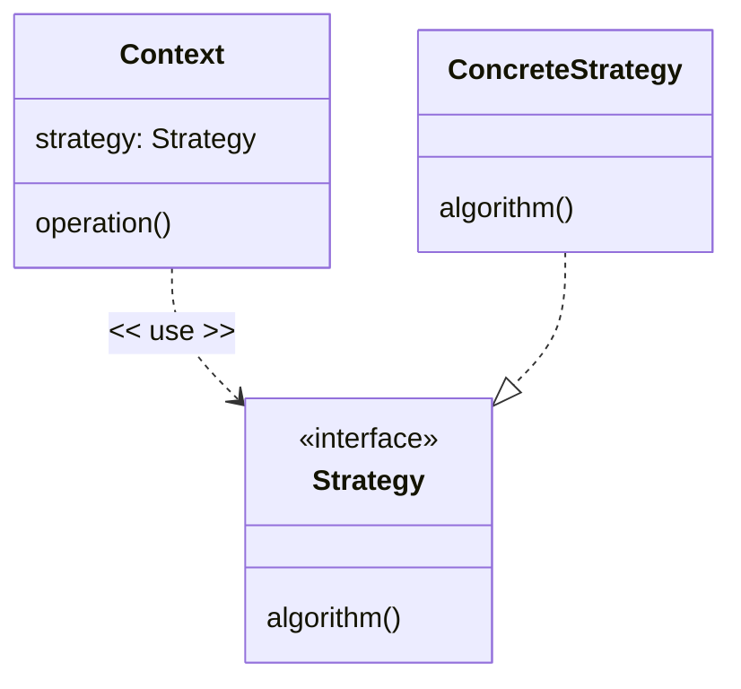
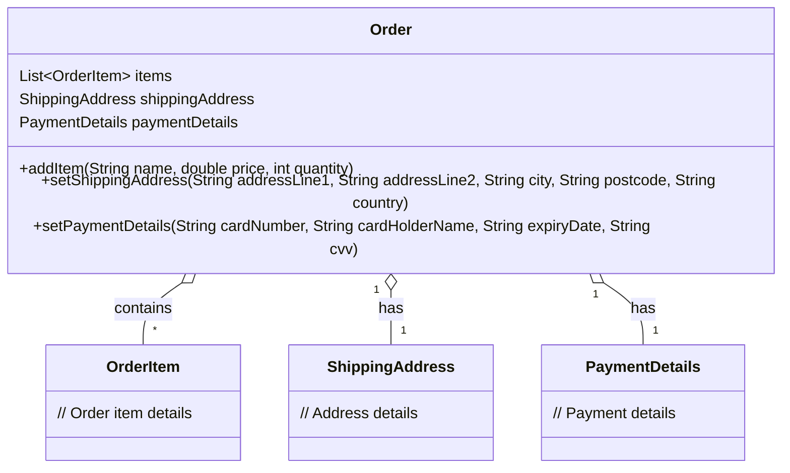

# Handling Variation using a Strategy and the Open/Closed Principle (OCP)

In our Product example we obtained a selling price by using a pair of polymorphic classes (FullPrice or DiscountedPrice). It allowed the Product class to vary its behavior(determining what is the selling price) depending on if we were working with either a FullPrice or DiscountedPrice.

In the UK we apply a sales tax called **Value Added Tax** or **VAT** to the selling price to calculate the actual price that the customer pays.
Most products have VAT applied at **Standard Rate** which at time of writing is 20%, although it does vary (VAT rates have been 8%, 10%, 12.5%, 15%,17.5 and 20% at various times).

Some products (food for example) do not attract VAT at all and arguments about whether an item should be zero-rated can be [complex](https://www.gov.uk/hmrc-internal-manuals/vat-food/vfood6260). There are also rules (which we are going to conveniently ignore for now) about rounding the calculated VAT amount.

We could manage the  ate by passing in some indicator (a string or an enum) to indicate what tax rate should be applied, for example:

``` Java
 @Override
    double getTax(String rate){

        double taxRate = 0.0d

        if(rate == "Zero")
        {
            taxRate = 0.0d
        } else if(rate == "Standard")
        {
            taxRate = 0.2d;
        } else {
            //something else
        }

        return sellingPrice.get() * taxRate;

    }
```

There are issues with this as an approach. New tax rates or changes in value require us to edit or expand the if/then statement (the same need to change or expand would be true if we had used enums and a switch statement instead of strings and an if statement). This means changing the class with the possibility of introducing an error and at the very least require a retesting of all the other options to ensure that they had not been changed accidentally.

We could model this using inheritance, using subclasses of an abstract Product class.

``` Java

abstract class Product
{
    abstract double getTax();
}

class ZeroRateProduct extends Product
{
    @Override
    double getTax(){
        return 0d
    }
}

//UK Standard Rate is 20%
class UKStandardRateProduct extends Product
{
    @Override
    double getTax(){
        return sellingPrice.get() *0.2d;
    }
}
```

This is still unsatisfactory - New tax rates require us to create a new Product type, which is wrong - it's not the Product that is varying it is the TaxRate. Also, if we changed the internals of the Product superclass (such as changing how we managed selling prices) it could require a change to every subclass.

The design flaw here is we are varying Product by TaxRate, but all the other parts of Product stay the same. We fix this by identifying the thing that varies (in this case the tax rate) and separating it out into its own polymorphic type.

The thing that is varying is the tax calculation - we don't know (or care) why its varying (it's probably a combination of the country we are selling into and the nature of the product or both). We declare a simple interface.

``` Java
interface TaxCalculation {
    double get(double price);
}
```

Create a Value type that holds both price and tax values.

```Java
class ProductPrice {

    public static ProductPrice ZER0 = new ProductPrice();

    private static double Zero = 0.0d;
    private final double price;
    private final double tax;
    private final double total;

    private ProductPrice() {
        this(Zero, Zero);
    }

    public ProductPrice(double price, double tax) {
        this.price = price;
        this.tax = tax;
        this.total = this.price + this.tax;
    }

    public double getPrice() {
        return price;
    }

    public double getTax() {
        return tax;
    }

    public double getTotal() {
        return total;
    }


    @Override
    public boolean equals(Object o) {
        if (!(o instanceof ProductPrice that)) return false;
        return Double.compare(price, that.price) == 0 && Double.compare(tax, that.tax) == 0;
    }

    @Override
    public int hashCode() {
        return Objects.hash(price, tax);
    }

    @Override
    public String toString() {
        return "ProductPrice{" + "price=" + price + ", tax=" + tax +  ", total=" + total + "}";
    }
```


Now the Product class works with the interface to calculate the tax

``` Java
class Product {

    private final MinimumPrice minimumPrice;
    private final TaxCalculation taxCalculation;
    private SellingPrice sellingPrice;

    public Product(FullPrice price, MinimumPrice minimumPrice, TaxCalculation taxCalculation) {
        this.sellingPrice = price;
        this.minimumPrice = minimumPrice;
        this.taxCalculation = taxCalculation;
    }

    public void applyDiscount(Discount discount) {

        sellingPrice = sellingPrice.applyDiscount(minimumPrice, discount);
    }

    public void removeDiscount() {

        sellingPrice = sellingPrice.removeDiscount();
    }

    public ProductPrice getPrice() {
        double sellingPriceExcludingTax = sellingPrice.get();
        double tax = taxCalculation.get(sellingPriceExcludingTax);
        return new ProductPrice(sellingPriceExcludingTax, tax);
    }
}
```

The TaxCalculation implementation takes a price and calculates the tax - how the implementation calculates the tax is completely variable. The right TaxCalculation implementation for the job is passed as an argument into the constructor of the Product, and thereafter the Product will simply **delegate** the job of calculating the tax to the TaxCalculation.

For example, if we were selling a product with Zero rate of Tax, then the implementation of TaxCalculation would be simple
``` Java
class ZeroRateTaxCalculation implements TaxCalculation {
    static final double NONE = 0.0d;

    @Override
    public double get(double price) {
        return NONE;
    }
}
```
Let's assume the standard sales tax rate is 20% - the implementation of TaxCalculation (ignoring the real-world issues of how to round the tax amount)

``` Java
class StandardRateTaxCalculation implements TaxCalculation {
    private static final double STANDARD_RATE = 0.2d;
    private static final int ROUNDING_DECIMALS = 2;
    private static final double ROUNDING_SCALE = Math.pow(10, ROUNDING_DECIMALS);

    @Override
    public double get(double price) {
        //This gets us into issues of how to round doubles correctly for tax purposes
        //This example for UK VAT the rules are documented in
        //https://www.gov.uk/hmrc-internal-manuals/vat-trader-records/vatrec12030
        //Instead a simple method using Math.round as this is an example
        double tax = price * STANDARD_RATE;
        return Math.round(tax * ROUNDING_SCALE) / ROUNDING_SCALE;
    }
}
```

What we have done here is identified the thing that could vary (in this case the tax calculation) and defined its behavior as an abstract type.

Furthermore, we have correctly named the classes based on the classification of tax, not the rate applied, because the rate applied can change over time.

The Product instance is created at runtime taking one of the many possible concrete implementations of a tax calculation that implement the TaxCalculation interface. The Product then calls the concrete implementation via the abstract interface. The decision as to which concrete implementation is provided to the product is taken elsewhere, probably in this case based on the country we are selling the product to at the time.

``` Java

FullPrice fullPrice = new FullPrice(100.0d);
MinimumPrice minimumPrice = new MinimumPrice(75.0d);
TaxCalculation standardTax = new StandardTax();
Product product = new Product(fullPrice, minimumPrice, standardTax);
System.out.format("%s%n", product.getPrice());
//Outputs ProductPrice{price=100.0, tax=20.0, total=120.0}
```

Each concrete implementation of TaxCalculation can be developed and tested independently (changing one implementation doesn't mean we have to change or retest the others). The Product implementation does not change when we add a new concrete implementation of TaxCalculation either. The testing burden of handling any changes to tax rates or selling into new countries is greatly reduced.

The tax calculation is an example of an **algorithm**. Algorithm is the term given to any sequence of steps to solve a problem, make a decision or calculate a value. What we have done in this design is recognise that the algorithm is the thing that is varying - and extracted it out of the Product code and encapsulating each different tax calculation (algorithm) into its own class with a common interface (encapsulation).

This is example of a **Design Pattern**. Recall that we introduced the idea of Design Patterns as being established solutions to common problems. The influential book on patterns that addressed common software design problems is *Design Patterns: Elements of Reusable Object-Oriented Software* by the "Gang of Four" (Gamma *et al*. 1994), which is frequently abbreviated as the 'GoF Book' and the patterns within as 'GoF Patterns'.

The GoF book named the solution shown above as the **Strategy** pattern - "Define a family of algorithms, encapsulate each one, and make them interchangeable. Strategy lets the algorithm vary independently of classes that use it." (Gamma *et al*. 1994 Ch5). Algorithm here just means code that solves a problem. The problem-solving code (the Strategy) is encapsulated behind an interface, and the client of the algorithm calls the interface.


### Structure

The pattern in Java with non-specific class and interface names looks like this:



``` Java

public interface Strategy {
    void algorithm();
}

public class Context {

    private final Strategy strategy;

    public Context(Strategy strategy) {
        this.strategy = strategy;
    }

    public void operation()
    {
        strategy.algorithm();
    }
}

```

Then at another time we create and use a ConcreteStrategy

``` Java
public class ConcreteStrategy implements Strategy {
    @Override
    public void algorithm() {
        //Do concrete thing
    }
}

public class Example {

    static void RunExample()
    {
        Strategy strategy = new ConcreteStrategy();
        Context context = new Context(strategy);
        context.operation(); //will use the provided ConcreteStrategy
    }

}
```

The Strategy pattern is one of the simplest but most common of the patterns described in the GoF book, it also demonstrates two other important principles in object-oriented design, favouring **Aggregation over Inheritance** and conforming to the **Open Closed Principle**.

## Aggregation over Class Inheritance.

We could have managed the variation in tax calculations using class inheritance, creating multiple subclasses of Product. Handling this kind of variation mixes up the variation with things that stay the same (such as the pricing variables). The method of calculating tax could also apply elsewhere (calculating tax on services such as delivery or gift wrapping).

With **Aggregation**, one class (the **aggregate**) containing references to other types (the **aggregated components**). The **aggregate** acts as a container for its components. The aggregate provides the public interface to its clients, and delegates work to the aggregated components (another example of encapsulation or hiding implementation detail from the client).

Aggregation is preferred over Inheritance because:

- Aggregated components (such as the TaxCalculation) can be developed and tested independently of (in this case) the Product class. The decouples the implementation of TaxCalculations completely from the implementation of Product.
- In Java only single inheritance is permitted, so by aggregating multiple strategies we can deal with multiple, independent variations

Some  practical issues with using Class Inheritance

- Easy to get inheritance wrong (inheritance is strictly an “is-a” relationship).
- Exposes protected implementation detail to subclasses, breaking encapsulation.
- Changes in the super class cascade to all subclasses, unintentionally breaking subclasses.
- Much more difficult (in Java) to handle multiple variations - you get a combinatorial explosion of subclasses (imagine there are two things that vary, and each one has two different variations - that's four subclasses in Java).

As guidance, we suggest that class inheritance is best kept for where classes have fields in common (and therefore common accessors and constructors) and common behavior (DRY again), rather than being the first choice for handling variation on behavior. Instead, look first to manage variation (such as different tax calculations) by **aggregating** a type that handles the variation (in this case a Tax Calculation type).

> You will also find principle also described as **Composition over Inheritance**. Composition in UML (our reference for terminology) has a specific meaning as a stronger form of Aggregation. Under the UML definition, Composition means a form of aggregation where the aggregate object owns the composed objects and manages their lifetimes. With composition the aggregated components do not have a life outside their owner, they are created, initialised and destroyed by their owner. Composition occurs when the  which isn't always the case, so we have used the term Aggregation instead.

> Another term you may hear is **aggregate root**. This refers to the top-level object that aggregates other objects. The principle is that the aggregate root is responsible for enforcing the invariants across the entire aggregate graph. To make this possible all the aggregated components are invisible to the client of the aggregate root - all access to objects within the aggregate must go through the aggregate root's API, which is how the aggregate root can enforce the aggregate's invariants.
> In the example below the Order class is the aggregate root, it aggregates OrderItems, ShippingAddress and PaymentDetails. The client of the Order class cannot access the OrderItems, ShippingAddress or PaymentDetails directly - all access must go through the Order class API.



## The Open Closed Principle

Using the Strategy pattern supports the **Open/Closed principle (OCP)**, which proposes that classes and methods should be "open for extension but closed for modification"  (Martin and Martin, 2007 p122). Under the open/closed principle an ideal design would allow you to extend (introduce another variation) by writing only new code, rather than modifying existing code.

Ideally, classes and methods are "open for extension" (open meaning available to be extended) by having a mechanism for adding a variation and "closed for modification" (closed meaning the implementation is finished and forbidden to be changed) which means that extension does not require the original source code to change.


If managing variation (such as different ways of calculating tax) depends on if/then or switch statements, then it is impossible to extend the cases being handled without changing the source - with all the possibilities of breaking something in the process. Using the strategy pattern we can extend the Product class with new ways of calculating tax by added a new implementations of the TaxCalculation interface and passing an instance of the new calculation into an instance of the existing and unmodified Product class. Our Product class obeys the OCP - it is closed for modification and open for extension.

Some practical patterns for writing classes that are open for extension.

- Use the **Strategy**  Pattern. Write methods that make use of abstract types (abstract class or `interface`). Supply the concrete classes at runtime. Extension is done by creating new implementations of the abstract type.
- Use the **Bridge**  Pattern. Allows for handing two interdependent variations. We will cover the Bridge pattern later.
- Use the **Template Method** Pattern. Define the skeleton of an algorithm in a base class, deferring some steps to subclasses. Extension is done by writing subclasses that override these steps without changing the algorithm's structure. We will cover the Template Method pattern later.
- Use the **Observer** Pattern. Notify observers when the state of your class changes. Extension is done by adding more observers. We will cover the Observer pattern later.
- Use the **Decorator** Pattern: Add additional responsibilities to a class by wrapping it in another class with the same logical interface. Extension is done by adding more Decorators. We will cover the Decorator pattern later.

> It is worth pointing out that not every class needs to be extensible in some way - most don't. Extensibility is only required when we know that there is or is going to be variation and that variation is likely to need new implementations in the future. Needlessly providing extensibility adds unnecessary complexity to the solution.
