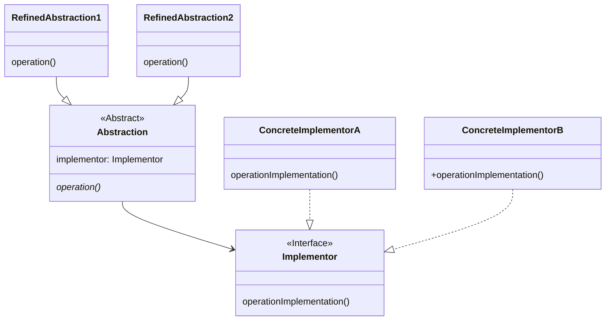

# More ways of handling variation

## The Bridge Pattern

In the previous chapter we gave general guidance to use inheritance to handle variation in structure (for example
additional fields) rather than variation in behavior (which is best done using a Strategy). However sometimes we need to
handle variations in structure *and* behavior.

For example, we want to give our Product an identity. We introduced the concept of a GTIN13 Value Object that held a
globally unique 13-digit Identity that would be understood by any organisation in the supply chain that subscribed to
the GS1 system. However, if I want to sell via the Amazon website, Amazon uses its own unique 10 alphanumeric character
product identifier called an Amazon Standard Identification Number (ASIN).

> Apparently ASIN exists because Amazon originally had only a 10-character `Id` field in the database which was good
> enough for books (Amazon was originally just a bookseller) and when they expanded into other product types they didn't
> want to change the database structure.
> See [https://inventlikeanowner.com/blog/the-story-behind-asins-amazon-standard-identification-numbers/](https://inventlikeanowner.com/blog/the-story-behind-asins-amazon-standard-identification-numbers/).

An ASIN is a base 36 number (0-9 and a-z case-insensitive), and this ASIN class is another example of the immutable
Value Object pattern. Unlike GTINs, there is no check digit.

``` Java

public final class ASIN {
    private static final int LENGTH = 10;
    private final String id;

    public static boolean isValid(String s) {
        return isValidLength(s) && isValidCharacters(s);
    }

    static boolean isValidLength(String s) {
        return Objects.nonNull(s) && s.length() == LENGTH;
    }

    static boolean isValidCharacters(String s) {
        for (int i = 0; i < LENGTH; i++) {
            char c = s.charAt(i);
            if (!Character.isDigit(c) && !Character.isLetter(c)) return false;
        }
        return true;
    }


    public ASIN(String id) throws InvalidException {

        if (!isValidLength(id)) {
            throw new InvalidLengthException(id, LENGTH);
        }

        if (!isValidCharacters(id)) {
            throw new InvalidCharacterException(id);
        }


        this.id = id;
    }

    @Override
    public boolean equals(Object obj) {
        if (this == obj) {
            return true;
        }
        if (obj == null || getClass() != obj.getClass()) {
            return false;
        }
        ASIN that = (ASIN) obj;
        return this.id.equalsIgnoreCase(that.id);
    }

    @Override
    public int hashCode() {
        return Objects.hash(id);
    }

    @Override
    public String toString() {
        return String.format("%s", id);
    }
}

```

Assume I want to print details of my Product in various formats for example price tickets or bag labels. My retail
operation and Amazon have different rules for how these should be formatted. I have two different *dimensions* of
variation, my concrete Product types and the different kinds of printing.

Start with a ProductPrinter interface that provides useful printing operations.

```java
interface ProductPrinter {
    void printHeader();

    void printString(String string);

    void printPrice(Price price);

    void printNewLine();

    void printBarcode(String format, String code);

    void printFooter();
}
```

Now create an abstract Product class that takes a `ProductPrinter`  to handle the printing.

```java
public abstract class Product {
    private final Price price;
    private final ProductPrinter printer;

    protected Product(Price price, ProductPrinter printer) {
        this.price = price;
        this.printer = printer;
    }

    public ProductPrinter getPrinter() {
        return printer;
    }

    public Price getPrice() {
        return price;
    }

    public abstract void print();
}

```

Now we use class inheritance to support two variations of products that have different identities - `RetailProduct` is
for shops and uses GTIN13 as an identity, `AmazonProduct` is for the Amazon website and uses ASIN as an identity.

> By adding the concept of Ids to Product we have turned it into an **Entity**. Entity is a design or modelling
> concept - not a Java language feature.
>
> Entities are defined by their identity, not the values in their fields. This means that even if the attributes of an
> entity change over time, it remains the same entity as long as its identity remains the same, and you would expect an
> equals() test to return true between two instances of a Product if their Ids matched, even if they had different prices.
> The value of the id generally cannot be changed once created because the id gets written into many places (not least
> primary and foreign key values in databases).
>
> Another good example of an Entity is a Student - when you arrive at the university you are given a Student id. This id
> remains the same through your time at the university, regardless of any name or course changes. Two students with the
> same or similar names are distinguishable by their ids (one of the reasons we ask you to include your student id on all
> pieces of submitted work).

Assume I want to print details of my Product in various formats for example price tickets or bag labels.
My retail operation and Amazon have different rules for how these should be formatted. I have two different *dimensions*
of variation, my concrete Product types and the different kinds of printing

``` Java
class RetailProduct extends Product {
    private final GTIN13 gtin13;

    public RetailProduct(GTIN13 gtin13, Price price, ProductPrinter printer) {
        super(price, printer);
        this.gtin13 = gtin13;
    }

    public GTIN13 getGtin() {
        return gtin13;
    }

    @Override
    public String toString() {
        return gtin13.toString();
    }

    //Retail Product specific print implementation requires the GTIN and Price to be printed on separate lines followed by a barcode
    @Override
    public void print() {
        ProductPrinter printer = getPrinter();
        printer.printHeader();
        printer.printString("GTIN: ");
        printer.printString(gtin13.toString());
        printer.printNewLine();
        printer.printString("Price: ");
        printer.printPrice(getPrice());
        printer.printNewLine();
        printer.printBarcode("GTIN-13", gtin13.toString());
        printer.printNewLine();
        printer.printFooter();

    }
}
```

```java
class AmazonProduct extends Product {
    private final ASIN asin;

    public AmazonProduct(ASIN asin, Price price, ProductPrinter printer) {
        super(price, printer);
        this.asin = asin;
    }

    public ASIN getAsin() {
        return asin;
    }


    @Override
    public String toString() {
        return asin.toString();
    }


    //Amazon specific print implementation requires ASIN and Price to be printed on the same line and no barcode is printed
    @Override
    public void print() {
        ProductPrinter printer = getPrinter();
        printer.printHeader();
        printer.printString("ASIN: ");
        printer.printString(asin.toString());
        printer.printString(" ");
        printer.printPrice(getPrice());
        printer.printNewLine();
        printer.printFooter();

    }
}
```

I also need to have two concrete implementations of ProductPrinter - one for Price Tickets and one for Bag Labels.

```java
class BagLabelPrinter implements ProductPrinter {
    //Implementation of methods for printing Bag Labels
}
```

```java
class PriceTicketPrinter implements ProductPrinter {
    //Implementation of methods for printing Price Tickets
}
```
The client code

```java
Price price = new Price(100.0d);
BagLabelPrinter bagLabelPrinter = new BagLabelPrinter();
Product product = new AmazonProduct(ASIN.parse("B09P4L33SW"), price, bagLabelPrinter);
product.print();
```


The concrete Product classes contain the logic for printing themselves using the `ProductPrinter` interface to handle
the differences in printing requirements between Amazon and Retail products.
The concrete ProductPrinter classes contain the code required for printing in different formats (Bag Labels or Price
Tickets).

This design pattern is called the **Bridge** pattern and is used when we two interdependent variations - in our case
different concrete products and different printing requirements with an interaction between them.

Whilst not a common pattern, its strength is that it avoids having to produce *n\*m* classes.

- The client can call print() on the abstract Product type using an abstract ProductPrinter type. The client code
  remains unchanged with the introduction of new concrete Products or new concrete ProductPrinters.
- If a new concrete Product class is introduced, it just needs to implement the abstract `print` method,
- If a new concrete ProductPrinter is introduced the new class has to implement `print` methods corresponding to the
  ProductPrinter interface.
- We are just adding 1 class for each new variation, not *n* or *m* new classes

The original description of the pattern (rather cryptically) was "Decouple an abstraction from its implementation so
that the two can vary independently" (Gamma *et al*. 1994 Ch4). The abstract class (in our case Product) is the *
*abstraction** and the Strategy (in our case the ProductPrinter) is the **implementation**. We have encapsulated the
product variations in the ProductClass hierarchy and encapsulated the printer Variations behind a ProductPrinter
`interface`. The pattern is the **bridge** between the extensible Product abstraction and variable printing
implementation.

The general form of the Bridge Pattern.



``` Java

interface Implementor {
    void operationImplementation(String abstraction);
}

abstract class Abstraction {
    protected final Implementor implementor;

    public Abstraction(Implementor implementor) {

        this.implementor = implementor;
    }

    public abstract void operation();
}


```

Then use subclassing to create RefinedAbstraction classes

``` Java

class RefinedAbstraction1 extends Abstraction {
    public RefinedAbstraction1(Implementor implementor) {
        super(implementor);
    }

    @Override
    public void operation() {
        //Do something specific to RefinedAbstraction1
        implementor.operationImplementation("Hello from Abstraction 1");

    }
}


class RefinedAbstraction2 extends Abstraction {
    public RefinedAbstraction2(Implementor implementor) {
        super(implementor);
    }

    @Override
    public void operation() {
        //Do something specific to RefinedAbstraction2
        implementor.operationImplementation("Hello from Abstraction 2");
    }
}


```

Create many realizations of the Implementor interface

``` Java

class ConcreteImplementorA implements Implementor {
    @Override
    public void operationImplementation(String abstraction) {
        System.out.format("ConcreteImplementorA abstraction%s%n", abstraction);
    }
}

class ConcreteImplementorB implements Implementor {
    @Override
    public void operationImplementation(String abstraction) {
        System.out.format("ConcreteImplementorB abstraction%s%n", abstraction);
    }
}

```

Client code can be given any combination of Abstraction and Implementor

``` Java

Implementor implementation = new ConcreteImplementorA();
Abstraction abstraction = new RefinedAbstraction1(implementation);
abstraction.operation();

```

## The Visitor Pattern

Another way of handling variations in behavior is to use the Visitor pattern.

First we define an interface for the Visitor

``` Java

interface ProductVisitor {
    void visit(AmazonProduct product);

    void visit(RetailProduct product);
}
```

The AmazonProduct and RetailProduct classes need to implement an `accept` method that takes a ProductVisitor as an
argument.

``` Java

class AmazonProduct extends Product {

    @Override
    public void accept(ProductVisitor visitor) {
        visitor.visit(this);
    }
}

class RetailProduct extends Product {
    @Override
    public void accept(ProductVisitor visitor) {
        visitor.visit(this);
    }
}
```

Now we can create concrete implementations of the ProductVisitor interface to handle different variations in behavior.

``` Java
class BagLabelPrinter implements ProductVisitor {

    @Override
    public void visit(AmazonProduct product) {
        //Print an AmazonProduct as a Bag Label
    }

    @Override
    public void visit(RetailProduct product) {
        //Print a RetailProduct as a Bag Label

    }
}
```

``` Java
class PriceTicketPrinter implements ProductVisitor {

    @Override
    public void visit(AmazonProduct product) {
        //Print an AmazonProduct as a Price Ticket
    }

    @Override
    public void visit(RetailProduct product) {
        //Print a RetailProduct as a Price Ticket
    }
}

```

Here it is the Printer classes that control how the different Product types are printed. The client code calls the `accept` method on the Product passing in the desired ProductVisitor implementation.

```java
Price price = new Price(100.0d);
BagLabelPrinter bagLabelPrinter = new BagLabelPrinter();
Product product  = new AmazonProduct(ASIN.parse("B09P4L33SW"), price);
product.accept(bagLabelPrinter);
```

## Discussion
Using the Bridge pattern, the concrete subclasses of the abstract `Product` class (the abstraction) contain the logic for printing themselves using the  `ProductPrinter` interface (the implementation) to handle the differences in printing requirements between Amazon and Retail products. We can add another subclass of Product (for example WholesaleProduct) and we can add another concrete ProductPrinter implementation (for example a ShelfLabelPrinter) independently.

However, there are two caveats with the Bridge pattern.

1. Product classes take on the responsibility for printing themselves, which may or may not be desirable depending on the other responsibilities of the Product class.
2. If we add another concrete Product whose printing requirements differ from existing Products (say it needs to print a graphic or icon), we have to add methods to ProductPrinter interface and implement them in all existing concrete ProductPrinter classes.

The caveat of the Visitor pattern is that we add a new concrete Product class (say WholesaleProduct), we have to add a new `visit(WholesaleProduct product)` method to the ProductVisitor interface and implement it in all existing concrete ProductVisitor classes. But the Visitor pattern has benefits:

1. The Visitor pattern takes the responsibility for printing out of the concrete Product classes and into the concrete ProductVisitor classes. The Product classes just accept a visitor and call the appropriate visit method.
2. If an existing Product needed to print graphics on its label, we could just add that logic to the existing ProductVisitor classes without changing the Product classes.

Visitors are good for adding new operations to a class, providing the operation can be achieved with the available API of the Product classes we can add new Visitors (for example an HTMLVisitor that produces HTML).

## Example Code

Full examples are available in the Variations project in the Student GitHub repository.

